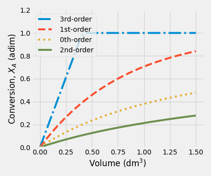
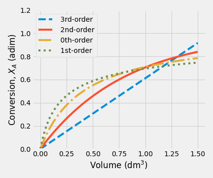
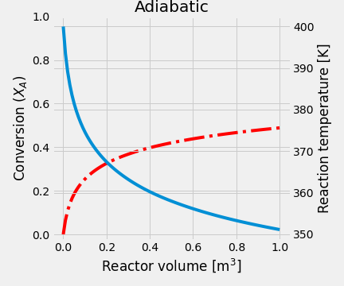
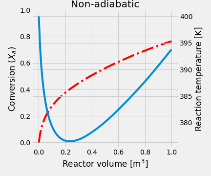
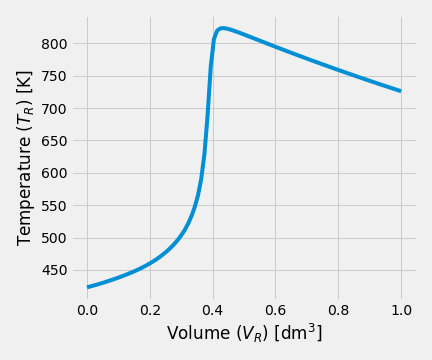
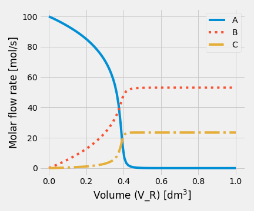
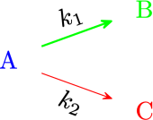
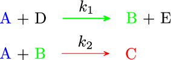
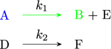
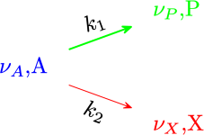

# Ideal Chemical Reactor Design

Process design has to do with specific matters relating to the process itself, in our cases, such as operation conditions, size, configuration, and operation mode of the reactor.

```{r mindmap, out.width = "80%", echo=FALSE, fig.align='center', fig.cap='Conceptual Map of Chemical Reactor Design', fig.lp='fig:'}
library(png)
library(grid)
img <- readPNG("figures/Reactor_Design_map.png")
grid.raster(img)
```

In this course, we will focus on the phenomena taking place in basic reactor types.

The phenomena occurring in a reactor may be broken down into reaction, mass, heat, and momentum transfer. Therefore, reactors' modeling and design are based on the reaction rate equation, the continuity, energy, and momentum equations. The modeling and design of reactors are based on the equations describing these phenomena: the reaction rate equation and the continuity, energy, and momentum equations [@froment2011].

Additionally, we will study two situations (1) the design of a new chemical reactor for a new process, (2) the analysis of the performance of an existing reactor for a current process. In many cases, as chemical engineers, we must consider several items shown in figure \@ref(fig:mindmap) when starts the design or analysis of a reactor.

## Fundamental Balances
### Material Balance

As a chemical engineer, our main modeling tools are the material balance and energy balance. We should remember two aspects: the material balance of a reactor must consider the rate at which species are converted from one chemical form to another and the rate at which energy is transformed by the process.

We will perform a mole balance on species $j$ in a system volume, where $j$ represents the particular chemical species of interest.

```{r arbitrarysystem, out.width = "30%", echo=FALSE, fig.align='center', fig.cap='System volume scheme', fig.lp='fig:'}
library(png)
library(grid)
img <- readPNG("figures/002_system.png")
grid.raster(img)
```

Based on figure \@ref(fig:arbitrarysystem), the mole balance expressed in mole/time would be

\begin{equation}
 F_{j0}  +  G_j   - {F_j } =  \frac{dN_j}{dt}
(\#eq:continuidad)
\end{equation}
where $F_{j0}$ is rate flow in $j$, $G_j$ is the generation rate of $j$ by chemical reaction, $F_{j}$ is rate flow out $j$, and $dN_j/dt$ means accumulation rate of $j$.

In equation \@ref(eq:continuidad), the generation/consumption of $j$ ($G_j$) will be expressed as the product of the reaction volume, $V$, and the rate of reaction, $r$.

The symbol $r$ is expressed in molar units per unit time and volume, and it is always **positive** when the reaction proceeds in the direction of the arrow. Thus, the integral form of the general mole balance for any chemical specie $j$ yields.
\begin{equation}
  F_{j0} - F_j + \int_{0}^V {r_j\,dV} = \frac{dN_j}{dt}
  (\#eq:genbal)
\end{equation}

In mathematical terms, the equation \@ref(eq:genbal) is called the continuity equation for $j$. If $j$ reacts in more than one phase, such an equation is needed for each phase. This equation will develop the design equations for different ideal reactors: batch, semi-batch, and continuous-flow.

The mechanisms by which $j$ can enter or leave the volume element are flow and molecular diffusion, and they are irrelevant. However, it is essential to realize that a fluid's motion is not really ordered and challenging to describe.

For this reason, as a first approach, it is therefore natural to consider two extreme conceptual cases: first, where there is no mixing of the streamlines, and second, where the mixing is complete. These two extremes may be formulated with sufficient approximation by the tubular plug flow reactor, and the continuous flow stirred tank with complete mixing.

In a plug flow reactor, all fluids elements move with equal velocity along parallel streamlines. The plug flow is the only mechanism for mass transport, and there is no mixing between fluid elements. The reaction leads to a concentration gradient in the axial flow direction.

Reactors with complete mixing may be subdivided into batch and continuous types. In batch-reactor types with complete mixing, the composition is uniform throughout the reactor. Consequently, the continuity equations may be written for the entire contents, not over a volume element. As the bulk composition varies with time, a first-order ordinary differential equation is obtained, with time as a variable. The form of this equation is analogous to that for the plug flow case.

In the continuous flow type, an element of the entering fluid is instantaneously mixed with the reactor's contents so that it loses its identity. This type also operates at a constant concentration level. In the steady-state, the continuity equations are algebraic.

Both types of continuous reactors considered are idealized conceptual cases. They are important cases because they are easy to calculate and give the extreme values of the conversions between those realized in a real reactor. With its intermediate level of mixing, the design of a real reactor requires information about this mixing.[@froment2011]

### Energy Balance

The real chemical reactors are almost operated under nonisothermal conditions because reactions generate or absorb large amounts of heat. Detailed reactor sizing and analysis require the energy balance to be solved in conjunction with one or more material balances. 

For a generic open system, the energy balance is: 
\begin{equation*}
 Q -  {W_s} + \dot{H}_\text{in} - \dot{H}_\text{out}  =  \frac{dE}{dt}
\end{equation*}

The terms in energy balances have the following meanings:

- $Q$ is the rate of heat transfer **into** the reactor. 
- $W_s$ means the rate at which shaft work is done by the system on the surrounding. If shaft work is done on the contents of the reactor, e.g., by an agitator, the value of $W_s$ is negative. 
- $\dot{H}_\text{in}$ is the rate at which enthalpy is transported into the reactor. 
- $\dot{H}_\text{out}$ is the rate at which enthalpy is transported out of the reactor. 
- $dE/dt$ is the rate at which the system's total energy, $E$, changes with time. 

In chemical reactors, it is typically assumed the internal energy is the dominant contribution over the kinetic and potential energies. Thus, the general energy balance will be 

\begin{equation}
\frac{dU}{dt}= Q - W_s + \dot{H}_{\text{in}} - \dot{H}_\text{out}
  (\#eq:energybal)
\end{equation}

For single reactors, the inlet and outlet molar flow are related through the extents of reaction ($\xi$). If "$R$" independent reactions occur, and if the extents of reaction are zero in the stream that enters the reactor.[@roberts2009]

\begin{equation*}
  F_i - F_{i0} = {\sum}_{j=1}^{R} \nu_{j,i}\,\xi_j
\end{equation*}
where $\nu_{j,i}$ refers to stoichiometric coefficient of the component \textit{i} in the reaction \textit{j}.

Therefore,
\begin{equation*}
\dot{H}_{\text{in}} - \dot{H}_{\text{out}} = \sum\limits_{i=1}^\mathcal{C} F_{i0}\,\overline{H}_{i0} - {{\sum_{i=1}^\mathcal{C}}} \left(F_{i0} + \sum_{j=1}^{R} \nu_{j,i}\,\xi_j\right)\,\overline{H}_i
\end{equation*}
where $\overline H_i$ refers to the partial molar enthalpy of the component \textit{i}.

Assuming that feed and product streams are ideal solutions, the partial molar enthalpies $\overline{H}_i$ can be replaced by pure component enthalpies, $H_i$, Thus, 
\begin{equation*}
\dot{H}_{\text{in}} - \dot{H}_{\text{out}} = \sum\limits_{i=1}^\mathcal{C} F_{i0}\,\left({H}_{i0} - H_i\right) - {{\sum_{j=1}^R}} \xi_j\,\left(\sum_{i=1}^{\mathcal{C}} \nu_{i,j}\,{H}_i (T)\right)
\end{equation*}
The term $\sum \nu_{i,j}\,{H}^\circ_i$ is just the enthalpy of reaction for reaction $j$, evaluated at exit conditions. Since the temperature of the effluent stream is $T$,
\begin{equation*}
  \sum_{i=1}^{\mathcal{C}} \nu_{i,j}\,{H}_i = \Delta H_{R,j}(T)
\end{equation*}
where $\Delta H_{R_j}(T)$ is the heat of reaction $j$, evaluated at the temperature $T$. 

If the pressure difference between the feed and the product streams is not substancial, and if there are no phase changes
\begin{equation*}
  H_{i0} - H_i = \int_T^{T_0} {C_{P_i}\,dT} \approx \overline{C}_{P_i} \left(T_0 - T\right)
\end{equation*}
where, $T_0$ is the temperature of the inlet stream, $C_{P_i}$ is the constant-pressure molar heat capacity of specie _i_, and $\overline{C}_{P_i}$ is the average constant-pressure molar heat capacity over the temperature range $T_0$ to $T$

So, eq. \@ref(eq:energybal) becomes to
\begin{equation}
\frac{dU}{dt}= Q - W_s - \sum\limits_{i=1}^\mathcal{C} \left(F_{i0}\,\int_{T_0}^{T} {C_{P_i}\,dT}\right) - {\sum_{j=1}^R} \xi_j\,\Delta H_{R,j}(T)
(\#eq:energybala)
\end{equation}

Equation \@ref(eq:energybala) is the energy balance for a whole reactor in which multiple reactions are taken place. In this equation, the term $\left(\sum F_{i0}\,\int{C_{P_i}\,dT}\right)$ represents the rate of sensible heat, and it is usually written on a **molar** basis. The term $\sum \xi_j\,\Delta H_{R,j}(T)$), means the heat rate (generated or consumed) related to the reaction.[@roberts2009]

If only one reaction is taking place, eq. \@ref(eq:energybala) can be written in terms of the fractional conversion. For a single reaction, where $A$ is a reactant, 
\begin{equation*}
  \xi = - \frac{F_{A0} - F_A}{\nu_A} = - \frac{F_{A0}\,X_A}{\nu_A}
\end{equation*}

Substituting this relationship into eq. \@ref(eq:energybala) and assuming steady-state condition gives [@roberts2009]

\begin{equation}
 Q - W_s - \sum\limits_{i=1}^\mathcal{C} \left(F_{i0}\,\int_{T_0}^{T} {C_{P_i}\,dT}\right) + F_{A0}\,X_A\,\frac{\Delta H_{R}(T)}{\nu_A} = 0
 (\#eq:energybalb)
\end{equation}
or
\begin{equation*}
Q - W_s - \sum\limits_{i=1}^\mathcal{C} \left(F_{i0}\,\int_{T_0}^{T} {C_{P_i}\,dT}\right) - \frac{\Delta H_{R}(T)}{\nu_A}\,r_A V =0
\end{equation*}

:::: {.blackbox data-latex=""}

When $\nu_A = −1$ is chosen, the basis for $\Delta H_R$ has been fixed to 1 mole of A, 
i.e., the units of $\Delta H_R$ must be energy/mole of A 
::::


The form of the energy balance results from considerations closely related to those for different continuity equations. When the mixing is so intense that the concentration is uniform over the reactor, it may be accepted that the temperature is also uniform. 

When plug flow is postulated, it is natural to accept that the concentration in a section perpendicular to flow is considered to be uniform. It is natural to also consider the temperature to be uniform in this section. It follows that when the heat is exchanged with the surroundings, the temperature gradient has to be situated entirely in a thin "film" along the wall. This also implies that the resistance to heat transfer in the central core is zero in a direction perpendicular to the flow, which is not right for certain catalytic reactors. 

### Momentum Balance

The momentum balance can be obtained by the application of Newton’s second law on a moving fluid.

In a chemical reactor, only pressure drop and friction forces have to be considered in most cases. Several specific pressure drop equations will be discussed later on PFR and on a fixed catalytic reactor.

## The Continuous-Stirred-Tank Reactor (CSTR)

When the demand for a single chemical product reaches a high level, there will be an economic incentive to continuously manufacture it, using a reactor dedicated to that product. One of those is The _Continuous-Stirred-Tank Reactor or CSTR_.

```{r cstrdraw, out.width = "50%", echo=FALSE, fig.align='center', fig.lp='fig:'}
library(png)
library(grid)
img <- readPNG("figures/CSTR_draw.png")
grid.raster(img)
```

The CSTR is a well-mixed vessel consisting of a baffled tank with mixing induced by an impeller and operates at a steady-state. The mass flow rate into the tank is equal to the mass flow rate out of it at steady-state, and the feed and product properties are not functions of time. Furthermore, the reactor volume is constant. 


A well-mixed vessel means a working fluid with neither radial, axial, nor angular gradients in properties. In other words, both the composition and temperature of the fluid are uniform over the entire volume. That is, they do not vary with position. Those assumptions are 

The central assumption is that the incoming fluid concentration will become instantaneously equal to outgoing upon entering the vessel. As a consequence of well-mixing behavior, the effluent stream must have precisely the same composition and temperature as the contents of the reactor. The feed must be immediately mixed with the reactor's contents in a time interval that is very small compared to the mean residence time of the fluid flowing through the vessel to meet this ideal mixing pattern. [@froment2011] 

The CSTR is frequently chosen when temperature control is a critical aspect when the conversion must occur at constant composition, when a reaction between two phases has to be carried out, or when a catalyst must be kept in suspension. [@froment2011] 

:::: {.blackbox data-latex=""}
In practice, it is possible to reach a perfect mixing condition if the mixing time is much less than the residence time inside the reactor, usually when the fluid is low viscosity.
::::

### The design equation for a CSTR 
An ideal CSTR is quite similar to a perfectly mixed batch reactor. The most significant difference is that mass flows into and out of a CSTR. Thus, the mass flow in and out of the reactor in eq. \@ref(eq:continuidad) will not cancel. 

Writing the material balance for this system: 
\begin{equation}
	\frac{dN_j}{dt} = F_{\text{in},j} - F_{j} + r_j V
	(\#eq:eq002028a)
\end{equation}
where $F_{\text{in},j}$ is the molar flow in of $j$, $F_{j}$is the molar flow out of $j$, $V$ is the reactor volume, $r_{j}$ is the production rate of specie $j$, and $N_{j}$ means the number of moles of specie $j$

At steady-state, the left-hand side of eq. \@ref(eq:eq002028a) is zero, thus 
\begin{gather}
	F_{\text{in},j} - F_{j} + r_j V = 0 \notag \\
	V = \frac{F_{\text{in},j} - F_{j}}{- r_j}
	(\#eq:eq002028b)
\end{gather}

Equation \@ref(eq:eq002028b) is **the design equation** for an ideal CSTR. For a single reaction, it is useful to write it down in terms of the conversion of reactant A. 
\begin{align*} 
    F_{A,\text{in}}   & = F_{A0} {\left(1 - X_{A,\text{in}} \right) }\\
    F_{A} & = F_{A0} {\left(1 - X_{A} \right)}
\end{align*}

leading to
\begin{equation}
	\frac{V}{F_{A0}} = \frac{X_{A} - X_{A,\text{in}}}{-r_A}, \quad r_A = - r 
	(\#eq:eq002031)
\end{equation}
where $\nu_A$ represents moles of _A_, and $r$ the global rate equation.

:::: {.blackbox data-latex=""}
The material balance equation is usually solved for V in steady-state operation or determines the changes of outlet properties concerning time in the unsteady-state process for a particular V.
::::

These characteristics of a CSTR generates an inherent weakness in its operation related to the fractional conversion: 
\begin{equation*}
  X_A = \frac{C_{A0} - C_A}{C_{A0}}
\end{equation*}

If a high conversion is desired, the reactant concentration must be small. But the reaction rate depends directly on the reactant concentration, so to compensate for this restriction, we must design larger reactors. 

#### Constant-Density System {-}
If the reactor volume is constant and the volumetric flow rate of the inflow and outflow streams are the same, the eq. \@ref(eq:eq002028a) in terms of volumetric flow rates, is

\begin{gather}
    F_j = \upsilon \,C_j \notag \\
	\frac{dC_j}{dt} = \frac{1}{\overline t}\left(C_{j,0} - C_{j} \right)+ r_j
	(\#eq:eq002031a)
\end{gather}
where $C_{0,j}$ is the concentration of specie $j$ at initial conditions, $C_j$ is the concentration into the reactor, and $\overline t$ is used to refer to the **mean residence time**, which is given by 
\begin{equation}
	\overline t = \frac{V}{\upsilon}
	(\#eq:eq002032)
\end{equation}
where $\upsilon$ is the volumetric flow rate evaluated at exit conditions. 

For $X_{A,\text{in}} = 0$, the effluent volumetric flow rate can be related to inlet flow rate by
\begin{equation}
	\upsilon = \upsilon_0 \left( 1 + \nu\, X_A \right)
	(\#eq:eq002032a)
\end{equation}
where $\upsilon_0$ is the volumetric flow rate evaluated at entrance conditions, and $\nu = \sum\nolimits_j \nu_j$

Since the volumetric flow rate is a function of $X$, $T$, and $P$, the mean residence time, $\overline t$, depends on those variables. Instead of using the reactor residence time to describe performance, an equal quantity called **space-time** define as: 
\begin{equation}
	\tau = \frac{V}{\upsilon_0}
	(\#eq:eq002033)
\end{equation}
This definition of space-time applies to any continuous reactor. 

For a homogeneous reaction, space-time has the dimension of time. It is related to the average time a volume element of fluid spends in the reactor. 

Although space-time is not necessarily equal to the mean residence time, they behave similarly, and it is possible to relate eq. \@ref(eq:eq002032) and eq. \@ref(eq:eq002033) 
\begin{equation}
	\overline t = \frac{\tau}{1 + \varepsilon_A\, X_A}
	(\#eq:eq002033a)
\end{equation}

If the volume change in the reactor is negligible, then $\varepsilon_A = 0$. Finally, if the working fluid has constant density 
\begin{gather}
	V = \frac{\left(C_{A0} - C_A\right) \upsilon}{r_A}  \notag \\
	\overline t = \tau
	(\#eq:eq002034)
\end{gather}

Space-time influences reaction behavior in a continuous reactor in the same way that real-time does on a batch reactor's behavior. In both cases, the fractional conversion will increase if reactants spend more time or space-time increases. 

Therefore, if the fluid density is constant, eq. \@ref(eq:eq002031) becomes 
\begin{equation}
	\tau = \frac{C_{A0} - C_{A}}{-r_A}, \quad r_A = - r 
\end{equation}

The equation \@ref(eq:eq002031) may be interpreted graphically from a plot of reciprocal rate $1/(−r_A)$ as function of $X_A$, as shown by curve EB in fig. \@ref(fig:fig002011). Point B is the _operating point_ of the reactor, which represents the steady-state condition in the reactor. Area ABCD represents the ratio $V/F_{A0}$ for the CSTR. 

```{r fig002011, out.width = "60%", echo=FALSE, fig.align='center', fig.cap='Graphical representation of the performance equations for CSTR', fig.lp='fig:'}
library(png)
library(grid)
img <- readPNG("figures/002_CSTR_01.png")
grid.raster(img)
```

Another parameter commonly used for CSTR design is the inverse of $\tau$, called **space velocity**, which can be regarded as the number of reactor volumes of feed processed per unit time at the feed conditions. 
\begin{gather}
	\text{SV} = \frac{\upsilon_0}{V} = \frac{1}{\tau}
	(\#eq:eq002034a)
\end{gather}

Space velocity is more useful in the field of heterogeneous catalysis. Its definition is not unique. For example, it can also be defined as GHSV, which means gas-hourly space velocity. It may be defined as the volumetric flow rate of gas entering the catalyst divided by the catalyst's weight. 

#### Variable-Density System {-}
For variable-density cases, the design equation for a CSTR is: 
\begin{align}
  \frac{V}{\upsilon} = \tau & = \frac{V}{\upsilon_0 \left( 1 + \varepsilon_A\, X_A \right)
} = \frac{C_{A0} - C_A}{r_A(C_A)} \notag \\
 \tau & = \left( 1 + \varepsilon_A\, X_A \right)\,\frac{C_{A0} - C_A}{r_A(C_A)}
\end{align}

### CSTR in series

#### CSTRs of equal sizes in series {-}
Consider a system of $N$ CSTRs connected in series, as shown in the figure \@ref(fig:fig002012). Though the concentration is uniform in each reactor, there is a change in concentration as fluid moves from one reactor to another.

```{r fig002012, out.width = "60%", echo=FALSE, fig.align='center', fig.cap='Sketch of ideal CSTRs in series', fig.lp='fig:'}
library(png)
library(grid)
img <- readPNG("figures/002_CSTR_01.png")
grid.raster(img)
```

The feed molar flow rate of reactant A is $F_{A0}$, the effluent conversion of A from the first reactor is $X_{A1}$, while the output conversion of A from the second reactor is $X_{A2}$ so on.

:::: {.blackbox data-latex=""}
It is crucial to be consistent in defining the fractional conversion for a series of reactors.
::::

For a series of three CSRTs in serie
\begin{align*}
	X_{A,1} = \left(F_{A0} - F_{A,1} \right)/(F_{A0}) \\
    X_{A,2} = \left(F_{A0} - F_{A,2} \right)/(F_{A0}) \\
	X_{A,3} = \left(F_{A0} - F_{A,3} \right)/(F_{A0})
\end{align*}

The conversion $X_{A1}$ is the fractional conversion of A in the stream leaving the first reactor. In contrast, $X_A2$ is the overall conversion of A in the second reactor's effluent, which means the conversion for the first and second reactors combined. Thus, the overall conversion for the series of three CSTRs is equal to $X_{A3}$. [@roberts2009]

The mole balance for reactant $A$ can be written for any reactor $j$ in the series will be
\begin{equation}
- r_{A,j} = \frac{F_{A,j-1} - F_{A,j}}{V_j}
\end{equation}

The molar flow rates from a reactor $j$ and $j-1$ expressed in terms of conversion are:
\begin{align*} 
    F_{A,j-1}   & = F_{A0} {\left(1 - X_{A,j-1} \right) }\\
    F_{A,j} & = F_{A0} {\left(1 - X_{A,j} \right)}
\end{align*}

The change in the molar flow rate of A in any reactor is defined as
\begin{equation*}
  F_{A,j-1} - F_{A,j} = F_{A0}\left(X_{A,j} - X_{A,j-1}\right)
\end{equation*}

Therefore, the design equation for a reactor $j$ is written in terms of conversion as:
\begin{equation}
  	\frac{V_j}{F_{A0}}= \frac{\left(X_{A,j} - X_{A,j-1}\right)}{- r_A\left(X_{A,j}\right)}
  	(\#eq:002044b)
\end{equation}

This equation can be rearranged in terms of the conversion from reactor $j$
\begin{equation}
  	X_{A,j} = X_{A,j-1} - \frac{r_{A,j}\:V_j}{F_{A0}}
  	(\#eq:002044c)
\end{equation}

Equation \@ref(eq:002044c) can be solved for each reactor sequentially to calculate the incremental conversion from each reactor. Equation \@ref(eq:002044d) can be generalized to apply to the Nth reactor in a series of CSTRs

\begin{equation}\label{ec:002_044d}
  	\frac{V_N}{F_{A0}}= \frac{\left(X_{A,N} - X_{A,N-1}\right)}{- r_A\left(X_{A,N}\right)}
  	(\#eq:002044d)
\end{equation}

A typical case is to evaluate the behavior of a series of N equal-size CSTRs that operate isothermally, with a first-order kinetic and no volume change $\left( \upsilon = \upsilon_0 \right)$.

In this case, it is convenient to write mass balances on specie A in terms of concentrations and $\tau$ instead of fractional conversion.

\begin{align*}
	C_{A0} - C_{A1} &= \tau_1\,r (C_{A1}) \\
    C_{A1} - C_{A2} &= \tau_2\,r (C_{A2}) \\
	C_{A2} - C_{A3} &= \tau_3\,r (C_{A3}) \\
	&\vdots \\
	C_{A,n-1} - C_{An} &= \tau_n\,r (C_{An})  
\end{align*}

Usually the initial concentration of A is known. Therefore, the system of equations can be rewritten as:
\begin{align*}
	C_{A1} &= \frac{C_{A0}}{\left( 1 + \tau_1 k \right)} \\
	C_{A2} &= \frac{C_{A0}}{\left( 1 + \tau_1\, k\right)\left( 1 + \tau_2\, k\right)} \\	
		&\vdots \\
	C_{Ai} &= \frac{C_{A(i-1)}}{\left( 1 + \tau_i\, k\right)} = \frac{C_{A0}}{\prod_k \left( 1 + \tau_k\, k\right)}
\end{align*}

In general, 
\begin{equation}
	\frac{C_{A,i-1}}{C_{A,i}} = 1 + k\,\tau_i \qquad \text{or} \qquad \tau_i = \frac{C_{A,i-1}-C_{A,i}}{k\,C_{A,i}}
	(\#eq:002044a)
\end{equation}

Assuming all reactors have the same volume ($V_i$), which means they have the same $\tau$, then the total residence time in the series of _N_ equal-residence-time CSTR is equal $\sum\nolimits_{k} \tau_{k} = N\, \tau$ and $C_{A,N}$, the concentration from the _N_-th reactor is given in terms of $C_{A0}$ by:

\begin{equation}
\frac{C_{A,N}}{C_{A0}} = \frac{C_{A,1}}{C_{A0}} \frac{C_{A,2}}{C_{A,1}} \cdots \frac{C_{A,N-1}}{C_{A,N}} = \frac{1}{{\left( 1 + \tau_N\, k\right)}^N}
(\#eq:002045)
\end{equation}

Substituting for $C_{A,N}$ in terms of conversion
\begin{equation}
C_{A0}\:{\left(1 - X_{A,N} \right)} = \frac{C_{A0}}{{\left( 1 + \tau_N\, k \right)}^N} \Rightarrow X_{A,N} = 1 - \frac{1}{{\left( 1 + \tau_N\, k\right)}^N}
(\#eq:eq002045a)
\end{equation}

Figure \@ref(fig:fig002014) shows the variation of conversion vs. the number of reactors in series for a first-order reaction. It also indicates that the Damkholer number is a crucial parameter to decide the optimal number of CSTRs required to reach an overall conversion.

```{r fig002014, out.width = "60%", echo=FALSE, fig.align='center', fig.cap='Plot of conversion as function of number of CSTRs in serie', fig.lp='fig:'}
library(png)
library(grid)
img <- readPNG("figures/002_17.png")
grid.raster(img)
```

In general, while the Damkholer number increases, the system will require fewer CSTRs to get the desired level of conversion. [(Numerical solution)](https://github.com/aliglara/ebook_che5314_ucv/blob/main/codes/lect_004CSTRSeries.ipynb)

The total capital cost is an important parameter rather than the total reactor volume in a practical situation. Increasing the number of CSTRs in series will reduce the total cost by reducing the required volume. However, it will also increase the price since more agitators, valves, piping, etc., will be required. The economic optimum usually occurs at a value of $N$ as low as 2 or 3. [@roberts2009]

:::: {.blackbox}
The optimal operation of a multistage CSTR can be considered from the point of view of minimizing the total volume V for a given throughput ($F_{A0}$) and fractional conversion ($X_A$). So it will be necessary an objective function for $V$ from the material balance together with a rate law and energy balance as required
::::

#### CSTRs of different sizes in series {-}
For reactions with slight density change is possible to find the outlet composition from a series of CSTRs by a graphical procedure due to the design equation of each CSTRs could be written as:
\begin{equation}
-\frac{1}{\tau_N} = \frac{(-r_A)_N}{C_{A,N} - C_{A,N-1}}
\end{equation}

```{r fig002015, out.width = "60%", echo=FALSE, fig.align='center', fig.cap='Graphical solution for multistage CSTRs - first-order reaction', fig.lp='fig:'}
library(png)
library(grid)
img <- readPNG("figures/002_cstr_11.png")
grid.raster(img)
```

Figure \@ref(fig:fig002015) shows a way to represent the material balances for each stage from a plot $1/(-r_A)$ as a function of $C_A$.

Another interesting situation is finding the best setup to achieve a given conversion. Let us illustrate the use of this method considering two CSTRs in series under isothermal conditions, as shown in the Figure \@ref(fig:CSTRseriesdifV)

```{r CSTRseriesdifV, out.width = "40%", echo=FALSE, fig.align='center', fig.cap='Graphical representation of two CSTRs in series', fig.lp='fig:'}
library(png)
library(grid)
img <- readPNG("figures/CSTR_series_difV.png")
grid.raster(img)
```

For the first CSTR, the design equation becomes
\begin{equation}
\frac{V_1}{F_{A0}} = \frac{X_{A1}}{-r_A(X_{A1})}
\end{equation}

while for the second one is:
\begin{equation}
\frac{V_2}{F_{A0}} = \frac{X_{A2} - X_{A1}}{-r_A(X_{A2})}
\end{equation}

These relations are graphically represented in the Figure \@ref(fig:CSTRseriesdifV2). The cascade of CSTRs operates between known initial and final conversion levels, and the total reaction volume is represented by the sum of the shaded areas.

```{r CSTRseriesdifV2, out.width = "40%", echo=FALSE, fig.align='center', fig.cap='Graphical representation of two CSTRs in series', fig.lp='fig:'}
library(png)
library(grid)
img <- readPNG("figures/CSTR_series_difV02.png")
grid.raster(img)
```

When the rectangle _KLMN_ is made as large as possible, the overall volume is minimized. Therefore, point $X_{A1}$ is the critical parameter to get the reactors' optimal size.

For reaction rate expressions of the _n_th-order form, it can be shown that there is always one and only one point that minimizes the total volume when $n>0$. [@hill2014]

The total reaction volume is:
\begin{equation}
V_1 + V_2 = F_{A0}\:\frac{X_{A1}}{(-r_A)_1} + F_{A0}\:\frac{X_{A2} - X_{A1}}{(-r_A)_2}
(\#eq:totalVolume)
\end{equation}

The derivative of eq. \#ref(eq:totalVolume) respects to $X_{A1}$ is:
\begin{equation}
\frac{d\:\left(V_1 + V_2\right)}{dX_{A1}} = \frac{F_{A0}}{(-r_A)_1} + F_{A0}\:X_{A1}\left(\frac{d\:\left(1/(-r_A)_1\right)}{dX_{A1}}\right) - \frac{F_{A0}}{(-r_A)_2} = 0
\end{equation}
simplifying leads to
\begin{equation}
\frac{d\left(1/(-r_A)_1\right)}{dX_{A1}} = \frac{1/(-r_A)_2 - 1/(-r_A)_1}{dX_{A1}}
\end{equation}

Therefore, the minimum reaction volume will be found when the intermediate fractional conversion $X_{A1}$ is selected. The slope of the reaction rate curve at this conversion level is equal to the slope of the rectangle's diagonal KLMN, as is shown in figure \@ref(fig:CSTRseriesminV).

```{r CSTRseriesminV, out.width = "40%", echo=FALSE, fig.align='center', fig.cap='Graphical representation of the minimum total reaction volume for two CSTRs in series', fig.lp='fig:'}
library(png)
library(grid)
img <- readPNG("figures/CSTR_series_minV.png")
grid.raster(img)
```

Generally, the optimum size ratio is dependent on the form of the reaction rate expression and on the conversion task specified. Table \@ref(tab:thumbRulesCSTRinSerie) summarizes the optimal configuration for CSTRs in series from a kinetic-order point of view. 


kinetic-order _n_ | Optimal configuration
- | -
$n = 1$  	| same size  
$n > 1$   | first tank with < volume 
$n < 1$	| first tank with > volume
Table: (\#tab:thumbRulesCSTRinSerie) Thumb-rules for optimal configuration for CSTRs in serie

In engineering practice, the designer tends to select CSTRs with the same volume to minimize installation and operational costs.

### Energy Balance
Now let us find out how to apply the general energy balance (eq.\@ref(eq:energybal)) to a CSTR.  Usually, for an ideal CSTR operating at a steady-state ($dU/dt = 0$), it is considered the work done by the stirrer neglected, so the energy balance yields to:

\begin{equation}
Q - \sum\limits_{i=1}^\mathcal{C} F_{i0} \left( \int_{T_0}^{T} C_{P_i} dT \right) - \sum\limits_{j = 1}^r \xi_j \, \Delta H_{R_j}(T) = 0
(\#eq:ec003017)
\end{equation}
From thermodynamics, we know that for a reaction $j$
\begin{equation}
\xi_j = \frac{F_i  - F_{i0}}{\nu_i} = - \frac{F_{i,0}\,X_i}{\nu_i}
\end{equation}

Thus
\begin{equation}
Q - \sum\limits_{i=1}^\mathcal{C} F_{i0} \left( \int_{T_0}^{T} C_{P_i} dT \right) + \sum\limits_{j = 1}^R {\left(\frac{F_{i,0}\,X_i}{\nu_i}\right)}_j \, \Delta H_{R_j}(T) = 0
(\#eq:ec003018)
\end{equation}

This equation written for a reactant A ($\nu_A=-1$), considering only one chemical reaction is taken place, becomes to
\begin{equation}
Q - \sum\limits_{i=1}^\mathcal{C} F_{i0} \left( \int_{T_0}^{T} C_{P_i} dT \right) - F_{A,0}\,X_A \, \Delta H_{R}(T) = 0
(\#eq:ec003019)
\end{equation}
or
\begin{equation}
Q - \sum\limits_{i=1}^\mathcal{C} F_{i0} \left( \int_{T_0}^{T} C_{P_i} dT \right) + \Delta H_{R}(T)\,r_A\,V = 0
(\#eq:ec003019a)
\end{equation}

while for a product $P$
\begin{equation}
Q - \sum\limits_{i=1}^\mathcal{C} F_{i0} \left( \int_{T_0}^{T} C_{P_i} dT \right) + \frac{\nu_P}{\nu_A}\,F_{A,0}\,X_A \, \Delta H_{R}(T) = 0
(\#eq:ec003020)
\end{equation}

Equation \@ref(eq:ec003019) (or \@ref(eq:ec003020)), if the system's heat transfer characteristic is known, requires a reaction rate expression and the design equation to determine the fluid's temperature and composition leaving the reactor.

Using the energy balance to analyze the performance or sizing an ideal CSTR is not as complicated mathematically, so let us consider some typical heat transfer modes.

#### Jacket-Cooled {-}
Consider the ideal CSTR shown in Figure \@ref(fig:fig003005a). Heat is added to or removed from the reactor by a heat-transfer fluid that flows through the jacket. 
Depending on the reactor temperature and whether the reactor is being heated or cooled, the heat-transfer fluid may be cooling water, chilled brine, chilled glycol solution, hot oil, or some other fluid. The fluid is a source of (or a sink for) the heat transferred through the reactor wall.

```{r fig003005a, out.width = "40%", echo=FALSE, fig.align='center', fig.cap='Schematic diagram of an ideal CSTR with heat transfer through a heating/cooling jacket', fig.lp='fig:'}
library(png)
library(grid)
img <- readPNG("figures/003_draw_000.png")
grid.raster(img)
```
The transit energy rate is $\dot{W}$. The temperature of the fluid at a point in the jacket is $T_c$. The fluid enters the jacket at $T_{c,i}$ and leaves at $T_{c,o}$. The feed enters the reactor at temperature $T_0$. The molar flow rates of each component of the feed are designated $F_{i,0}$, and its corresponding concentrations are designated $C_{i,0}$. The reactor operates at a temperature, _T_, which is the effluent temperature too. The molar flow rates in the output stream are designated $F_i$, and the corresponding concentrations are $C_i$.

If a single reaction occurs in a CSTR and one mole of reactant _A_ is consumed in an elemental first-order reaction, the eq. \@ref(eq:ec003020a) yields to:
\begin{equation}
Q - \left(\sum\limits_{i=1}^\mathcal{C} F_{i0}\,\overline{C}_{p,i}\right)\left(T - T_0\right) - F_{A0}\,X_A \, \Delta H_{R}(T) = 0
(\#eq:ec003020a)
\end{equation}

The _Q_ term in eq. \@ref(eq:ec003020a) depends on the removal scheme used. In general, the rate for heat transfer is:
\begin{equation*}
	q = U \left(T_c - T\right)
\end{equation*}
where: _q_ is the heat flux into the reactor $\left(\text{J}/\text{m}^2-\text{h}\right)$, and _U_ means the overall heat-transfer coefficient $\left(\text{J}/\text{m}^2-\text{h}-\text{K}\right)$.

If $T<Tc$, heat is transferred into the reactor and $q>0$. The total heat transfer rate, _Q_, is obtained by integrating the flux, _q_, over the whole area of the exchanger. For example, if the temperature of the fluid is the same at every point in the exchanger.
\begin{equation*}
	Q = U\,A_{J} \left(\overline{T}_c - T\right)
\end{equation*}
where $\overline{T}_c$ is the constant temperature of the heat-transfer fluid, and it is equal to the outlet temperature, $T_{c,o}$, $A_J$ is the total area of the heat exchanger.

Substituting in \@ref(eq:ec003020a),
\begin{equation}
- F_{A0}\,X_A \, \Delta H_{R}(T)
= U\,A_{J} \left(T - T_c\right) + \left(\sum\limits_{i=1}^\mathcal{C} F_{i0}\,\overline{C}_{p,i}\right)\left(T - T_0\right)
(\#eq:ec003021)
\end{equation}

To understand the physical meaning of the terms in eq. \@ref(eq:ec003021), consider an exothermic reaction. The term $\left[- F_{A0}\,X_A \, \Delta H_{R}^\circ(T)\right]$ represents the enthalpy change related to change in composition because of the chemical reaction. While $U\,A_{J} \left(T - T_c\right)$ is the rate at which heat is transferred out of the CSTR. Finally, $\left(\sum\limits_{i=1}^\mathcal{C} F_{i0}\,\overline{C}_{p,i}\right)\left(T - T_0\right)$ represents the increase in sensible heat of the feed as it goes from $T_0$ to _T_.

Now, we define two functions corresponding to the left-hand side and right-hand of eq. \@ref(eq:ec003021), respectively.

The first function is:
\begin{equation}
 HPR(T) = - F_{A0}\,X_A\,\Delta H_R(T)
 (\#eq:ec003022)
\end{equation}

The function _HPR(T)_ represents the **heat generation* rate in the reactor, proportional to the reaction heat ($\Delta H_R$) and conversion degree ($X_A$). For an exothermic reaction, this term will be > 0 and a strong temperature function.

The second function, _HWR(T)_, is defined from two right-hands terms of the eq. \@ref(eq:ec003023).
\begin{equation}
HWR(T)  = UA_{J} \left(T - T_c\right) + \left(\sum\limits_{i=1}^\mathcal{C} F_{i0}\,\overline{C}_{p,i}\right)\left(T - T_0\right)
(\#eq:ec003023)
\end{equation}

Eq \@ref(eq:ec003023) is called the **removal** term because it represents the total heat transfer rate per unit volume of the reaction mixture. In summary, it represents the sensible heat from $T_0$ to _T_ and the heat transferred to the heat-transfer fluid.

Both _HPR(T)_ and _HWR(T)_ allow identifying when the CSRT operates under steady-state conditions and which of them is stable. If _HPR(T)_ $\neq$ _HWR(T)_, the CSTR is **not** at steady-state.

Figure \@ref(fig:fig003005aaa) shows a typical _HPR(T)_ and _HRW(T)_ vs _T_ plot for an ideal CSTR, assuming an irreversible, exothermic and first-order reaction is taking place.

```{r fig003005aaa, out.width = "50%", echo=FALSE, fig.align='center', fig.cap='Typical $HPR(T)$ and $HWR(T)$ curves versus temperature, $T$, for an irreversible, exothermic reaction in an ideal CSTR', fig.lp='fig:'}
library(png)
library(grid)
img <- readPNG("figures/003_draw_006.png")
grid.raster(img)
```

The intersection of the _HPR(T)_ curve with the _HWR(T)_ line is the reactor's operating point. Therefore it is a **graphical** solution to the design equation and the energy balance for the CSTR.

The \textit{HWR(T)} is linear when $C_P$ is assumed constant, while the \textit{HPR(T)} curve is generated following pseudo-algorithm: 


| **INPUT:** Assumed reaction temperature, T;  
| **OUTPUT:** HPR-HWR curve;  
| 
| **WHILE** output is **not** generated
|   select T from input;
|   calculate kinetic constants with input;
|   solve design equation for $X_A$;
|   calculate _HPR(T)_
|   plot _HPR(T)_ vs. _T_
|   **IF** output_is_True:  
|     end;

For reasons of convenience, several different expressions for heat production and heat removal are used. For the heat production with constant density reactions, we have:

1. the heat production per unit time: $\left(-\Delta H_r\right) \upsilon C_{A0} X_A$
2. the heat production per unit of volume of reaction mixture: $\left(-\Delta H_r\right) C_{A0} X_A$ 
3. the heat production per unit of volume of reaction mixture divided by $\rho C_P$, the sensible heat per unit of volume of the reaction: $\left(-\Delta H_r\right) C_{A0} X_A/\rho C_P$. This represents the fraction of the maximum possible temperature increase, which is reached in the reactor.

For heat removal, similar expressions can be defined. As long as the HPR and HWR are unit-consistent, all will lead to the same conclusions concerning the reactor design and operation. [@westerterp1984]

#### Multiple steady-states analysis {-}

Another essential aspect of CSRT design is to determine if multiple steady-states are raised. This situation is possible because a non-linear equation can have more than one solution. Nevertheless, how is it possible to determine this particular situation?

Let us consider some changes to the situation shown in Figure \@ref(fig:fig003005aaa). Suppose that the temperature of the feed, $T_0$, or the cooling fluid temperature, _Tc_, is reduced. The result of this modification will be to increase the intercept of the HWR(T) line on the y-axis without changing the slope of the line. It means that HWR(T) line shifts to the left, parallel to the original curve, so that it could be more than one operating point. This situation is known as **multiple steady-states** 

In order to determine if there are multiple steady-states for a CSTR. We are going to follow the next steps:

1. Let us fixed inlet conditions.
2. Let us establish a range for _T_ we are interested in.
3. For each _T_ in the temperature range, let calculate _k_ and $X_A$ (or $C_A$).
4. Again, for each _T_, the cooling fluid temperature _Tc_ is calculated.
5. Finally, the set of values for _T_, $X_A$, and _Tc_ is substituted into the reactor energy balance. 
When the left-hand side of equation \@ref(eq:ec003020a) is equal to 0, a steady-state will have been reached.

The heat-transfer fluid consumption is calculated from an energy balance around the perfectly mixed jacket at temperature $T_J$. Constant physical properties of the cooling medium are assumed.

\begin{equation}
	F_c\,\rho_c\,C_{P_c} T_{c,\text{in}} = F_c\,\rho_c\,C_{P_c} T_J - Q
	(\#eq:ec003024)
\end{equation}
where $F_c$ is flow rate of coolant  $\left(\text{m}^{3}/\text{s}\right)$, $\rho_{c}$ means density of coolant  $\left(\text{kg}/\text{m}^{3}\right)$, $C_{P_c}$ is heat capacity of coolant $\left(\text{J}\,\text{kg}^{-1}\,\text{K}^{-1}\right)$, $T_{c,\text{in}}$ represents the supply temperature of cooling medium (K), and $T_{J}$ is the output temperature of cooling medium (K).

The typical reactor design situation is given the feed conditions, the kinetic information, and the desired conversion. The problem is to determine the temperature and the size of the reactor. The next illustrations show how the principles described above are applied in the design of a CSTR. See Exercise \@ref(exr:it003001)

```{exercise, it003001, name="Operation of a cooled exothermic CSTR"}
  An irreversible exothermic reaction is carried out in a CSTR.
  \[A \xrightarrow{k} {B}\]
  		
  The reaction is first-order in reactant $A$ and has a heat reaction given by $\Delta H_R$ which is based on reactant $A$. 
  Negligible heat losses and constant densities can be assumed. A well-mixed cooling jacket surrounds the reactor to remove the heat of reaction. 
  Cooling water is added to the jacket at a rate of $F_J$ and at an inlet temperature of $T_{J0}$.
  
  ```{r fig.align='center', out.width = "30%", echo=FALSE}
      library(png)
      library(grid)
      img <- readPNG("figures/003_02_cstr.png")
      grid.raster(img)
  ```
  	 
  The volume $V$ of the contents of the reactor and the volume $V_J$ of water in the jacket are both constant. The reaction rate constant changes as function of the temperature according to the equation.
  \begin{equation*}
  k = k_0\,\exp\left( -E/R\,T\right)
  \end{equation*}
  The feed flow rate $F_0$ and the cooling water flow rate $F_J$ are constant.
  The jacket water is assumed to be completely mixed.
  Heat transfer from the reactor to the jacket can be calculated from:
  \begin{equation*}
  Q = U\,A_J\left(T_J - T \right)
  \end{equation*}
  where $Q$ is the heat transfer rate, $U$ is the overall heat transfer coefficient, and $A_J$ is the heat transfer area.
  
  1. Formulate the material and energy balances that apply to the CSTR and the cooling jacket.
  2. Calculate the steady-state value of $C_A$, $T_J$, and $T$ for the operating conditions.
  3. Identify all possible steady-state operating conditions, as this system may exhibit multiples steady states.
  4. Solve the unsteady-state material and energy balances to identify if any of the possible multiple steady states are unstable.
```

_Solution_

(a) There are three balance equations that can be written for the reactor (respect to reactant $A$) and the cooling jacket.\@ref(exr:it003001)
\begin{gather*}
F_{0}C_{A0} - F\,C_A - k\,C_A\,V = 0 \\
\rho\,C_P\left(F_0\,T_0 - F\,T\right) - \Delta H_R(T)\,V\,k\,C_A + U\,A_J\left(T_J - T \right) = 0 \\
\rho_J\,C_{P_J}F_J\left(T_{J_0} - T_J \right) - U\,A_J\left(T_J-T\right) = 0
\end{gather*}

(b) The operation conditions for the reactor are:

Sym|Value|Sym|Value
-|-|-|-
$F_0$ 	| 40 ft$^3$/h 			| $U$ 			| 150 btu/h-ft$^2$-R
$F$ 		| 40 ft$^3$/h 			| $A_J$ 		| 250 ft$^2$ 
$C_{A0}$ 	| 0.55 lbmol/ft$^3$ 	|$T_{J0}$ 		| 530 R 
$V$ 		| 48 ft$^3$ 			| $T_{0}$ 		| 530 R
$F_J$ 	| 49.9 ft$^3$/h 		| $\Delta H_R$ 	| $-30\,000$ btu/lbmol 
$C_P$		| 0.75 btu/lb-R 		| $C_{P_J}$ 	|1 btu/lb-R 
$k_0$ 	| 7.08E10 h$^{-1}$ 		| $E$ 			| $30\,000$ btu/lbmol 
$\rho$ 	| 50 lb/ft$^3$ 			| $\rho_J$ 		| $62.3$ lb/ft$^3$ 
$R$ 		| 1.9872 btu/lbmol-R 	| 	&nbsp;			| &nbsp;
  		
All these values were implemented into modeling equations into a Python script [link](https://github.com/aliglara/ebook_che5314_ucv/blob/main/codes/lect_005CSTRStability.ipynb). The solution obtained was:

Variable | Value
-|-
$C_A$ (lbmol/ft$^3$) 	| 0.521  
$T$ (R)				| 537.25 
$T_{J}$ (R)			| 537.25 

When we are dealing with exothermic reactions, several steady states may be possible in a CSTR, which can easily calculate them if we rewrite the equations like so:

\begin{align*}
C_A &= \frac{F_0\,C_{A0}}{F+V\,k} \\
T_J &= \frac{\rho_J\,C_{P_J}F_J\,T_{J_0} + U\,A_J\,T}{\rho_J\,C_{P_J}\,F_J+ U\,A_J}
\end{align*}

Now, these equations are solved for a range $500 \leq T \leq 700$, next their results are evaluated into energy balance function (eq. \@ref{eq:ec003020b}) on the reactor.

\begin{equation}
f(T) = \rho\,C_P\left(F_0\,T_0 - F\,T\right) - \Delta H_R(T)\,V\,k\,C_A + U\,A_J\left(T_J - T \right) 	(\#eq:ec003020b)
\end{equation}

These equations are solved for a range from 500 to 700. Next, their results are evaluated into energy balance function on the reactor. The results obtained are plotted vs $T_R$ in figure \@ref(fig:fig003007).

```{r fig003007, out.width = "65%", echo=FALSE, fig.align='center', fig.cap='Graphical indication of multiple steady-states solutions', fig.lp='fig:'}
library(png)
library(grid)
img <- readPNG("figures/003_04_001.png")
grid.raster(img)
```

Figure \@ref(fig:fig003007) shows the system has three operating-points. Now, how a CSTR can operate at multiple steady-states is necessary to know which is (or which of them) stable for the operating condition.
Thus, the next step in designing a non-isothermal CSTR must be to carry out a steady-state analysis.

Usually, the stability analysis can be done from the plot _HPR(T)_-_HWR(T)_ vs. reaction temperature.

```{r fig003008, out.width = "65%", echo=FALSE, fig.align='center', fig.cap='Graphical solutions of the heat balance for a CSTR', fig.lp='fig:'}
library(png)
library(grid)
img <- readPNG("figures/003_04_002.png")
grid.raster(img)
```

Figure \@ref(fig:fig003008) shows _HPR_ is a sigmoidal curve because of the rate constant's exponential temperature dependence. The shape of the curve depends in large part on the value of the activation energy.

All possible reactor operating temperatures must satisfy both functions, _HPR_ and _HWR_, such that the two functions have equal values. These operating points are represented in Fig. \@ref(fig:fig003008) by circles.

Additionally, Figure \@ref(fig:fig003008) shows that the _HWR_ line intercepts the _HPR_ curve in three points at the same temperatures shown in Figure \@ref(fig:fig003007).
Gray dots represent stable conditions, and especially the latter point is of practical interest since it represents a high degree of conversion.

The stable conditions are related to the fact that the heat removal line's slope should be greater than that of the heat production line. Under that condition, more heat is removed on a positive deviation from the operating point than produced heat so that the reaction temperature will return to the steady-state value.

Figure \@ref(fig:fig003008)'s black circle is an unstable operating condition because the situation is reversed than for gray dots. Since the heat production curve slope is here more significant than that of the heat removal line, any positive temperature deviation will be amplified until the reactor works in the upper stable operating point and vice versa.

In summary, the lower stable steady-state operating point in Figure \@ref(fig:fig003007) corresponds to low rates of heat generation and removal. This combination may result from one or more of the following factors:

1. Small values of $\Delta H_R$;
2. Low value of the reaction rate constant;
3. Short average residence time;
4. Small value of the feed rate, and
5. Fast removal of heat from the reactor, which does not cause the temperature to rise to higher values.

On the other hand, the higher stable steady-state operating point in Figure \@ref(fig:fig003007) corresponds to the reactant's nearly complete consumption. This outcome is favored by:

a. An enormous value of $\Delta H_R$;
b. A more considerable value of the reaction rate constant;
c. Longer average residence time;
d. Larger reactant throughput, and
e. A slower heat removal regime by a heat exchanger.

Whether the reactor operates at a lower or higher stable point depends on how it is started up. The **unsteady energy** and material balances must be solved simultaneously to determine the effect of startup conditions.

The type of stability analysis carried out above is not mathematically rigorous. However, it is a handy way to understand the concept of stable and unstable operating points. In mathematical terms, the above analysis has shown that a steady-state operating will be unstable if
\begin{equation*}
  \left[\frac{\partial HPR(T)}{\partial T}\right]_\text{operating point} > \left[\frac{\partial HWR(T)}{\partial T}\right]_\text{operating point}
\end{equation*}

and will be stable if
\begin{equation*}
  \left[\frac{\partial HPR(T)}{\partial T}\right]_\text{operating point} < \left[\frac{\partial HWR(T)}{\partial T}\right]_\text{operating point}
\end{equation*}

The first inequality is a sufficient criterion for instability so that the operating point will be intrinsically unstable in this situation. The second inequality is a sufficient criterion for stability, provided that the CSTR is adiabatic. If the reactor is not adiabatic, the second condition is necessary but not sufficient.

It is important to remark that the curve HPR/HRW vs. _T_ performed in Fig. \@ref(fig:fig003007) corresponds to a simple reaction rate expression $r_A = - k\,C_A$.
As the reaction change's characteristics, the shape of that curve will change, and the resulting analysis will need to be accordingly modified.

Figure \@ref(fig:fig003009) presents qualitative forms of the HPW/HWR curve for (a) a reversible reaction, (b) a pair of consecutive exothermic reactions, and (c) for two consecutive reactions, where the first is exothermic and the second is endothermic.

```{r fig003009, out.width = "65%", echo=FALSE, fig.align='center', fig.cap='Qualitative shape of HPR/HPWR curve for several kind of reactions', fig.lp='fig:'}
library(png)
library(grid)
img <- readPNG("figures/CSTR_draw_05.png")
grid.raster(img)
```
#### Internal Coil {-}
If an internal coil is used, the cooling medium flows in plug flow through the coil. 
The temperature differential driving force for heat transfer is a log mean average of the differential temperatures at the coil's two ends.

\begin{gather}
\Delta T_\text{in} = T_R - T_{C,\text{in}} \notag \\
\Delta T_\text{out} = T_R - T_{C,\text{out}} \\
{\left(\Delta T\right)}_{LM} = \cfrac{\Delta T_\text{in} - \Delta T_\text{out}}{\ln\left(\cfrac{\Delta T_\text{in}}{\Delta T_\text{out}}\right)} \notag
(\#eq:ec003025)
\end{gather}
where:
 	$T_{C,\text{in}}$ is the supply temperature of cooling medium (K) and $T_{C,\text{out}}$ is the temperature of cooling medium leaving the coil (K).

The energy balance on the coil is again given by the eq. \@ref(eq:ec003024).
While the heat transfer rate is given by
\begin{equation}
Q_\text{coil} = U\,A_\text{coil}\Delta T_{LM}
(\#eq:ec003026)
\end{equation}
There are several issues to be resolved in the design of a cooling coil but these will not be considered for this course.

```{exercise, it003002, name="Non-rigorous coil design for a CSTR"}
  As illustration, let us design (non-rigorous) a coil heat exchanger for a CSTR presented in part 1 of the illustration \@ref(exr:it003001).
The following coil specification are used in this illustration:

1. the pipe diameter is 5/8 in.
2. the loop diameter constitutes 80\% of the diameter of the vessel.
3. The spacing between the loop flights is the diameter of the pipe.
4. Only one coil is used.
5. The reactor vessel has an aspect ratio (L/D) of 2.
```

_Solution._
In order to solve this problem, it is required two iterative calculations. One to determine the size of the reactor, including the coil heat exchanger, and the second one to determine the coolant flow rate required

In the first iterative calculation, it must include following equations:
\begin{align*}
&\text{Length of the reactor} && L_R = 2\,D_R \\
&\text{Number of coils} && N = \frac{L_R}{2D_\text{coil}}\\
&\text{Length of coil} && L_\text{coil} = 0.8\,D_R\,\pi\,N \\
&\text{Volume of coil} && V_\text{coil} = \frac{\pi D_\text{coil}^2}{4}\,L_\text{coil}
\end{align*}  
This problem was implemented in [Python](https://github.com/aliglara/ebook_che5314_ucv/blob/main/codes/lect_006CSTRCoil.ipynb) and the results obtained were:

Reactor size parameters including coil heat exchanger:\
Reactor diameter: 1.55 m\
Reactor volume: 6.0 m

Coil heat exchanger parameters:\
Transfer area: 19.09 m$^2$\
Number of loops: 98 \
Coil volume: 0.08 m$^3$\
Coil length: 382.87 m

Cooling fluid parameters:\
Exit temperature: 436.15 K\
Log-mean temperature difference: 7.10 K\
Coolant flowrate: 34.88 cm$^3$/s

The main advantage of a coil over a jacket is more transfer area.

### Reactors in series {-}

In the general energy balance (eq. \@ref(eq:energybala)), the extent of reaction, $\xi_j$, in the inlet stream was taken to be zero. When dealing with CSTRs in series, this balance must include the change in extension of reaction or fractional conversion per each CSRT referred to in the first reactor. [@roberts2009]

Then, if only one reaction is taking place, the Eq. \@ref(eq:energybala) becomes
\begin{equation}
Q - \left(\sum\limits_{i=1}^\mathcal{C} F_{i0}\,\overline{C}_{p,i}\right) \left(T_{\text{out}} - T_{\text{in}}\right) - F_{A0}\left(X_{A,out} - X_{A,in} \right)\Delta H_{R}(T) = 0
(\#eq:ec003026a)
\end{equation}

If more than one reaction occurs, and if the extents of reaction in the feed to a reactor or segment are denoted $\xi_k^0$, then eq. \@ref(eq:energybala) becomes

\begin{equation}
\frac{dU}{dt}= Q - \left(\sum\limits_{i=1}^\mathcal{C} F_{i0}\,\overline{C}_{p,i}\right)\left(T_\text{out} - T_\text{in}\right) - {\sum_{j=1}^R} \left(\xi_j - \xi_j^0\right) \,\Delta H_{R,j}(T)
(\#eq:ec003026b)
\end{equation}

It is essential to point out that in Eqs. \@ref(eq:ec003026a) and \@ref(eq:ec003026b), _Q_ is the rate at which heat is transferred into the reactor section under consideration, i.e., for which the inlet temperature is $T_\text{in}$, and the outlet temperature is $T_\text{out}$.

Finally, it is necessary, the temperature correction for the heat of reactions is based on:
\begin{equation*}
 \Delta H_{R,j}(T) = \Delta H^\circ_R(T^\circ) + \int_{T^\circ}^T \sum\nu_i C_{p,i}\,dT
\end{equation*}

where $\Delta H^\circ_R(T^\circ)$ is usually calculated from enthalpies of the formation of components involved in the chemical reaction.

```{exercise, it003003, name="Heat transfer requirement for multiple CSTRs"}
Reactant A undergoes an essentially irreversible isomerization reaction that obeys first-order kinetics.
An irreversible exothermic reaction 
\begin{equation*}
		A \rightarrow B
\end{equation*}	

Both A and B are liquids at room temperature ad both have too high boiling points.
Consider the possibility of using one or more CSTRs operating in series. 
If each CSTR operates at 163C and if the feed stream consists of pure A entering at 20C.

Determine the reactor volumes and heat transfer requirements to produce 2 million pounds in 7000 h for

1. A single CSTR.
2. Three identical CSTRs in series.

**Data and assumptions**

1. Reaction rate expression: $r = k\,C_A$.
2. Rate constant at 163C = 0.8 h<sup>-1</sup>.
3. Heat of reaction = -83 cal/g.
4. Molecular weight = 250.

The heat capacities of species A and B may be assumed to be identical and equal to 0.5 cal/g-C. 
Their densities may be assumed to be equal to 0.9 g/cm<sup>3</sup>.
The conversion final is 97%
```

_Solution_\
1. For a CSTR. From the CSTR's design equation
\begin{equation*}
{C_A}={\frac {{C_{A0}}}{1+k\tau}}
\end{equation*}

Additionally,
\begin{equation*}
{X_A}={1-\frac{C_A}{C_{A0}}}
\end{equation*}

So, combining two last equations with $k$ and $X_A$ values
\begin{equation*}
 0.97=-\frac{1}{1+ 0.8\,\tau}+1 \Rightarrow \tau = 40.42 \;\text{h}
\end{equation*}

From problem data given:
\begin{align*}
F_{A0} &= 1.297\cdot 10^5 \;\frac{\text{g}}{\text{h}} \\
\upsilon &= 144.13 \;\frac{\text{L}}{\text{h}} \\
\mathbf{ V_R} &= \mathbf{5825.13} \;\textbf{L}
\end{align*}

The $Q$ is calculated from Eq. \@ref(eq:ec003020)
\begin{equation*}
\mathbf{Q} = - \,1.1687 \cdot 10^6 \;\frac{\text{cal}}{\text{h}} = \mathbf{-\,4634.85} \;\frac{\textbf{btu}}{\textbf{h}}  
\end{equation*}

2. For a three-CSTR series
For the last reactor,
\begin{equation*}
C_{A3}=\frac{C_{A0}}{{\left( 1+k\tau \right)}^{3}}
\end{equation*}

This equation could be rewritten in
\begin{equation*}
X_{A3} =- {\left( 1+k\tau \right)}^{-3}+1
\end{equation*}
Thus, $\boldsymbol{\tau} = \mathbf{2.77}$ h, therefore $\mathbf{V_R = 399.645}$ L

The heat requirement for each reactor is calculated from $\tau$ and the fractional conversion reached in each of them.
Thus,
\begin{align*}
	C_{A1}&=\frac{C_{A0}}{1+k\tau} \Rightarrow &&\mathbf{X_{A1} = 0.689} &&\\
	C_{A2}&=\frac{C_{A0}}{{\left(1+k\tau\right)}^2} \Rightarrow && \mathbf{X_{A2} = 0.9034}&&
\end{align*}

Finally,
\begin{align*}
	\mathbf{Q_1} &= \left( F_{A0} \int\limits_{20}^{163} C_P\,dT + F_{A0} \,X_{A1} \,\Delta H_R\right) \frac{1}{252.16} = \mathbf{7350.97} \;\frac{\textbf{btu}}{\textbf{h}} \\
	\mathbf{Q_2} &= \left(F_{A0} \left[X_{A2} -X_{A1}\right]\Delta H_R\right) \frac{1}{252.16} = \mathbf{-\,9144.44} \;\frac{\textbf{btu}}{\textbf{h}} \\
	\mathbf{Q_3} &= \left(F_{A0} \left[X_{A3} -X_{A2}\right]\Delta H_R\right) \frac{1}{252.16} = \mathbf{-\,2841.39} \;\frac{\textbf{btu}}{\textbf{h}}
\end{align*} 

## Plug-flow reactor (PFR)
Plug flow is a simplified and idealized picture of a fluid's motion, whereby all the fluid elements move with a uniform velocity along parallel streamlines. This perfectly ordered flow is the only transport mechanism accounted for in the plug flow reactor model.

In summary, the essential features of a PFR are:

1. The volumetric flow may vary continuously in the direction of the flow because of a change in density, 
2. Each element of fluid is a closed system; that is, there is no axial mixing (it seems a CSTR),
3. fluid properties may change continuously in the axial direction but are constant radially at a given axial position, 
4. Each element of fluid has the same residence time, t, as any other.

This kind of reactor is usually used:

1. When a high flow rate of the reacting system is needed (fast reactions).
2. Large scale.
3. High temperature.
4. Homogeneous or heterogeneous reactions.
5. Continuous operations.

In a PFR, the composition of the fluid varies from point to point along a flow path. Thus the material balance for a reaction component must be made for a differential element dV, as shown in Figure X.

```{r fig002016, out.width = "65%", echo=FALSE, fig.align='center', fig.cap='Plug-flow reactor volume element', fig.lp='fig:'}
library(png)
library(grid)
img <- readPNG("figures/002_pfr_01.png")
grid.raster(img)
```

Under steady-state operation, the material balance is expressed in terms of the molar flow.
\begin{equation}
    dV = \frac{dF_A}{r_A}
    (\#eq:ec002050)
\end{equation}
Equation \@ref(eq:ec002050) is the **_design equation_** for an ideal PFR.

For a single reaction, it may be convenient to write Eq. \@ref(eq:ec002050) in terms of fractional conversion of a key reactant
\begin{align}
  F_A =& F_{A0}\left(1-X_A\right) \\ \notag
  dF_A =& - F_{A0}\,d X_A \\ \notag
  \frac{dV}{F_{A0}} =& - \frac{dX_A}{r_A}
  (\#eq:ec002051)
\end{align}

The equation \@ref(eq:ec002051) could be rewritten as a differential equation representing the gradient of $X_A$ for a position (_z_) in a PFR.
Assuming that the reactor is a cylinder of radius R. The volume of the reactor from the inlet to position is $V(z) = \pi R^2 z$, so:
\begin{equation}
    \frac{dX_A}{dz} = - \frac{\pi\,R^2\,r_A}{F_{A0}}
    (\#eq:ec002054)
\end{equation}

Under the traditional approach for sizing reactors, the equation \@ref(eq:ec002051) is rewritten depending on the reacting fluid density. As far as I understand, it is unnecessary because of software like Python or Matlab, making more straighforward numerical calculations.
Despite that, let us study how the equation design changes on a constant- and variable- density fluid. 

### Design equation
#### Constant-Density System {-}
If the reacting fluid keeps its density constant during the chemical reaction, then Equation \@ref(eq:ec002051) can be written in terms of the initial concentration of limiting reactant ($C_{A0}$) and the spacial time ($\tau$)
\begin{equation}
    d\,\tau = - C_{A0}\frac{dX_A}{r_A} \equiv \frac{dC_A}{r_A}
    (\#eq:ec002052)
\end{equation}

A graphical interpretation of equations \@ref(eq:ec002051) and \@ref(eq:ec002052) is illustrated in Figure \@ref(fig:fig002017)

```{r fig002017, out.width = "65%", echo=FALSE, fig.align='center', fig.cap='Graphical interpretation of design equation for a PFR', fig.lp='fig:'}
library(png)
library(grid)
img <- readPNG("figures/002_pfr_02.png")
grid.raster(img)
```

The shape of figure \@ref(fig:fig002017) is based on the assumption that $-r_A$ decreases as $X_A$ increases. Thus equation \@ref(eq:ec002051) states that $(V/F_{A0})$ for an ideal PFR is the area under the curve of $(1/-r_A)$ vs. $X_A$, between the inlet and outlet fractional conversion.

#### Variable-Density System {-}
When the reacting system's density is not constant throughout a PFR, the size of a PFR must be calculated using the general design equation (Eq. \@ref(eq:ec002051)).

For example for an irreversible first-order reaction, which $r_A = - k\,C_A$. The kinetic equation will be written as
\begin{equation*}
  r_A = - k\,C_A = -k\,\frac{F_A}{\upsilon} = - k\,F_{A0}\:\frac{\left(1-X_A\right)}{\upsilon}
\end{equation*}

Thus, the equation design is
\begin{equation}
\tau = - C_{A0} \int_0^{X_A} \frac{d\,X_A}{r_A} = C_{A0} \int_0^{X_A} \frac{\upsilon\:d\,X_A}{k\:F_{A0}\:\left(1-X_A\right)} = \frac{1}{k\:\upsilon_0} \int_0^{X_A} \frac{\upsilon\:d\,X_A}{1-X_A}
(\#eq:ec002054a)
\end{equation}

Taking into account that, in this case, $\upsilon = \upsilon_0 \left(1 + \varepsilon_A\,X_A\right)$ then \@ref(eq:ec002054a) becomes
\begin{equation}
\tau = \frac{1}{k} \int_0^{X_A} \frac{\left(1 + \varepsilon_A X_A\right)}{1-X_A}\:dX_A
  (\#eq:ec002054)
\end{equation}

As it was mentioned before, for ideal PFR, all fluid elements take the same length of time in the reactor. This time is called **mean residence time** ($\overline t$) and, in general, it could be calculated by:
\begin{equation}
    \overline{t} = \int_{0}^{V} \frac{dV}{\upsilon}
    (\#eq:ec002056)
\end{equation}
where $\upsilon$ is the volumetric flow rate.

The space-time and the mean residence time are identical when there is no density change in the reactor.
For analyzing kinetic data obtained from tubular reactors, the $\tau$ is a more useful variable than _t_ because the former is an independent variable. In contrast, the latter only can be obtained if the progressive changes occurring within the reactor are known beforehand. 

:::: {.infobox .info data-latex="information"}

For systems of constant density, the performance equations are identical for a BR and PFR, which means $\tau$ for PFR is equivalent to $t$ for the BR

::::

To demonstrate how to use the expressions for PFR, let us solve the next problem.

```{exercise, it003004, name="Effect of the rate laws over PFR performance"}
Consider the effect of reaction on conversion in a PFR whose volume is $1.5$ dm$^3$. The irreversible liquid phase reaction $A \rightarrow B$ is taking place in which the feed concentration is $C_{A0} = 1.0$ mol/dm$^3$ and the volumetric flow rate is $\upsilon_0 = 0.9$ dm$^3$/min. The reaction rate constant for various reaction orders is fixed at 1.1 for this comparison with units consistent with the concentration mentioned above and flow rate.
    
1. Plot the conversion in a PFR as a function of reactor volume for zero-, first-, second-, and third-order reaction to a reactor volume of $1.5$ dm$^3$.
2. Repeat for feed concentrations of $C_{A0}$ at 0.5 and 2.0 mol/dm$^3$.
```

_Solution_.
For the PFR, a differential mole balance gives the following differential equation for converting _A_
\begin{equation}
	\frac{dX}{dV} = - \frac{r_A}{F_{A0}}
(\#eq:eq058)
\end{equation}

where the rate law is 
\begin{equation*}
	r_A = - k\,{C_{A}}^n
\end{equation*}
and n = 0, 1, 2, or 3 according to the reaction's order. As an initial condition for eq. \@ref(eq:eq058) is that there is no conversion at the reactor inlet. Additionally, if constant temperature and pressure are considered, then the concentration of reactant A could be expressed using conversion as:
\begin{equation*}
	C_A = C_{A0} \left( 1 - X_A \right)
\end{equation*}

Part 1 of this problem was solved in [Python](https://github.com/aliglara/ebook_che5314_ucv/blob/main/codes/lect_007PFRisoNorders.ipynb), and the graphical results are given

```{r figlect00701, out.width = "55%", echo=FALSE, fig.align='center', fig.cap='Fractional conversion vs volume for various reaction orders', fig.lp='fig:'}
library(png)
library(grid)
img <- readPNG("figures/lect007_01.png")
grid.raster(img)
```

Figure \@ref(fig:figlect00701) shows clearly the effect of reaction on conversion in a PFR, for zero-order kinetic will obtain higher conversion than other cases. As we expect, for a zero-order kinetic, fractional conversion shows an independent behavior of concentration _A_. That is why a linear function is observed when the fractional conversion is less than one.

In those cases, when order-kinetic is more significant than zero, fractional conversion shows an exponential behavior, and the final conversion value decreases inversely to order-kinetic.

The results for item 2 were plotted. When the initial concentration of A decreases to 0.5 mol/dm$^3$, fractional conversion changes in the same way. The main difference with item 1 is that final conversion values, for order-kinetic greater than zero, are less.

The results obtained when the initial concentration of A was increased to 2.0 mol/dm$^3$ are shown.

(a) $C_{A0} = 0.5$ mol/dm$^3$           |  (b) $C_{A0} = 2.0$ mol/dm$^3$
:-------------------------:|:-------------------------:
  |  

### Energy balance

This section will derive an energy balance for a PFR, considering the volume element in Figure \@ref(fig:fig003009a). Additionally, it will be assumed temperature and composition of the reaction mixture are uniform over the cross-section of the PFR and depend only on the distance L from the feed point.

```{r fig003009a, out.width = "45%", echo=FALSE, fig.align='center', fig.cap='PFR reactor volume element', fig.lp='fig:'}
library(png)
library(grid)
img <- readPNG("figures/003_draw_007.png")
grid.raster(img)
```

According to Fig. \@ref(fig:fig003009a), the steady-state energy balance over a differential volume of the reactor becomes, if any work done by the reaction mixture is neglected:
\begin{equation}
\frac{dQ}{dV} - \frac{d}{dV}\left(\sum\limits_{i=1}^\mathcal{C} F_{i} \, H_i \right)= 0
(\#eq:ec003027)
\end{equation}

The enthalpy term can be broken apart into two terms:
\begin{equation}
\frac{dQ}{dV} - \sum\limits_{i=1}^\mathcal{C} \left(\frac{dF_{i}}{dV} \, H_i\right) -\sum\limits_{i=1}^\mathcal{C} \left(F_i \, \frac{dH_{i}}{dV} \right)= 0
(\#eq:ec003028)
\end{equation}

The differential of enthalpy is
\begin{equation}
  \frac{dH_i}{dV} = C_{Pi}\,\frac{dT}{dV} + \left[V_i-T\left(\frac{\partial V_i}{\partial T}\right)_P\right]\frac{dP}{dV}
  (\#eq:ec003028a)
\end{equation}

If the pressure changes over enthalpy are neglected
\begin{equation}
  \frac{dH_i}{dV} = C_{Pi}\,\frac{dT}{dV}
  (\#eq:ec003028b)
\end{equation}

The second term in Fig. \@ref(eq:ec003027) is related to a molar balance over specie _i_. If we consider that only one reaction is taking place in the PFR:
\begin{equation}
  \frac{dF_i}{dV} = \nu_i \, r
  (\#eq:ec003028c)
\end{equation}

Substituting  \@ref(eq:ec003028c),  \@ref(eq:ec003028b) into  \@ref(eq:ec003028) to give
\begin{equation}
\frac{dQ}{dV} - \sum\limits_{i=1}^\mathcal{C} \left(H_i\,\nu_i\right)r -\sum\limits_{i=1}^\mathcal{C} \left(F_i \, C_{Pi}\right)\,\frac{dT}{dV} = 0
 (\#eq:ec003028d)
\end{equation}
This equation is equivalent to:
\begin{equation}
\frac{dQ}{dV} = \Delta H_R\,r  + \sum\limits_{i=1}^\mathcal{C} \left(F_i \, Cp_i\right)\,\frac{dT}{dV}
(\#eq:ec003028e)
\end{equation}

Equation \@ref(eq:ec003028e) provided the concentration and temperature profiles in the PFR as a function of _V_, solving it simultaneously with Eq. \@ref(eq:ec003028c), when the rate of heat transfer to the reactor is known.

In most cases, the equation \@ref(eq:ec003028e)  is written in terms of 1 mole of the key reactant A.
\begin{equation}
\frac{dQ}{dV} = \sum\limits_{i=1}^\mathcal{C} \left(F_i \, Cp_i\right)\,\frac{dT}{dV} - \Delta H_{R,A}\:r_A , \quad r_A = - r
(\#eq:ec003028f)
\end{equation}

Therefore,
\begin{equation}
\frac{dT}{dV} = \cfrac{\cfrac{dQ}{dV} + \Delta H_{R,A}\,r_A}{\sum\limits_{i=1}^\mathcal{C} \left(F_i \, Cp_i\right)}, \quad r_A = - r
(\#eq:ec003028g)
\end{equation}

#### Temperature and concentration profiles as function of PFR length {-}
In case that the tube diameter is constant, it could be useful to express Eq. \@ref(eq:ec003028e) considering the differential element of length (_dL_() rather than the differential element of volume, _dV_. 

The volume of the reactor is related to the axial length, _L_, and the vessel diameter, _D_. Thus, over a differential element of volume:
\begin{equation}
  dV  = \frac{\pi\,D^2}{4}\,dL = A_t\,dL
  (\#eq:ec003028h)
\end{equation}
where $A_t$ is the cross-sectional tube area.

Substituting this relationship into Eq. \@ref(eq:ec003028c), the molar-balance equation then becomes for _A_
\begin{equation}
  \frac{dF_A}{dL} = \frac{\pi\,D^2}{4}\,r_A
  (\#eq:ec003028i)
\end{equation}

or, for constant-density, considering that $F_i = A_t\,u\,C_i$ 
\begin{equation}
  u \frac{d\,C_i}{dL} = \nu_i\,r
  (\#eq:ec003028ea)
\end{equation}
where $u$ is the linear velocity with which the fluid flows through the tube, and $C_i$ is the concentration of the specie _i_.

Incorporating Eq. \@ref(eq:ec003028h) into the energy balance, \@ref(eq:ec003028e), gives
\begin{equation}
\frac{dQ}{dL} = \sum\limits_{i=1}^\mathcal{C} \left(F_i \, C_{Pi}\right)\,\frac{dT}{dL} - \frac{\pi\,D^2}{4}\,\Delta H_{R,A}\,r_A
(\#eq:ec003028j)
\end{equation}

Now, the simultaneous solution of Eq. \@ref(eq:ec003028i) and Eq. \@ref(eq:ec003028j) gives the temperature and concentration profiles along the reactor's axial length, provided that the rate of external heat transfer is known.

#### External Heat Transfer to PFR {-}
In such cases, when a PFR operates with heat transfer to the surroundings to control the temperature within a specified range, it is possible to impose a constant heat flux at the reactor's wall, which could be implemented example, electrical heating.

The rate of heat transfer depends on the local temperature difference between the fluid in the reactor and the heat transfer fluid, as follow:
\begin{equation}
  \frac{dQ}{dV} = U \left( T_{\infty} - T\right) \frac{dA}{dV}
  (\#eq:ec003028k)
\end{equation}

where: U is overall heat transfer coefficient, $T_{\infty}$ is the temperature of the surrounding heat transfer fluid, _T_ is the temperature inside of the reactor, _A_ is the heat transfer area of the reactor upon which _U_ is based.

_A_ represents the heat transfer area of the external wall of the tube, thus.
\begin{equation}
  d\,A = p_w \, dL
\end{equation}
$p_w$ is the perimeter length of the tube wall. Suppose the tube is cylindrical, then $A = \pi\,D$. 
Thus, for a typical PFR illustrated in Figure \@ref(fig:fig003009a), with a length equals to _dL_
\begin{equation}
  \frac{dQ}{dV} = U \left( T_{\infty} - T\right) \frac{\pi\,D\,dL}{\left(\pi D^2/4\right)dL} = U \left( T_{\infty} - T\right) \frac{4}{D}
  (\#eq:ec003029)
\end{equation}

Substituting Eq. \@ref(eq:ec003029) into Eq. \@ref(eq:ec003028d)
\begin{equation}
U \left( T_{\infty} - T\right) \frac{4}{D}=  \sum\limits_{i=1}^\mathcal{C} \left(F_i \, Cp_i\right)\,\frac{dT}{dV} - \Delta H_{R,A}\,r_A
(\#eq:ec003030)
\end{equation}

This equation is one form of the energy balance for a PFR with external heat exchange. It is widespread to rewrite the energy balance as
\begin{equation}
\frac{dT}{dV} = \frac{1}{{\sum_{i=1}^\mathcal{C}} F_{i} \,C_{P_i}}\left({\frac{4U\left(T_{\infty}-T\right)}{D} + \Delta H_{R,A}\,r_A}\right)
(\#eq:ec003031)
\end{equation}

Writing Eq. \@ref(eq:ec003031) in terms of the length by substituting Eq. \@ref(eq:ec003028f)
\begin{equation}
\frac{dT}{dL} = \frac{1}{{\sum_{i=1}^\mathcal{C}} F_{i} \,C_{P_i}}\left(\pi\,U\,D\left(T_{\infty}-T\right) + \frac{\pi\,D^2}{4}\,\Delta H_{R,A}\,r_A\right)
(\#eq:ec003032)
\end{equation}

Any form of energy balance equation must be combined with the molar balance over PFR to obtain the temperature and concentration profiles along the reactor. In cases in which pressure could not be neglected, the momentum balance must be added.

One standard method of reactor operation is having a phase change taking place in the heat transfer fluid, that is, a boiling or condensing fluid use. In this operating mode, $T_\infty$ is constant, and the energy balance equation is solving based on that supposition.

Another useful assumption is considering an average heat capacity value (composition independent) which gives the following equation.
\begin{equation*}
\frac{dT}{dL} = \frac{\pi\,U\,D}{\dot{m}\,\overline{C}_P}\left(T_{\infty}-T\right) + \frac{\pi\,D^2}{4 \dot{m}\,\overline{C}_P}\Delta H_{R,A}\,r_A
\end{equation*}

From temperature analysis, there are four essential differences between PFRs and CSTRs.

1. The variation properties with axial position down the length of the reactor. In CSTR, the maximum reaction temperature is reached at the exit of the reactor under steady-state conditions.
However, in a PFR, the peak temperature usually occurs at an intermediate axial position in the reactor. (assuming irreversible and exothermic reaction).
2. In a CSTR, a change over an input variable has an immediate effect on variables inside the reactor. In contrast, a PFR takes time for the disturbance to work its way through the reactor to exit. Thus there are significant dynamic lags and dead time between changes made at the inlet of the reactor and temperatures and compositions further down the reactor's length.
3. It is mechanically impossible to control the reaction temperature at each axial position down the PFR. Only a single temperature can be controlled, which can be the peak temperature or exit temperature.
4. In CSTR, the inlet temperature is not the most critical process variable but, in the case of a PFR, it is a design and control variable.

The primary assumption about flow pattern in a PFR is relatively reasonable for an adiabatic reactor. 
However, for non-adiabatic reactors, radial temperature gradients are inherent features.
However, if tube diameters are kept small, the plug flow assumption is more suitable.

```{exercise, it003005, name="Heat transfer requirement for a PFR"}
Consider a reaction 
\begin{equation*}
		A \rightarrow B
\end{equation*}
Feed contains 80\% $A$ and 20\% inert by weight.
The molecular weight of $A$ is 160 and that of inert is 80.
The feed comes at a mass flow rate of 1 kg/s.
The reaction is second order in $A$.

Reaction data:

- The rate constant is $k = 10^4 \exp\left(9000/T_R\right)$ m$^3$ mol$^{-1}$ s$^{-1}$.
- The specific heat capacity of $A$ and $B$ are 100 J/mol/K and 200 J/mol/K, respectively.
- The heat of reaction is $20\,000$ J/mol A reacted.
- The feed temperature is 400 K and the volumetric flow rate at the inlet is 1 L/s.

  
1.  If it is adiabatically in a PFR of 1 m$^3$, what is conversion?
2.  If heating coil are employed, and we are given that $U = 3\times 10^2$ W m$^{-2}$, $A = 2$~m$^2$ per m$^3$ of PFR and $T_J$ = 500 K, what is the conversion?
```

_Solution_.
The solution of this problem is available in this [link](https://github.com/aliglara/ebook_che5314_ucv/blob/main/codes/lect_008PFRadiabatico.ipynb)

Since it is a liquid-phase reaction, no significant change in density is assumed.

1. Under adiabatic conditions, we have to solve two equations:
  \begin{gather*}
	\frac{dX_A}{dV} = - \frac{r_A}{F_{A0}} \\
	\cfrac{dT}{dV} = \cfrac{\Delta H_R \,r_A}{F_A\,C_{P_A}+F_I\,C_{P_I}+F_B\,C_{P_B}}
\end{gather*}

This system of equations was solved, and the reaction temperature was 351 K, while the conversion of A equals 48.89%.

In the next figure is shown the temperature and conversion profile obtained.
In the beginning, the temperature is high, as well as the concentration of A. Later both temperature and conversion drop drastically, so the reaction rate is slowing down a lot.

2. When the heating coil is used, the heat balance must change to include the quantity of heat-related to the heat exchanger.
\begin{equation*}
	\frac{dT}{dV} = \frac{U\left(\frac{A}{V_\text{max}}\right)\left(T_J-T\right) + \Delta H_R \,r_A}{F_A\,C_{P_A}+F_I\,C_{P_I}+F_B\,C_{P_B}}
\end{equation*}

In this case, the output is at 394 K, and the conversion is 76.53%. Temperature and conversion profiles are shown in figure Y

Without heat exchanger    |  With heat exchanger
:-------------------------:|:-------------------------:
|

```{exercise, it003006, name="Parallel Reactions in a PFR with Heat Effects"}
Consider next set of reactions which occurs in gas-phase 
\begin{align*}
	&A \xrightarrow[]{k_1} B\\
	&2A \xrightarrow[]{k_2} C
\end{align*}
with $r_{1} = k_{1}\,C_A$ and $r_{2} = k_{2}\,C_A^2$ 
Pure $A$ is fed at a rate of 100 mol/s, a temperature of 150 $^\circ$C and a concentration of 0.1 mol/dm$^3$.
Determine the temperature and flow rate profiles down the reactor.
```

_Solution_.
This problem was solved from following set of equations:

Kinetics equations:
\begin{align*}
r_1 &= k_1\,C_A\\
r_2 &= k_2\,C_A^2
\end{align*}
Mole balances:
\begin{align*}
\frac{dF_A}{dV} &= r_A = - r_1 - 2\,r_2\\
\frac{dF_B}{dV} &= r_B = r_1 \\
\frac{dF_C}{dV} &= r_C = r_2
\end{align*}
Energy balance:
\begin{equation*}
\frac{dT}{dV} = \frac{Ua\left(T_J - T\right) + r_{A1}\,\Delta H_{R1} + r_{A2}\,\Delta H_{R2}}{F_A\,C_{P_A} + F_B\,C_{P_B} + F_C\,C_{P_C} }
\end{equation*}

Temperature profile    |  Molar flowrates
:-------------------------:|:-------------------------:
|

### Recycle PFR

A recycling reactor is an ideal tubular reactor that part of the effluent stream back to the reactor inlet. As shown in Figure \@ref(fig:fig002021). Recycle can control the temperature in the reactor and adjust the product distribution if more than one reaction is taking place.

```{r fig002021, out.width = "55%", echo=FALSE, fig.align='center', fig.cap='Recycle PFR', fig.lp='fig:'}
library(png)
library(grid)
img <- readPNG("figures/002_pfr_recycle.png")
grid.raster(img)
```

Based on the flowsheet in Fig. \@ref(fig:fig002021), the feed to the process is denoted by the subscript ''o'' with is mixed at the point M with the recycle stream, denoted by a subscript ''R''. The mixed stream, which is denoted by a subscript ''in'', is then fed to the reactor.

At point S, the outlet stream from the reactor, which is denoted by a subscript ''out'', is split into recycle stream and the final stream leaving the process (denoted by a subscript ''f''). The recycle ratio, _R_, as defined as
\begin{equation*}
R = \frac{\upsilon_R}{\upsilon_f} = \frac{F_{\text{tot},R}}{F_{\text{tot},f}} = \frac{F_{A,R}}{F_{A,f}} 
\end{equation*}
where $\upsilon$ and $F$ are the volumetric and molar flow, respectively.

If the fresh feed $F_o$ contains a molar fraction $x_{Ao}$, and the reactor product a molar fraction $x_{A}$ of the specie $A$, then the molar balance for $A$ at point $M$ is
\begin{equation*}
F_{A,in} = F_{A,0} + F_{A,R} = F_{A,0} + R \, F_{A,f}
\end{equation*}

On the other hand, the $A$ balance at point S is
\begin{equation*}
F_{A,out} = F_{A,f} + F_{A,R} = F_{A,f} + R \, F_{A,f} = \left(1 + R \right) F_{A,f} \Rightarrow F_{A,f} = \frac{F_{A,out}}{1 + R}
\end{equation*}

Combining those last two equations, the desired expression for the initial value of the molar flow rate of A will be:
\begin{equation*}
F_{A,in} = F_{A,0} + R\,\frac{F_{A,out}}{1 + R}
\end{equation*}

The material balance may obtain the volume of the recycled PFR for the reactant $A$ into the reactor, which is
\begin{equation}
\frac{V }{F_\text{in}} = - \int_{X_{A,\text{in}} }^{X_A} {\frac{dX_A }{r_A }}
(\#eq:eq064)
\end{equation}

However, there are at least two ways to define the conversion of a system like this. One is the per-pass conversion given in eq. \@ref(eq:ecconglobal) and the other is the overall conversion given in equation \@ref(eq:ecconglobal).

\begin{gather}
X_{A,pass} = \frac{F_{A,in} - F_{A,out}}{F_{A,in}} (\#eq:ecconpass) \\ 
X_{A,overall} = \frac{F_{A,0} - F_{A,f}}{F_{A,0}} (\#eq:ecconglobal) 
\end{gather}

It is essential to consider that the reactor's volumetric flow rate is greater than the volumetric flow rate entering the process when the rate expression contains concentrations. 

The definition of concentration (eq. \@ref(eq:eccondef)) is used as usual. For a gas-phase system, the volumetric flow rate, in the denominator, is written using an appropriate equation of state.
\begin{equation}
  C_i = \frac{F_i}{\upsilon}
  (\#eq:eccondef)
\end{equation}

On the other hand, if the fluid is a liquid of constant density, the reactor's volumetric flow rate must be used according to Eq. \@ref(eq:ecconcliquid)
\begin{equation}
  C_i  =\frac{F_i}{\upsilon_{in}}  = \frac{F_i}{\upsilon_{0}\left(1 + R\right)}
  (\#eq:ecconcliquid)
\end{equation}

When the recycled PFR operates at non-isothermal temperature, the initial condition for the temperature is found at point M while noting that $T_{out} = T_R = T_f$. Assuming that no phase change occurs in any of the streams, the heat balance would be:
\begin{equation}
  \sum_i \left(F_{i,0} \int_{T_0}^{T_{in}} C_{P,i} dT \right) +  \sum_i \left(F_{i,R} \int_{T_R}^{T_{in}} C_{P,i} dT \right) = 0
  (\#eq:echeatbalanceM)
\end{equation}
Therefore, the temperature of the stream ''in''
\begin{equation}
  T_{in} = T_0\,\frac{\sum_i \left(F_{i,0}  C_{P,i} \right) + T_R\, \sum_i \left(F_{i,R} C_{P,i}\right)}{\sum_i \left(F_{i,in}  C_{P,i} \right) }
  (\#eq:ectemp_in)
\end{equation}

In summary, the performance of a non-isothermal recycle PFR must be calculate 
\begin{align}
  &\frac{dF_i}{dz} = \frac{\pi D^2}{4}\sum \nu_{i,j} r_j \\
  & \pi D U \left(T_e - T\right) = \left(\sum F_i C_{P,i}\right)\frac{dT}{dz} + \frac{\pi D^2}{4} \sum r_j \Delta H_j \\
  & F_i \left(z =0\right) = F_{i,in} = F_{i,0} + \frac{R}{1+R} F_{i,out} \\
  & T \left(z=0\right) = T_{in}
\end{align}

This EDO system must be solved using successive substitution because the flow rate and temperature of stream ``in'' usually are not provided. To calculate the initial values of these variables is necessary to know the molar flow rate and temperature of the stream ''out''. However, $F_{i,in}$ and $T_{in}$ are needed to integrate the design equation and calculate $F_{i,out}$ and $T_{out}$.

The problem could be solved by calculating an initial guess for the conditions of stream ``in'' assuming that there is no recycle stream. The previous calculation provides an educated-guess for the composition and temperature of the recycle stream ''R''. The rest of the calculations are performed using these values as initial conditions. 

Under isothermal operation and assuming that $F_0 = F_f$, and noting that $x_{A,R} = x_{A,out} = x_{A,f}$, the problem is much easier to solve. A balance for _A_ at point M.
\begin{equation*}
  F_0\,x_{A,0} + F_R\,x_{A,R}  = F_\text{in}\,x_{A,in}
\end{equation*}
Now, a balance on the reactor
\begin{equation*}
  F_\text{in} = F_{out} = F_f \left(1 + R\right) \equiv F_0 \left(1 + R\right) 
\end{equation*}
Therefore
\begin{align*}
	  x_{A,\text{in}} &= \frac{F_0\,x_{A,0} + F_R \,x_{A,f}}{F_\text{in}} \\
				& = \frac{F_0\,x_{A,0} + F_0\,R\,x_{A,f}}{F_{out}} = \frac{F_0\left( x_{A,0} + R\,x_{A,f}\right)}{F_0 \left(1 + R\right) } 
\end{align*} 
where $x_{A,k}$ referred to molar fraction of A in the stream $k$

Then, the total reactor feed contains a molar fraction $x_{A,\text{in}}$, given by
	\begin{equation}
		x_{A,\text{in}} = \frac{x_{Ao} + R\,x_{A}}{1+R} 
		(\#eq:eq063)
	\end{equation}
	
The fractional conversion in the stream entering the reactor $X_{A,\text{in}}$ is not zero since this stream is a combination of fresh feed and the recycle stream. Thus the fractional conversion at the reactor inlet is:
\begin{align}
	X_{A,\text{in}} =& \frac{x_{Ao} - x_{A,\text{in}}}{x_{Ao}}  \notag \\
	& = \frac{1}{x_{Ao}} \left( x_{Ao}  - \frac{x_{Ao} + R\,x_{A}}{1+R}\right) \notag \\
	X_{A,\text{in}} & = \frac{R}{1 + R} X_A
	(\#eq:eq065)
\end{align}
	
Substituting \@ref(eq:eq065) in \@ref(eq:eq064)
\begin{equation}
	V= - F_0 \left( 1 + R \right)\int_{ \frac{R}{1 + R} X_A}^{X_A} {\frac{dX_A }{r_A }}
	(\#eq:eq066)
\end{equation}

In this case, $X_A$ represents the overall conversion which means
\begin{equation*}
  X_A = \frac{\text{moles of A reacted overall}}{\text{mole of fresh feed}}
\end{equation*}

For the particular case where density changes are negligible, we may write \@ref(eq:eq066) in terms of concentrations,
\begin{equation}
	\tau = \left( 1 + R \right)\int_{ \frac{C_{A0} + R\,C_{Af}}{1 + R}}^{C_{Af}} {\frac{dC_A }{r_A }}
\end{equation}

Equation \@ref(eq:eq066) is the mole balance for a recycled reactor, which has two characteristic limiting cases: 

Limiting case | Reactor volume
-|-
$R \to 0$ | $\frac{V}{F_o} = - \int_0^{X_A}{\frac{dX}{r_A \left(X\right)}}$ 
$R \to \infty$ |  $\frac{V}{F_o} = - \frac{X_A}{r_A \left(X_A\right)}$

:::: {.infobox .info data-latex="information"}

When $R \to{} 0$, $V$ corresponds to an ideal PFR without recycling, while $R \to{} \infty$, $V$ will be an ideal CSTR's volume.

::::

It could be interesting to know the **per pass conversion of _A_**, which is the fraction of the total feed of reactant A converted in a single pass through the reactor.
\begin{equation*}
  X_A = \frac{\text{moles of A reacted in a single pass}}{\text{mole of of A feed to the reactor}}
\end{equation*}

In this case, the total molar flow rate of $A$ into the reactor is $F_o + R\,F_{out}$, and to set the fractional inlet conversion of $A$, equal to zero for the combined stream that enters the reactor. [@roberts2009]

On this basis, the design equation becomes
\begin{equation*}
  \frac{V}{F_o + R\,F_{out}} = - \int_0^{X_A} \frac{dX}{r_A}
\end{equation*}
where
\begin{align*}
  X_A = & \frac{\left(F_o + R\,F_{out}\right) - \left(R+1\right)F_{out}}{F_o + R\,F_{out}} = \frac{F_o - F_{out}}{F_o + R\,F_{out}} \\
  X_A = & \frac{F_o - F_o\left(1 - X_A\right)}{F_o + R\,F_o\left(1 - X_A\right)} = \frac{X_A}{1 + R\left(1 - X_A\right)}
\end{align*}

This equation is difficult to solve because $X_A$ appears on both sides of it. Therefore, the previous method is much simpler. The following example may serve to illustrate this reactor type.

```{exercise, it003007, name="Autocatalytic reaction"}
Determine the required reactor volume to treat $0.1$ m$^3$/min of a fluid having a $C_{A0} = 10$ mmol/m$^3$ to 90% conversion. Additionally, it is known next experimental data:

  []() | []() | []() | []() | []() | []() | []() | []() | []()
  - | - | - | - | - | - | - | - | -
	$C_{A0}$, mmol/m$^3$ 	| 2   | 5 | 6 | 6 | 11 | 14 | 16 | 24
	$C_{A}$, mmol/m$^3$ 	| 0.5 | 3 | 1 | 2 | 6 | 10 | 8 | 4  
	$\tau$, min 			| 30  | 1 | 50 | 8 | 4 | 20 | 20 | 4
		
Suppose that the reactor is:

1. a CSTR.
2. a PFR.
3. a recycle reactor with $R = 30$.
4. the recycle reactor with minimum volume.

```

_Solution_.
In this reaction system, the fluid density is constant, so it is possible to rewrite \@ref(eq:eq066) in terms of concentration (which is an advantage for us because the fitting of experimental data was already done).
\begin{align*}
    C_{A,\text{in}} &= \frac{C_{Ao} + R\,C_{A}}{1+R} \\
    \tau &= - \left( 1 + R \right)\int_{ C_{A,\text{in}}}^{C_{A}} {\frac{dC_A}{r_A }} 
\end{align*}
    
It is necessary add a negative sign because $A$ is the reactant in the reaction.
Those equations were implemented in a Python [script](https://github.com/aliglara/ebook_che5314_ucv/blob/main/codes/llect_011PFRReciclo.ipynb) to solve the problem both graphically and analytically. Figure \@ref(fig:figlect011) shows the comparison between continuous-flow reactors for an autocatalytic reaction.

```{r figlect011, out.width="85%", echo=FALSE, fig.align='center', fig.cap='Comparison continuous-flow reactors with autocatalytic kinetics: (a) CSTR, (b) PFR, (c) PFR with R = 1, (d) PFR at optimal recycle', fig.lp='fig:'}
library(png)
library(grid)
img <- readPNG("figures/lect011.png")
grid.raster(img)
```

Fig. \@ref(fig:figlect011), for each case, shaded area represents the value of the integral $\int dC_A/r_A$. In summary, the volume for:
  
1. a CSTR is 9.24 m$^3$. 
2. a PFR is 1.769 m$^3$.
3. a PFR with $R = 30$ is 7.49 m$^3$.
4. Finally, the optimal R for a PFR is 0.5455. Therefore, its volume is 1.23 m$^3$. 
        
In general, PFRs require less volume than CSTRs of equal fractional conversion, but this generalization is not valid in the case of autocatalytic reactions. In the example solved before, although the volume required for a PFR (case (b)) is smaller than a CSTR (case (a)), it is not minimum.
    
For autocatalytic reactions, back-mixing of reacted material with fresh feed is often beneficial in optimizing the overall reactor design, as it was proved in both cases (c) and (d).

## Analysis of Equilibrium-Limited Adiabatic Reactors
Suppose we are asked to analyze the behavior of a single reaction taking place in an adiabatic reactor. One of the questions we might want to answer is: "What is the maximum conversion that can be achieved?''

 Of course, the maximum conversion is obtained when the reaction reaches chemical equilibrium. This situation will be reached for an infinite reactor volume or an infinite weight of the catalyst. Nevertheless, the composition and temperature of the effluent from any reactor will be determined by the reaction's kinetics. 

In any case, a reactor's performance is susceptible to the temperature of the inlet stream, which is especially true for PFRs, and for reactors that operate adiabatically. Thus, it is vital to consider the type of reaction we are dealing with: exothermic, endothermic, irreversible, or reversible.

Temperature, composition, and reaction rate are uniquely related to any single homogeneous reaction, and this way is represented graphically in one of three ways, as shown in Figure \@ref(fig:fig003029).

```{r fig003029, out.width="85%", echo=FALSE, fig.align='center', fig.cap='General shape of the temperature-conversion plot for different reaction types [@levenspiel2004]', fig.lp='fig:'}
library(png)
library(grid)
img <- readPNG("figures/003_draw_009.png")
grid.raster(img)
```

### Adiabatic reactors
The simplest and cheapest mode of reactor design and operation is the adiabatic model. If heat is added to or withdrawn from the reactor as the reaction proceeds, the heat-exchange surface must be designed into the reactor, increasing the capital cost substantially. 
However, an adiabatic reaction is practicable when the resulting temperatures stay in a workable range. That is, when they did not drop so that the rate becomes too small or rise until the rate becomes uncontrollable. The following conditions are favorable to adiabatic operation: 

1. When the heat of reaction is small. 
2. When it is possible to adjust the initial temperature to not take the system out of the workable range. 
3. When the heat capacity of the equipment or the solvent or any inert materials that may be present is sufficient to moderate the temperature effect. 
4. When an inert material is present or introduced without harm, it can moderate temperature changes by vaporization or condensation.

The construction of an adiabatic reactor is relatively simple, and the capital cost is relatively low, so its design should always be considered. A more complex design should be used only when there are compelling reasons.

For the design of nonisothermal operation, these necessary data are needed: [@walas1989] 

1. The specific reaction rate as a function of temperature. 
2. The system's thermal data, such as the heat capacities and sensible and latent enthalpies of all participants and inert materials present, as functions of temperature. 
3. The heat of reaction at some base or reference temperature. 
4. Heat fluxes or heat-transfer coefficients. 

For an adiabatic flow reactor operating at a steady-state with no shaft work, when only one reaction takes place, eq. \@ref(eq:energybalb) simplifies to 

\begin{equation}
\left(\sum\limits_{i=1}^\mathcal{C} F_{i0}\,\overline{C}_{P_i}\right)\left(T_0 - T\right) - {F_{A0}\,X_A}\,\Delta H_{R,A}(T) = 0
(\#eq:ec003033)
\end{equation}
Rearranging,
\begin{equation}
T = T_0 - \left(\frac{{F_{A0}}\,\Delta H_{R,A}(T)}{\sum\limits_{i=1}^\mathcal{C} F_{i0}\,\overline{C}_{P_i}} \right)\:X_A
(\#eq:ec003034)
\end{equation}

Equation \@ref(eq:ec003034) shows that the temperature, _T_, is proportional to the fractional conversion, $X_A$, for an adiabatic flow reactor at a steady state. If the fractional conversion is known, the corresponding temperature can be calculated.

Let $T_\text{ad}$ be the temperature that corresponds to complete conversion (i.e., $X_A = 1$)

\begin{equation}
\Delta T_\text{ad} = \left(\frac{{F_{A0}}\left(-\Delta H_{R}(T_\text{ad})\right)}{\sum\limits_{i=1}^\mathcal{C} F_{i0}\,\overline{C}_{p,i}\left(T_0 \to T_\text{ad}\right)} \right)
(\#eq:ec003035)
\end{equation}
where $\Delta T_\text{ad}$ is called **_adiabatic temperature change_**.

```{exercise, it003008, name="Comparing PFRs performance"}
Plot a $C_A$ and $T$ profiles vs $\tau$ for the reaction 
\begin{equation*}
		A \xrightarrow[]{k(T)} B
\end{equation*}
with $r = k(T)\,C_A$ 

The reaction is taken place in an adiabatic PFR for $E = 30$ kcal/mol, $k_0 = 2.6 \times 10^{20}$ min$^{-1}$, $\Delta H_r = -20$ kcal/mol, $\rho C_P = 1000$ cal/L-K, $T_0 = 300$ K y $C_{Ao} = 2$ mol/L.
```

_Solution_.
For any continuous flow reactor working under adiabatic mode, the energy balance is calculated by
\begin{equation*}
  T = T_0 + \left(\frac{{F_{A0}}\left(-\Delta H_{R}(T)\right)}{\sum\limits_{i=1}^\mathcal{C} F_{i0}\,\overline{C}_{p,i}} \right)X_A
\end{equation*}
  
This equation could rewrite it, taking advantage of the reacting fluid is constant-density,
\begin{equation*}
  F_i = \rho \, \upsilon_i
\end{equation*}
where $\upsilon$ represents the volumetric flow.

Substituting this expression into the energy balance, and rearranging it
\begin{align*}
  T & = T_0 + \left(\frac{{F_{A0}}\left(-\Delta H_{R}(T)\right)}{\upsilon\,\rho\,C_P} \right)X_A \\
  & = T_0 + \left(\frac{-\Delta H_{R}(T)}{\rho\,C_P} \right)\,{C_{A0}}\,X_A \\
  T & = T_0 + \left(\frac{-\Delta H_{R}(T)}{\rho\,C_P} \right)\,\left(C_{A0} - C_A\right)
\end{align*}

The design equation for a PFR,
\begin{equation}
  d\,\tau = \frac{d\,C_A}{r_A} = -\frac{d\,C_A}{k(T)\,C_A}
\end{equation}

Summarizing, the set of equations to be solved is:
\begin{align*}
  d\,\tau &= - \frac{d\,C_A}{k(T)\,C_A} \\
    T &= T_0 + \left(\frac{-\Delta H_{R}(T)}{\rho\,C_P} \right)\,\left(C_{A0} - C_A\right) \\
    k(T) &= k_0 \exp(-E/R/T)
\end{align*}
  
This system of equations was implemented and solved with [Python](https://github.com/aliglara/ebook_che5314_ucv/blob/main/codes/lect_012PFRadiabatico.ipynb), and the graphical solution for the concentration and temperature profiles are shown in Fig. \@ref(fig:solprofiles).

```{r solprofiles, out.width="85%", echo=FALSE, fig.align='center', fig.cap='Profiles for an adiabatic PFR: (a) Concentration, (b) Temperature', fig.lp='fig:'}
library(png)
library(grid)
img <- readPNG("figures/003_15_01.png")
grid.raster(img)
```

It is interesting to compare the concentration profile for the adiabatic PFR with the solution for the reactor maintained isothermally at 300 K. These solutions are plotted in Figure \@ref(fig:fig003024).

```{r fig003024, out.width="65%", echo=FALSE, fig.align='center', fig.cap='Comparison of concentration profile for a PFR', fig.lp='fig:'}
library(png)
library(grid)
img <- readPNG("figures/003_15_03.png")
grid.raster(img)
```

From Figure \@ref(fig:fig003024), it is worthy to point out when the PFR operates in adiabatic mode, a shorter $\tau$ to attain complete conversion is required than under isothermal operation. Otherwise, the isothermal reactor curve exhibiting a standard exponential decay, but the adiabatic reactor shows an acceleration in rate as the reaction proceeds because the temperature increases.

The same problem was solved for an adiabatic CSTR, and both profiles obtained were compared with PFR profiles in Figure \@ref(fig:fig003025).

```{r fig003025, out.width="85%", echo=FALSE, fig.align='center', fig.cap='Comparison of concentration and temperature profile for an adiabatic CSTR and adiabatic PFR: (a) Concentration profile, (b) Temperature profile', fig.lp='fig:'}
library(png)
library(grid)
img <- readPNG("figures/003_15_05.png")
grid.raster(img)
```

Figure \@ref(fig:fig003025) shows that the temperature profile and concentration profile have a similar shape. The difference is that temperature increases while concentration decreases for this exothermic reaction.

Otherwise, from the comparison between PFR and CSTR, it is possible to note that, in this example, the CSTR requires a shorter residence time for a given conversion than a PFR. Finally, CSTR profiles' shapes suggest multiple steady states approximately at $\tau = 1.5$ min.

To identify those operating points, we will rewrite the material and energy balance for our adiabatic CSTR.

The material balance is
\begin{align}
  &\upsilon\,C_{A0} - \upsilon\,C_A + r_A\,V = 0 \notag \\
  &C_{A0} - C_A = -r_A\,\tau \notag \\
  &C_{A0} - C_A = k(T)\,C_A\,\tau \notag \\
  &C_A = C_{A0} \, \frac{k(T)}{1 + \tau\,k(T)}
  (\#eq:ec003042a)
\end{align}

The energy balance is
\begin{align}
  &\upsilon\, \rho C_P \left(To - T\right) - k(T)\,C_A\,\Delta H_r\,V = 0 \notag \\
  &\frac{\rho C_P}{\tau} \left(To - T\right) - k(T)\,C_A\,\Delta H_r = 0
  (\#eq:ec003042b)
\end{align}

The first term of Eq. \@ref(eq:ec003042a) represents the removal of heat, and the second one is associated with generating heat. When both terms have the same value, then the CSTR will be operating at steady-state conditions. 

Now, to identify possible steady-state operating points. First, we set a residence time, in our case 1.5 min. Second, we set the evaluating temperature range, which is 300 - 340 K. Finally, Eq. \@ref(eq:ec003042a) is substituted into Eq. \@ref(eq:ec003042b) and the resulting equation is evaluated for each temperature from the temperature range.
 
Figure \@ref(fig:fig003026) shows the energy balance for our CSTR at $\tau = 1.5$ min, following the procedure described before, and it is possible to identify three operating points. These points are approximately 302.5 K, 317.5 K, and 337.5 K, respectively.

```{r fig003026, out.width="65%", echo=FALSE, fig.align='center', fig.cap='Locations of steady-state operating points for an adiabatic CSTR at $\\tau = 1.5$ min', fig.lp='fig:'}
library(png)
library(grid)
img <- readPNG("figures/003_15_06.png")
grid.raster(img)
```

### Selecting the best reactor for adiabatic operation
In any case, it is important to know the optimum temperature progression because it will assure the minimum $V/F_{A0}$ for a given conversion of reactant. This optimum may be isothermal, or it may be a changing temperature: in time for a batch reactor, along the length of the PFR, or from stage to stage for a series of mixed flow reactors.

In order to select the best adiabatic continuous-flow reactor for carrying out a reaction, it is suitable to analyze the $1/r$ plot because either for isothermal or nonisothermal reactors, $\tau$ is still the area under curves of plots 1/r versus $C_{A0} - C_A$.

In general, the size of reactor required for a given duty and a given temperature progression is found as follows:

1. Draw the reaction path on the $X_A$ vs. _T_ plot, which is the operating line for the operation.
2. Find the rates at various $X_A$ along this path.
3. Plot the $1/r_A$ vs. $X_A$ curve for this path.
4. Find the area under this curve, which gives $V/F_{A0}$

This procedure is general, applicable for any kinetics, temperature progression, reactor type, or reactor series. Thus, once the operating line is known, the reactor size can be found. For exothermic reactions, this procedure is illustrated in Figure \@ref(fig:fig003028) for three paths.

```{r fig003028, out.width="75%", echo=FALSE, fig.align='center', fig.cap='Finding the reactor size for different types of flow [@levenspiel2004]', fig.lp='fig:'}
library(png)
library(grid)
img <- readPNG("figures/003_draw_008.png")
grid.raster(img)
```

The optimum temperature progression in any reactor is as follows: At any composition, it will always be at the temperature where the rate is a maximum. The locus of the maximum rates is found by examining the $r(T,C)$ curves of Figure W.

To illustrate this procedure, let us work with the previous example. In figure \@ref(fig:fig003027) values of $1/r_A$ are plotted versus $C_{A0} - C_A$

```{r fig003027, out.width="65%", echo=FALSE, fig.align='center', fig.cap='Plot of $1/r_A$ vs $C_{A0} - C_A$', fig.lp='fig:'}
library(png)
library(grid)
img <- readPNG("figures/003_15_07.png")
grid.raster(img)
```

Figure \@ref(fig:fig003027) shows that $r_A$ increases then decreases so that $1/r_A$ has a global minimum.

### Optimization of endothermic equilibrium reactions

The temperature dependence of the chemical equilibrium constant is given by the van't Hoff equation:

\begin{equation}
\left(\frac{\partial \left(\ln K\right)}{\partial T}\right)_P = \frac{\Delta H_R}{R\,T^2}
(\#eq:ec003043)
\end{equation}

For endothermic reaction, the value of $\Delta H_R >0$, therefore increasing the temperature, leads to an increase in the $K$ value.

As a high temperature also increases the reaction rate, high temperatures are desirable to maximize rate and conversion in endothermic reactions, and higher temperatures will lead to smaller reactors. (Figure \@ref(fig:fig003030) 

```{r fig003030, out.width="65%", echo=FALSE, fig.align='center', fig.cap='Operating line for minimum reactor size for an endothermic reversible reaction', fig.lp='fig:'}
library(png)
library(grid)
img <- readPNG("figures/003_draw_010.png")
grid.raster(img)
```

### Optimization of exothermic equilibrium reactions

When an exothermic reaction occurs in an adiabatic reactor, the effect of temperature on its performance is crucial.

In an exothermic reaction, the $\Delta H_R < 0$ ; therefore, increasing the reaction temperature decreases the equilibrium chemical constant (_K_) value, with a concomitant decrease in the equilibrium yield. This situation is disadvantageous of the kinetic side because a high reaction rate occurs at high temperatures.

Figure \@ref(fig:fig003013) shows a typical equilibrium composition line for an exothermic reaction. When the reaction temperature is low, the fractional conversion is close to unity, but while temperature increases, the conversion decreases.

```{r fig003013, out.width="55%", echo=FALSE, fig.align='center', fig.cap='Typical graphic for an equilibrium composition vs. reaction temperature for an exothermic reaction', fig.lp='fig:'}
library(png)
library(grid)
img <- readPNG("figures/003_draw_001.png")
grid.raster(img)
```

Fig. \@ref(fig:fig003013) also shows two lines that represent operation modes for the reactor: adiabatic and isothermal modes. For adiabatic mode, the line governs the relationship between the temperature and the fractional conversion, assuming $\Delta H_R$ and $C_P$ are constant, as presented in equations Eq. \@ref(eq:ec003034) and Eq. \@ref(eq:ec003040).

In this operation mode, the temperature and the fractional conversion will increase along this line until the equilibrium curve is encountered at **Te** and **Xe**. At this point, the rate is zero, so any additional change, neither composition nor temperature, will not occur.

If the same reactor operates isothermally, the change of composition will follow the vertical line, and the final fractional conversion will be determined, again, for the chemical equilibrium curve.

Although the final conversion (_X_) will be higher for an isothermal mode than for an adiabatic mode at the same initial temperature ($T_0$), the isothermal operation may not be practical because of the required reactor volume.

For this reason, it is necessary to determine the optimal temperature progression along the reactor to maximize the conversion for the minimum possible reactor volume, which is shown as a dashed line in figure \@ref(fig:fig003014).

```{r fig003014, out.width="55%", echo=FALSE, fig.align='center', fig.cap='Typical lines of constant reaction rate corresponding to set of values of temperature and conversion for an exothermic reaction', fig.lp='fig:'}
library(png)
library(grid)
img <- readPNG("figures/003_draw_002.png")
grid.raster(img)
```

In figure \@ref(fig:fig003014), each solid line represents a locus of the set of temperature and conversion that gives a specified value of rate. 
At a constant reaction rate, the conversion initially rises rapidly with increasing temperature and then begins to fall due to a faster reverse reaction's rising rate. The top line (equilibrium line) corresponds to a reaction rate of zero.

The dashed line gives a trajectory of maximum reaction rates as a function of the conversion called "the locus of maximum reaction rates''. This locus is independent of the type of reactor used, and for a given conversion, the reactor volume is minimum if the temperature of operation is selected to correspond to the maximum reaction rate.

The temperature at which the conversion rate is a maximum will be somewhat lower than Te and is determined by the condition. 
\begin{equation}
\frac{\partial r_j}{\partial T} = 0
(\#eq:ec003044)
\end{equation}

```{exercise, it003009, name="The locus of maximum reaction rates"}
Derive an equation for the locus of maximum reaction rates for a simple reversible-exothermic reaction 

\[
A \xrightarrow[k_2]{k_1} B
\]

Assuming $C_{B0} = 0$, $r_{1} = k_{1}\,C_A$, $r_{2} = k_{2}\,C_B$, and
\begin{align*}
	k_1 &= k_{10} \exp\left(-Ea_1/RT\right)\\
	k_2 &= k_{20} \exp\left(-Ea_2/RT\right)
\end{align*}
with $Ea_2>Ea_1$
```

_Solution_.
The corresponding maximum reaction rate can be derived as a function of temperature, which is:
\begin{equation*}
r_\text{opt}(T) = \cfrac{Cao\:k_{10}\:k_{20} \left(- Ea_{1} + Ea_{2}\right)}{Ea_{1}\: k_{10}\: e^{\cfrac{Ea_{2}}{R T}} + Ea_{2}\: k_{20}\: e^{\cfrac{Ea_{1}}{R T}}}
\end{equation*}

More details about the solution of this problen is available on this link [Python](https://github.com/aliglara/ebook_che5314_ucv/blob/main/codes/lect_013ThermoMaxExothemica.ipynb)

```{exercise, it003010, name="Calculation of the optimal temperature"}
Derive an equation for the optimal temperature for a simple reversible-exothermic reaction 
\begin{equation*}
		A + B \rightleftharpoons P + Q
\end{equation*}

\begin{align*}
r_{1} &= k_{1}\,C_A\,C_B, \qquad k_1 = k_{10} \exp\left(-E_1/RT\right) \quad \text{forward reaction}\\
r_{2} &= k_{2}\,C_P\,C_Q, \qquad	k_2 = k_{20} \exp\left(-E_2/RT\right) \quad \text{reverse reaction}
\end{align*}
with $E2>E1$
```

_Solution_.
Following the same procedure shown in the last illustration, the optimal temperature is 
\begin{equation}
	T_{\text{opt}} = \cfrac{E_1 - E_2}{\ln\left(\cfrac{k_{10}\,E_1\,C_A\,C_B}{k_{20}\,E_2\,C_P\,C_Q}\right)\,R}
	(\#eq:ec003052)
\end{equation}

The system will reach the chemical equilibrium at $r = 0$ and
\begin{equation}
K = \frac{C_P\,C_Q}{C_A\,C_B} = \frac{k_{10} \exp\left(-E_1/RT\right)}{k_{20} \exp\left(-E_2/RT\right)}
(\#eq:ec003053)
\end{equation}

Substituting Eq. \@ref(eq:ec003053) into \@ref(eq:ec003052)
\begin{equation}
\frac{T_\text{opt}}{T_\text{e}} = \cfrac{E_1-E_2}{-E_2+E_1-\ln\left(\cfrac{E_2}{E_1}\right)\,R\,T_\text{e}}
(\#eq:ec003054)
\end{equation}

When the difference between the absolute temperature $T_\text{e}$ and $T_\text{opt}$ is relatively small, \@ref(eq:ec003054) may be approximated by
\begin{equation}
\frac{T_\text{e}-T_\text{opt}}{T_\text{e}} \approx \frac{R\,T_\text{e}}{-\Delta H_R}\ln\left(\frac{E_2}{E_1}\right)
(\#eq:ec003055)
\end{equation} 
  
More details about the solution of this problen is available on this link [Python](https://github.com/aliglara/ebook_che5314_ucv/blob/main/codes/lect_014raMaxExothemica.ipynb)

In practice, it may be challenging to achieve an optimal temperature profile within a reactor. Therefore other designs are often used. 

1. For relatively fast reactions that are equilibrium limited, the adiabatic reactor is commonly used in the industry.
2. Where very high conversions are desired, it is common to use multiple reactors in series, with cooling between each reactor.

Figure \@ref(fig:fig003015) shows a typical conversion path for multiple adiabatic reactors in series. Each diagonal line represents one reactor, which operates adiabatically until the fixed conversion is reached. 
For example, $X_1$ then the process stream is cooled by passing it through a heat exchanger until a predetermined temperature (in this stage, there is no conversion). Afterward, the process stream enters the next reactor (Bed 2) and so on.

```{r fig003015, out.width="55%", echo=FALSE, fig.align='center', fig.cap='Typical conversion path for multiple adiabatic reactors in series for exothermic reactions', fig.lp='fig:'}
library(png)
library(grid)
img <- readPNG("figures/003_draw_003.png")
grid.raster(img)
```

In designing reactor systems with interstage cooling, one crucial question that must be addressed is how the reactor stages should be sized. Should all the temperature differences between inlet and outlet be equal? Or is there some optimum distribution of $\Delta T$'s? The latter would imply an optimum in the number of reactor stages and (in the case of catalytic reactions) an optimum distribution of mass of catalyst between the reactor stages.

In the end, the exact number of the reactor and the degree of cooling between them depends on the reaction involved and operating and capital costs. 
However, it is clear that the system is very complex, and the optimum to be arrived at would depend on the type of objective function(s) that are adopted.

When dealing with a series of PFR, the application of Eq. \@ref(eq:ec003054) is quite tricky. However, the optimum temperature profile can be found based on the assumption that the criterion Eq. \@ref(eq:ec003044) and hence also equation Eq. \@ref(eq:ec003054) must be valid for any cross-section of the reactor.

The volume of a PFR is proportional to the integral
\begin{equation}
\int_0^{X_{A,L}} \frac{dX_A}{r_A}
(\#eq:ec003056)
\end{equation}

From the optimum temperature policy, this integral should be a minimum which leads to the condition
\begin{equation}
\int_0^{X_{A,L}} \frac{\partial r_A}{\partial T}\,\frac{dX_A}{r_A^2}=0
(\#eq:ec003057)
\end{equation}

In order to the highest possible final conversion for a given number of sections based on a given entrance temperature of the first section, the conditions must be met:
For each section, $N$ equation X becomes to
\begin{equation}
\int_{{X_{A,0}}}^{X_{A,L}} \frac{\partial r_A}{\partial T}\,\frac{dX_{A,N}}{r_A^2}=0
(\#eq:ec003058)
\end{equation}
where $X_{A,N}$ and $T$ are related by

\begin{equation}
    T_N = T_{N,0} = \Delta T_\text{ad} \left(X_{A,N}-X_{A,0}\right), \quad \Delta T_\text{ad} = \frac{-\Delta H_R \,C_{A0}}{\rho C_P}
(\#eq:ec003059)
\end{equation}

Between two sections ($N-1$) and $N$
\begin{align}
R_{A(N-1),L} &= R_{AN,0} \\
X_{A(N-1),L} &= X_{AN,0}
(\#eq:ec003060)
\end{align}

The procedure will be illustrated using a temperature conversion diagram of a given exothermic equilibrium reaction with a given feed composition. 

```{r fig003016, out.width="55%", echo=FALSE, fig.align='center', fig.cap='Sketch of optimal temperature progression', fig.lp='fig:'}
library(png)
library(grid)
img <- readPNG("figures/003_draw_004.png")
grid.raster(img)
```

Figure \@ref(fig:fig003016) contains a curve for $T_\text{e}$ (chemical equilibrium) and $T_\text{opt}$ (optimum temperature profile) at which the conversion rate is at a maximum, both for the corresponding fractional conversion. Two lines of constant conversion rate have also been drawn.

The feed enters the first stage at temperature $T_{1,0}(X_{1,0}=0)$ and the reaction is heated up proportionally to $X$ following equation \@ref(eq:ec003059).
When the $T_1-X_1$ line intersects with the curve for $T_\text{opt}$, the sign of $\partial R/\partial T$ changes from positive to negative, which occurs at $T_{1,L},X_{1,L}$ located on curve $R = R_1$ so reaction mixture must be cooled at temperature $T_{2,0}$ and then the mixture entering the second stage has the same conversion rate $R_1$, and so on until the desired number of stages has been passed.

In the case that the process has a maximum of permissible temperature $T^\ast$ so that only a corresponding degree of conversion $X^\ast < X_{A1,L}$ can be reached in stage number $1$. This section then no longer has the minimum volume since Eq. \@ref(eq:ec003058) is no longer applicable.

Therefore, Eq. \@ref(eq:ec003058) must be replaced by
\begin{equation}
\Delta T_\text{ad} \int_{0}^{X_{A1,L}^\ast} \frac{\partial r_A}{\partial T}\,\frac{dX_{A1}}{r_A^2} + \frac{1}{r_A(X^\ast)} = \frac{1}{r_{A2,0}}
(\#eq:ec003061)
\end{equation}
to find the proper entrance temperature to the second section.

```{exercise, it003011, name="Reversible exothermic reaction"}
Consider next chemical reaction is taking place in a CSTR that has two feed streams, $F_{A0}$ and $F_{B0}$ (m$^3$/s) with concentrations $C_{A0}$ and $C_{B0}$ (kmol/m$^3$). 
\begin{equation*}
		A + B \longleftrightarrow C + D
\end{equation*}
Assuming a first-order kinetic, determine the operating temperature that maximize the fractional conversion of $A$ in a CSTR with volume equals to (a) 50 m$^3$, (b) 100 m$^3$ and (c) 200 m$^3$.

Variable | Description
-|-
$F_{A0} = 4.377\times 10^{-3}$ |     Feed flowrate of A, m$^3$/s 
$C_{A0}$ = 8.01 |         Feed concentration of A, kmol/m$^3$ 
$F_{B0} = 4.377\times 10^{-3}$ |     Feed flowrate of B, m$^3$/s 
$C_{B0}$ = 8.01 |         Feed concentration of B, kmol/m$^3$ 
$k_{f} = 4.239\times 10^{6}$ |     Forward preexponential factor, m$^3$/s/kmol 
$k_{r} = 3.631\times 10^{16}$ |     Reverse preexponential factor, m$^3$/s/kmol 
$E_f = 69.71\times 10^6$ |       Forward activation energy, J/kmol 
$E_r = 139.4\times 10^6$ |       Reverse activation energy, J/kmol 

```

_Solution_.
The net reaction rate is the difference between the forward and reverse reactions.
\begin{equation*}
r = k_f\,C_A\,C_B - k_r\,C_C\,C_D
\end{equation*}
The component balances can be written
\begin{align*}
F_{A0}\,C_{A0} &= F\,C_A + V_R r \\
F_{B0}\,C_{B0} &= F\,C_B + V_R r \\
0 &= F\,C_C - V_R r \\
0 &= F\,C_D - V_R r
\end{align*}
And assuming constant density, the volumetric flow rate of the effluent will be equal to the volumetric of the two feeds
\begin{equation*}
F = F_{A0} + F_{B0}
\end{equation*}

This problem was solved in [Python](https://github.com/aliglara/ebook_che5314_ucv/blob/main/codes/lect_016CSTROptimization.ipynb), and the results are presented in Figure \@ref(fig:fig003017).

```{r fig003017, out.width="65%", echo=FALSE, fig.align='center', fig.cap='Conversion vs reaction temperature for a reversible reaction in a CSTR', fig.lp='fig:'}
library(png)
library(grid)
img <- readPNG("figures/003_12.png")
grid.raster(img)
```

The reaction's activation energy is greater than the activation energy of the forward reaction from the data given. 
For this reason, figure \@ref(fig:fig003017) shows that at low temperatures, the conversion is scanty because of detained specific reaction rates. 
At high temperatures, the conversion is also low, this time because of a low equilibrium constant.

For each volume reactor studied, at the beginning of the curve, the fractional conversion of A is reaction-rate limited and equilibrium limited at high temperature.

In the following table, the maximum conversion of A and its correspondence reaction temperature for each volume reactor is presented.

Reactor volume (m$^3$) | Conversion $X_A$ | Temperature (K)
-|-|- 
50  | 0.5242 | 352.52 
100 | 0.5725 | 347.47 
200 | 0.6789 | 341.41 

Now, let us add the same size CSTR to the previous problem and determine the optimum operating temperature and final fractional conversion.

```{exercise, it003012, name="Reversible exothermic reaction"}
For the elementary solid-catalyzed liquid-phase reaction
\[A \leftrightarrows B\]

1. Make a plot of equilibrium conversion as a function of temperature.
2. Determine the adiabatic equilibrium temperature and conversion when pure $A$ is fed to the reactor at a temperature of 300 K.
3. What conversion could be achieved if two interstage coolers is available that had the capacity to cool the exit stream to 350 K?. Assume in each reactor, 95\% of equilibrium conversion is achieved.
4. Plot the optimal operating temperature profile.
5. Determine the heat duty of each exchanger for a molar feed rate of $A$ of 40 mol/s. 
6. Calculate the volume of each reactor to get those conversion.
7. For a 1 m$^3$ RFP, determine the inlet temperature which maximize the fractional conversion achieved.  
```

_Solution_.
This problem was solved in [Python](https://github.com/aliglara/ebook_che5314_ucv/blob/main/codes/lect_018CSTRLecho.ipynb)

First, the equilibrium conversion temperature and the adiabatic heat balance line are plotted in Figure \@ref(fig:fig003019).

```{r fig003019, out.width="65%", echo=FALSE, fig.align='center', fig.cap='Equilibrium conversion vs. reaction temperature for a reversible reaction',fig.lp='fig:'}
library(png)
library(grid)
img <- readPNG("figures/003_14_01.png")
grid.raster(img)
```

The figure \@ref(fig:fig003019) was produced by solving the next system of equations:

\begin{align*}
  K &= \frac{k_{10}}{k_{20}}\exp{\frac{(E_2-E_1)}{R\,T}}\\
  X_e &= \frac{K}{1+K}
 \end{align*}

If the reactor is operated adiabatically, with $T_{in} = 300$ K, the adiabatic line (dashed green line on Fig. \@ref(fig:fig003019)) is obtained from:

\begin{equation*}
  T = T_{in} + \left(X_A-X_{A,\text{in}}\right)\frac{\left(-\Delta H_R^\circ\right)}{C_{P_A}}
\end{equation*} 

Then, assuming 95% of equilibrium conversion at each stage, three reactors with interstage cooling are modeled, and the results are presented in Figure \@ref(fig:fig003020).

```{r fig003020, out.width="65%", echo=FALSE, fig.align='center', fig.cap='Equilibrium conversion vs. reaction temperature for a reversible reaction',fig.lp='fig:'}
library(png)
library(grid)
img <- readPNG("figures/003_14_02.png")
grid.raster(img)
```

In Figure \@ref(fig:fig003020), the actual path is represented by a dashed line while the locus of the optimal temperature is the red line. The latter was calculated from Eq. \@ref(eq:ec003054).

In the following table, the summary of results is presented.

Reactor | Final conversion $X_A$ | Final Temperature (K) | Cooling load (kW)  | Volume Reactor (L)
- | - | - | - | -
First  | 0.3809 | 452.38 | 189 | 1215.38
Second | 0.5826 | 430.66 | 161 | 624.87
Third | 0.7388 | 412.47 | 125 | 804.70

The cooling load represents the heat that a heat exchanger must be retired to cool the outlet stream of the reactor (bed) to 350 K, as required by the problem. The heat requirement by each cooling interstage was calculated from:

\begin{equation*}
  Q = \sum\limits_{i=1}^{2} F_{i,\text{in}} C_{P_i} {\left(T - 350\right)}
\end{equation*}

The volume reactor is the volume required by each PFR (bed) to achieve the 95% of the equilibrium conversion set by the problem. And it was calculated from the mass balance in each reactor by:

\begin{align*}
  r_A &= k_f\,C_{A0}\left(1-X_A\right) - k_r \,C_{A0}\,X_A\\
  \frac{dV}{dX} &= \frac{F_{A0}}{r_A}
\end{align*}

In Figure \@ref(fig:fig003021), the fractional conversion profile as a function of volume reactor for each bed is presented. 

```{r fig003021, out.width="65%", echo=FALSE, fig.align='center', fig.cap='Conversion profile as function of volume reactor',fig.lp='fig:'}
library(png)
library(grid)
img <- readPNG("figures/003_14_03.png")
grid.raster(img)
```

## The Batch Reactor (BR)

A batch reactor (BR) is a spatially uniform closed system whose concentration parameters are established at time zero.  To ensure that the reactor content is well mixed, they are mechanically agitated, and in most cases, it is necessary to implement a heat-transfer system to ensure an isothermal operation mode. Therefore, it is assumed that in an ideal batch reactor.

:::: {.infobox .info data-latex="information"}
At any time, the batch is uniform in composition and temperature at every point in the reactor.
::::

Batch reactors are generally used for liquid-phase reactions. When a solid catalyst has to be kept in suspension or two liquid phases, an agitator is required. Since the batch reactor (BR) has no flow streams, and as a consequence that the reaction mixture is homogeneous, that is, all contents are in a single phase. Perfect mixing is also assumed, which means that there are no spatial variations in temperature and composition. The composition changes with time, however. Temperature sequencing may be favorable for the selectivity of achieving complete conversion in a safe way. [@froment2011]

If all reactants are charged to the reactor, its concentration initially is large, which means that the reaction rate and the heat transfer load are high at the beginning of the batch cycle unless the temperature keeps low for external heat-transfer equipment.

For better control of temperature, this type of operation may not be advisable, and the reactant(s) may have to be added progressively to the vessel's contents. The reactor is then said to operate in semi-batch mode. [@froment2011]

**Characteristics**:

- These reactors usually have a cylindrical-tank shape.
- Reactor is charged from the top.
- Nothing else is put or taken out until the reaction is done.
- Tank is efficiently heated or cooled by a heat-exchanger jacket.
- Each batch is a closed system.
- The total mass of each batch is fixed.
- The volume or density of each batch may vary (as the reaction proceeds).
- The energy of each batch may vary (as the reaction proceeds).
- The reaction time _t_ for all elements of fluid is the same.
- The operation of the reactor is inherently unsteady-state.
- These reactors are very flexible. Thus, a single reactor may be used to produce many different products.

**Uses**:

- Small scale production.
- Intermediate or one-shot production.
- Testing new processes that have not been fully developed.
- Manufacture of expensive products.

### The isothermal batch reactor

In spite of the perfect mixing assumption, for a single reaction the mole balance (Eq. \@ref(eq:continuidad)) for the key component _j_ for the entire reactor volume reduces to:

\begin{equation}
    \frac{dN_j}{dt}= V\,r_j\left(C_j\right)
(\#eq:ec002002)
\end{equation}

Where _t_ is the residence time in the reactor, which is the same as ''clock'' time, $N_j$ describes the moles of the component _j_, V is the portion of the overall reactor volume in which the reaction takes place.

Equation \@ref(eq:ec002002) is referred to as the **design equation** for an ideal batch reactor, and it is valid no matter how many homogeneous reactions are taking place. Moreover, in despited of any operation mode, it allows us to answer two questions related to the design of a BR:

1. What is the reaction time necessary to achieve a conversion _X_ for a reactant?
  \begin{equation*}
       t = \int_{0}^{t} dt = \int_{N_{jO}}^{N_j} \frac{1}{V}\:\frac{dN_j}{r_j}
  \end{equation*}      
2. What is the reaction volume (size of reactor) required for a specific production flow rate?

#### Constant-Volume Batch Reactor {-}

If the reactor volume is constant, then the mass density of the system, $\rho$ (mass/volume), must also be constant since the mass of material in a batch reactor does not change with time. In this case, it is possible to rewrite the molar balance (Eq. \@ref(eq:ec002002)) directly in terms of concentrations.
\begin{equation}
    r_j \left(C_j\right) = \frac{1}{V}\frac{dN_j}{dt} = \cfrac{d\left(\cfrac{N_j}{V}\right)}{dt} = \frac{dC_j}{dt}
(\#eq:ec002004)
\end{equation}

:::: {.infobox .info data-latex="information"}
**Remember**: In Eq. \@ref(eq:ec002004), the reaction rate must be expressed in terms of concentration of specie _j_. 
:::::

For batch reactors, it is important to know how much time is required for reactants to achieve a certain conversion _X_. For this reason, the molar balance is in terms of conversion. Let us assume we are dealing with a reactant specie, _A_.
\begin{equation}
    N_A = N_{A0} \left(1-X_A \right)
(\#eq:ec002005)
\end{equation}

differentiating \@ref(eq:ec002005) with respect to time
\begin{equation}
    r_A \left(X_A\right)= - \frac{N_{A0}}{V}\,\frac{dX_A}{dt} = -\,C_{A0}\,\frac{dX_A}{dt}
(\#eq:ec002006)
\end{equation}

Equation \@ref(eq:ec002006) is the basic mole balance for the constant-volume batch reactor. And this solution is:
\begin{equation}
t = C_{A0} \int_{0}^{X_A} \frac{dX_A}{r_A} = - \int_{C_{A0}}^{C_A} \frac{dC_A}{r_A}
(\#eq:ec002023)
\end{equation}

:::: {.infobox .info data-latex="information"}
The assumption of constant volume is valid for the most industrial batch reactor. The mass density is approximately constant for a large majority of liquids, even if the temperature changes moderately as the reaction proceeds. Moreover, if a vessel is filled with gas, the gas volume will be constant because the vessel's dimensions are fixed and do not vary with time. [@roberts2009]
::::

#### Variable-Volume Batch Reactor {-}

In a variable-volume batch reactor, the volume of the reacting mixture changes over time for two reasons:

1. external means (e.g., filling a reaction vessel or adding a second reactant), which is often termed ''semi-batch'' operation, and
2. changes in densities of reactants or products (e.g., molar expansion of gases), which is not commonly used in industry because of the small mass capacity. However, at the laboratory level, gas-phase reactors have been utilized.

If _V_ change over time, Eq. \@ref(eq:ec002002) in terms of concentrations would be:
\begin{equation*}
    r_j = \frac{1}{V}\,\frac{dN_j}{dt} = \frac{1}{V}\,\frac{dC_j\,V}{dt} = \frac{dC_j}{dt} + \frac{C_j}{V}\frac{dV}{dt} 
\end{equation*}
which is more complex than Eq. \@ref(eq:ec002004).

However, for a critical reactant, an alternating way is to rewrite Eq. \@ref(eq:ec002006) in terms of fractional conversion because a change in the volume yields a change in concentrations. 

Usually, a batch reactor operates isothermally, and the pressure drop is neglected thus
\begin{equation}
   V = V_0 \left(1 + \varepsilon_A\,X \right)
\end{equation}

From this relationship, the design equation for a batch reactor (Eq. \@ref(eq:ec002002)) is written as
\begin{equation}
    r_A\left(X_A\right) = - \frac{1}{V_0 \left(1 + \varepsilon_A\,X_A \right)}\frac{dN_A}{dt}
\end{equation}
and their solutions are:
\begin{equation} 
  t = N_{A0} \int_{0}^{X_A} \frac{dX_A}{\left(-r_A\right)V_0\left(1+\varepsilon_A\,X_A\right)} = C_{j0} \int_{0}^{X_A} \frac{dX_A}{\left(-r_A\right)\left(1+\varepsilon_A\,X_A\right)}
(\#eq:ec002024)
\end{equation}

All these equations apply to both isothermal and nonisothermal operations, and they can be represented graphically, as shown schematically in Figure \@ref(fig:fig002010), to know the reaction time.

```{r fig002010, out.width="55%", echo=FALSE, fig.align='center', fig.cap='Graphical representation of the performance equations for batch reactors, isothermal or nonisothermal.',fig.lp='fig:'}
library(png)
library(grid)
img <- readPNG("figures/002_batch_08.png")
grid.raster(img)
```

### The nonisothermal batch reactor
 It is not always possible, or even desirable, to carry out a reaction under isothermal conditions in practice. In this situation, both the energy and mass balances must be solved simultaneously.
 
 It is known that a batch reactor is a closed system. Otherwise, in most cases, the work done by the stirrer is neglected unless the mixture is highly viscous and the stirring operation draws significant power. Under this scenario, Eq. \@ref(eq:energybal) becomes
 \begin{equation}
    \frac{dU}{dt}= Q - W_s 
(\#eq:ec003002)
\end{equation}

By convenience, let us rewrite Eq. \@ref(eq:ec003002) in terms of enthalpy,
\begin{equation*}
    \frac{dH}{dt} - P\frac{dv}{dt} - v\frac{dP}{dt} = Q - P\frac{dv}{dt}
\end{equation*}
Thus
\begin{equation}
    \frac{dH}{dt} - v\frac{dP}{dt} = Q
(\#eq:ec003003)
\end{equation}

Doing some math, over a multicomponent system of $\mathcal{C}$ components, Eq. \@ref(eq:ec003003) becomes to
\begin{equation*}
    \sum\limits_{i=1}^\mathcal{C} n_i \frac{d\,H_i}{dt} + \sum\limits_{i=1}^\mathcal{C} H_i \frac{d\,n_i}{dt}- v\frac{dP}{dt} = Q
\end{equation*}

Now, including some thermodynamic relationships over a chemically-reactive system
\begin{equation*}
    \sum\limits_{i=1}^\mathcal{C} n_i \,C_{P_i}\frac{dT}{dt} + \sum\limits_{i=1}^\mathcal{C} n_i \left(v_i -T {\left(\frac{\partial v_i}{\partial T}\right)}_P\right) \frac{dP}{dt} + \sum\limits_{i=1}^\mathcal{C} H_i \frac{d\,n_i}{dt} - v\frac{dP}{dt} = Q
\end{equation*}

Thus, 
\begin{equation}
    \sum\limits_{i=1}^\mathcal{C} n_i \,C_{P_i}\frac{dT}{dt} - T \sum\limits_{i=1}^\mathcal{C} n_i \beta_i v_i \frac{dP}{dt} + \sum\limits_{i=1}^\mathcal{C} H_i \frac{d\,n_i}{dt}  = Q
(\#eq:ec003004)
\end{equation}
where $\beta_i$ is volume expansivity of specie _i_

If ''_R_'' reactions are taking place into a batch reactor,
\begin{equation*}
  \frac{dn_i}{dt} = V\:\sum\limits_{j=1}^{R} \nu_{j,i}\, r_j
\end{equation*}
so that
\begin{equation*}
\sum\limits_{i=1}^\mathcal{C} H_i \frac{d\,n_i}{dt} = \sum\limits_{i=1}^\mathcal{C} H_i \left(V\:\sum\limits_{j=1}^{R} \nu_{j,i}\, r_j\right) = V\:\sum\limits_{j=1}^{R} \Delta H_{R_j}(T)\: r_j
\end{equation*}

Combining this relationship with Eq. \@ref(eq:ec003004), 
\begin{equation}
 Q = \sum\limits_{i=1}^\mathcal{C} n_{i} \,C_{P_i}\frac{dT}{dt} - T\,v\, \beta\:\frac{dP}{dt} +V\: \sum\limits_{j=1}^R \Delta H_{R_j}(T) \,r_j
 (\#eq:ec003005)
\end{equation}
where $\beta = \sum\nolimits_{i=1} n_i \beta_i$

The batch reactor can be operated in either constant-(e.g., in an autoclave) or variable-(e.g., in an open vessel) volume mode. The form of the energy balance equation (Eq. \@ref(eq:ec003004)) depends on which of these two modes is used.

#### Batch Reactor at constant-pressure {-}

A batch reactor operating at **constant pressure** or the fluid is incompressible, then Eq. \@ref(eq:ec003005) reduces to
\begin{equation}
Q = \sum\limits_{i=1}^\mathcal{C} n_{i} \,C_{P_i}\frac{dT}{dt} + V\: \sum\limits_{j=1}^R \Delta H_{R_j}(T) \,r_j 
(\#eq:ec003006)
\end{equation}

In general, when dealing with a batch reactor, it will be required to calculate the reaction temperature and fractional conversion as a function of time under given conditions of heat supply or removal, or to calculate the heating or cooling requirements for obtaining a desired temperature and reactor capacity. 

For a single reaction,
\begin{equation}
Q = \sum\limits_{i=1}^\mathcal{C} n_{i} \,C_{P_i}\frac{dT}{dt} + V\:  \Delta H_{R}(T) \,r
\end{equation}

If _A_ is the key reactant, and setting $\nu_A = -1$
\begin{equation}
Q = \sum\limits_{i=1}^\mathcal{C} N_{i} \,C_{P_i}\frac{dT}{dt} - \Delta H_{R,A}(T)\,r_A\,V, \quad r_A = - r
\end{equation}
where _r_ is the global reaction rate.

Thus, the temperature profile is just calculated from this relationship.
   
\begin{equation}
\frac{dT}{dt} = \frac{q\,A_k + \Delta H_{R}(T)\,r_A\,V}{\sum\limits_{i=1}^\mathcal{C} N_{i}\,C_{P_i}} , \quad r_A = - r
(\#eq:ec003007)
\end{equation}

Where Eq. \@ref(eq:ec003007) is the appropriate simplified heat balance and $A_k$ is the heat exchanger surface. The term $q\,A_k$ represents any addition or removal of heat from the reactor. For a heat exchange coil, _q_ would have the form:
\begin{equation}
q = U\left(T_r - T\right)
\end{equation}
where $T_r$ is the temperature of the heating or cooling medium.

For adiabatic operation, $q = 0$, and it is very important to dig a little bit under this type of operation. Under this operation mode, Eq. \@ref(eq:ec003007) becomes to:
\begin{equation}
\frac{dT}{dt} = \frac{\Delta H_{R}(T)\,r_A\,V}{\sum\limits_{i=1}^\mathcal{C} N_{i}\,C_{P_i}} , \quad r_A = - r
\end{equation}
which is equivalent to
\begin{equation*}
    \frac{dT}{dt} = \cfrac{\Delta H_{R}(T) \left(\cfrac{dN_A}{dt}\right)}{\sum\limits_{i=1}^\mathcal{C} N_i \,C_{P_i}}
\end{equation*}
Eliminating the time derivative term 
\begin{equation}
\left(\sum\limits_{i=1}^\mathcal{C} N_i \,C_{P_i}\right)\,dT = \Delta H_{R}(T)\,{dN_A}
(\#eq:ec003038)
\end{equation}

When only one reaction is taking place $N_i = N_{i,0} + \nu_i\,N_{A,0}\,X_A$, so 
\begin{equation*}
\left(\sum\limits_{i=1}^\mathcal{C} N_{i,0} \,C_{P_i} + N_{A,0}\,X_A\,\sum\limits_{i=1}^\mathcal{C} \nu_{i} \,C_{P_i}\right)\,dT + \Delta H_{R}(T)\,N_{A,0}\,{dX_A}
\end{equation*} 

At constant pressure,
\begin{equation*}
  \sum\limits_{i=1}^\mathcal{C} \nu_{i} \,C_{P_i} \approx \frac{d\,\Delta H_R(T)}{dT}
\end{equation*}

Combining both equations
\begin{equation*}
\left(\sum\limits_{i=1}^\mathcal{C} N_{i,0} \,C_{P_i} + N_{A,0}\,X_A\,\frac{d\,\Delta H_R(T)}{dT}\right)\,dT + \Delta H_{R}(T)\,N_{A,0}\,dX_A = 0
\end{equation*} 
so
\begin{equation}
\sum\limits_{i=1}^\mathcal{C} N_{i,0} \,C_{P_i}\,dT + N_{A,0}\,d\left[\Delta H_R(T)\,X_A\right] = 0
(\#eq:ec003039)
\end{equation}  

Assuming that $C_{P_i}$ and $\Delta H_{R}$ are known and constant for the reaction temperature range, the integration of Eq. \@ref(eq:ec003_039) is straightforward:
\begin{equation*}
\left(\sum\limits_{i=1}^\mathcal{C} N_{i,0} \,C_{P_i}\right)\left(T-T_0\right) + N_{A,0}\,\Delta H_R(T)\,X_A = 0
\end{equation*}

Rearranging,
\begin{equation}
    T = T_0 + \left(\frac{N_{A0}\,\left(-\Delta H_{R}(T)\right)}{\sum\limits_{i=1}^\mathcal{C} N_{i,0} \,\overline{C}_{P_i}}\right)X_A
(\#eq:ec003040)
\end{equation}

The equation \@ref(eq:ec003040) can be used to check the maximum reactor temperature change that can be attained with adiabatic operation by setting the fractional conversion of _A_ equal to one. This  temperature change is called **adiabatic temperature change**

:::: {.infobox .info data-latex="information"}
Physically, it is the amount that the temperature will increase or decrease as the reaction goes to completion under adiabatic conditions.
::::

Finally, if $\left({N_{A0}(-\Delta H_{R}(T))}/{\sum\limits_{i=1}^\mathcal{C} N_{i,0} \,\overline{C}_{P_i}}\right)$ is constant, independent of temperature, the Eq. \@ref(eq:ec003040) can be written as

\begin{equation}
T = T_0 + \Delta T_\text{ad}\,X_A
\end{equation}

This equation represents a simplified version of the energy balance for an adiabatic reactor, valid when $\Delta T_\text{ad}$ is constant.

:::: {.infobox .info data-latex="information"}
The operating point of an adiabatic CSTR at steady-state must lie somewhere on the line that represents the adiabatic energy balance. For an adiabatic PFR at a steady-state or for an adiabatic batch reactor, the energy balance describes the reaction's path, including the exit condition for a PFR and the final condition for a batch reactor. For an adiabatic reactor, if point $(X,T)$ does not lie on the line, the energy balance is not satisfied.
::::

```{exercise, it003013, name="Heat requirement for a BR"}
In a batch reactor, having a volume $V_R = 5 \text{ m}^3$, a constant-density exothermic reaction $A \rightarrow P$ is carried out in the liquid phase. For the conversion rate we have


\begin{align*}
&r_A = -k\,C_A \quad \left[\text{kmol/m}^3\text{s} \right]\\
&C_P = 4.2 \cdot 10^6 \, \text{J/}\text{m}^3\,^\circ \text{C}\\ 
&k = 4\cdot 10^6 \exp \left(-7900/T\right) \quad \left[\text{s}^{-1} \right]\\
&\text{MW}_A = 100 \text{ kg/kmol}\\
&\Delta H_R = -1.67 \cdot 10^6 \; \text{J/kg}\\
&C_{A0} = 1 \text{ kmol/m}^3$
\end{align*}

The initial temperature $T_0$ of the reaction is 20 $^\circ$C and the maximum allowable reaction temperature is 95 $^\circ$C. The reactor contains a spiral for heat exchange purpose; its surface area $A$ is 3.3 m$^2$ and it can be operated with steam ($T_s = 120\, ^\circ$C, $U_s$ = 1360 W/m$^2\,^\circ$C) and cooling water ($T_c = 15\, ^\circ$C, $U_c$ = 1180 W/m$^2\,^\circ$C). The time required for filling and emptying the reactor are 600 and 900 s, respectively. 
	
The problem to be solved is calculated the duration of one reaction cycle and the steam consumption for a relative conversion $X_A \geq 0.9$ and for the following policies of operation:

1. Preheat to 55 $^\circ$C, let the reaction proceed adiabatically, start cooling when 95 $^\circ$C or $X_A = 0.9$ is reached, cool down to 45 $^\circ$C.
2. Heat up to 95 $^\circ$C, let the reaction proceed isothermally until $X_A = 0.9$, cool down to 45 $^\circ$C.

```

_Solution_. To solve the problem, we are going to apply the energy balance for a batch reactor that operates at constant-pressure (eq. \@ref(eq:ec003007)).
This equation will combine with the mass balance equation and the kinetic rate law of the reaction, following the operation policies described before.

**Case I**. First policy of operation (see Figure \@ref(fig:fig0030203))

_Step 1_. Heating up. During this step, the chemical reaction is not taking place. It is just a preheat of the reaction mixture.
The energy balance for an incompressible fluid without external heat exchange and chemical conversion becomes to

\begin{equation*}
\frac{dT(t)}{dt} =\frac {U_s\,A\left(T_s - T(t)\right)}{C_P\,V_R}
\end{equation*}

Where $T_s$ and $U_s$ is the operating temperature and the global heat transfer coefficient for steam, respectively.

This ODE was integrated from $T = 20 \,^\circ$C and $T = 55 \,^\circ$C (ec. \@ref(eq:ec003013)) and it is found that the latter temperature is reached after 2015.69 seconds. 
\begin{equation}
    T (t) =T_s + \exp \left(-\frac{U\,A\,t}{C_P\,V_R}\right) \left(20 - T_s \right) 
(\#eq:ec003013)
\end{equation}
 
_Step 2_. Reaction under adiabatic operation. Now, it is necessary to combine mass balance, kinetic rate with energy balance.
Thus, the ODEs system to be solved is
\begin{align*}
    \frac{d X_A}{dt} &= k\left(1-X_A\right) \\
    \frac{dT}{dt} &= - \frac{\Delta H_{R_A}^\circ\,C_{A0}}{C_P} \frac{d X_A}{dt}
\end{align*}
This system required 4063.6 seconds for reached 90% of conversion. The final temperature was 90.79 $^\circ$C.

_Step 3_. Cooling down. This stage will be solved under same assumptions set out in first stage but using water as refrigerant fluid.
\begin{equation*}
    \frac{dT(t)}{dt} =\frac {U_c\,A\left(T_c - T(t)\right)}{C_P\,V_R}
\end{equation*}
In this stage, the system was cooled to 45 $^\circ$C in 4997.43 seconds.

```{r fig0030203, out.width="65%", fig.align='center', fig.cap='Conversion and temperature in a batch reactor (Case I)', echo=FALSE, fig.lp='fig:'}
library(png)
library(grid)
img <- readPNG("figures/003_02_03.png")
grid.raster(img)
```

**Case II**. Second policy of operation. (see Figure \@ref(fig:fig0030204)). 

_Step 1_. In first step, the heating up and reaction will be simultaneous. Therefore, the equations to be solved are:
\begin{align*}
    \frac{d X_A}{dt} &= k\left(1-X_A\right) \\
    \frac{dT}{dt} &= \frac {U_s\,A\left(T_s - T(t)\right)}{C_P\,V_r} - \frac{\Delta H_{R_A}^\circ\,C_{A0}}{C_P} \frac{d X_A}{dt}
\end{align*}
The reaction was stopped when the reaction temperature was 95 $^\circ$C. 
This temperature was reached in 3442.17 seconds, and the conversion of $A$ was 67.8%

_Step 2_. In the second step, the reaction proceeded at a constant temperature. 
The equation required to solve this step is just the mass balance of $A$ with $k$ evaluated at 95 $^\circ$C. Under this circumstance, the conversion of 90\% was reached in 609.38 seconds. 

\begin{equation*}
    \frac{d X_A}{dt} = k(T)\left(1-X_A\right) 
\end{equation*}

_Step 3_. The final step was cooling down the reaction mixture until 45 $^\circ$C. This temperature was reached in 5290.39 seconds.

```{r fig0030204, out.width="65%", fig.align='center', fig.cap='Conversion and temperature in a batch reactor (Case II)', echo=FALSE, fig.lp='fig:'}
library(png)
library(grid)
img <- readPNG("figures/003_02_04.png")
grid.raster(img)
```

The total time operation in case I (including filling and emptying times) was 11676.5 seconds or 3.24 hours. For case II, the total time required was 9341.94 or 2.59 hours, which implies a decrease of 20%.

However, it is essential to include an economic function to optimize the operation scheme because steam and cooling water requirements are different in both cases.

The solution for this problem is avalaible in [Python](https://github.com/aliglara/ebook_che5314_ucv/blob/main/codes/lect_019BatchReactorHX.ipynb)

```{exercise, it003014, name="Dynamic simulation of a non-isothermal batch reactor"}
The chemical reaction is a liquid-phase, irreversible, exothermic, and first-order, which is taking place 
into a BR.
 
Let us assume that $A$ is fed to the reactor at 294 K, the diameter of the reactor is 2 m, and it is equipped with a jacket heat transfer and an additional external heat exchanger, which heat transfer area is four times the jacket area. The operating temperature is 340 K, and initially, the reactor is heated with a hot fluid until the reaction begins to generate heat, and then it is cooled by a cold fluid. 

A split-range-heating/cooling system is used to heat or cool the reactor as it is required. A reactor temperature controller's setpoint is ramped up from 300 K to 340 K in 45 min. The hot-stream temperature is 373 K while the cold-stream one is 294 K. The maximum flow rate of each stream is one kg/s.

The process has two operating restrictions: 

1. It is required the maximum conversion of $A$ is equal to 99.99% and, 
2. the reaction stops if the batch temperature is equal or greater than 400 K.

```

_Solution_.
This problem is described by following ODEs
\begin{gather*}
\frac{dC_A}{dt} = - k \,C_A \\
\frac{dT}{dt} = \frac{1}{\rho\,C_P\,V_R}\left(Q - \Delta H_R(T) \,k \,C_A \,V_R\right)\\
\frac{dT_J}{dt} = \frac{F_\text{cold}\,T_\text{cold} + F_\text{hot}\,T_\text{hot}}{V_J} - 
\frac{\left(F_\text{hot}+F_\text{cold}\right)T_J}{V_J} - \frac{Q}{V_J\rho_J\,C_{P_J}}
\end{gather*}
where $J$ refers to jacket heat exchanger

with:
\begin{equation*}
	Q = U\,A\,\left(T_J - T \right) \qquad
	k = k_0 \exp\left(\frac{-E}{R\,T}\right)
\end{equation*}

This problem was solved in [Python](https://github.com/aliglara/ebook_che5314_ucv/blob/main/codes/lect_020BatchReactorDyn.ipynb), and its results are shown in Figure \@ref(fig:fig003004).

```{r fig003004, out.width="70%", fig.align='center', fig.cap='Dynamic simulation of a batch reactor', echo=FALSE, fig.lp='fig:'}
library(png)
library(grid)
img <- readPNG("figures/003_03_01.png")
grid.raster(img)
```

Figure \@ref(fig:fig003004) (a) shows the reactor temperature profile compared to setpoint temperature (340 K). This figure is consistent with the regular mode operation of a BR depicted for high exothermic reactions.
 
In (b), the behavior of the hot fluid and cold fluid rate is observed. 
The maximum flow rate of the cold stream occurs at the end of the ramp when the temperature ($T_{R,\text{max}}$) exceeded 340 K (approx. 350K).
Now, the reaction slows down, and when $T$ starts to drop, the cooling flow rate is gradually reduced to maintain $T$ at the desired level.

In general, at $T_{R,\text{max}}$ for the reaction
\begin{equation*}
U\,A\left(T_{R,\text{max}}-T_\text{cold}\right) = \Delta H_R(T) V_R\,r_A(T_{R,\text{max}})
\end{equation*}

For a batch reactor is crucial that the cooling system could maintain $T_{R,\text{max}}$ and that the sensibility of $T_{R,\text{max}}$ towards the cooling medium inlet temperatura $T_\text{cold}$, $dT_{R,\text{max}}/dT_{\text{cold}}$ should be lower than 1 in order to have a dampening effect.

In (c) is shown that at $T_{R,\text{max}}$ the concentration of _A_ dropped to about half its initial value. The final conversion of _A_ was reached in **291.29 min**
    
The same problem was solved for two different diameters for the reactor to analyze the effect over reactor performance and stability of the reaction.
The results obtained are shown in figure \@ref(fig:fig003005).

```{r fig003005, out.width="65%", fig.align='center', fig.cap='Effect of size reactor over dynamic behavior of a BR', echo=FALSE, fig.lp='fig:'}
library(png)
library(grid)
img <- readPNG("figures/003_03_02.png")
grid.raster(img)
```

Figure \@ref(fig:fig003005) shows when the reactor size is decreased, its response is unstable, with a 10K overshoot of the desired temperature, whereas when the diameter is increased to 3 m, the reactor runs away

#### Batch Reactor at constant-volume {-}

Nevertheless, when the reactor operates at constant volume, the boundary work is zero so let us rewrite the energy balance for a batch reactor (from Eq. \@ref(eq:ec003005)) in reasonable terms. The variation of the pressure can be derived from the total differential of volume.

\begin{equation}
    dV ={\left( \frac{\partial V}{\partial T}\right)}_{P,n} dT + {\left( \frac{\partial V}{\partial P}\right)}_{T,n} dP + \sum\limits_{i=1}^\mathcal{C} \overline{V}_i dn_i
(\#eq:ec003008)
\end{equation}

Other uselful relationships are:
\begin{align}
  \beta & = \frac{1}{v}\left(\frac{\partial v}{\partial T}\right)_{P,n_k}\\
  \kappa_T & = -\frac{1}{V}\left(\frac{\partial v}{\partial P}\right)_T \\
   C_{P} & = C_{V} + T\,v\,\frac{\beta^2}{\kappa_T}
(\#eq:ec003009)
\end{align}

Now, forming time derivatives for Eq. \@ref(eq:ec003008),
\begin{equation}
    \frac{dP}{dt} = -\cfrac{\left( \cfrac{\partial V}{\partial T}\right)_{P,n} \cfrac{dT}{dt} + \sum\limits_{i=1}^\mathcal{C} \overline{V}_i \cfrac{dn_i}{dt}}{\left( \cfrac{\partial V}{\partial P}\right)_{T,n}} = \frac{\beta}{\kappa_T} \frac{dT}{dt} +\frac{1}{V\,\kappa_T} \sum\limits_{i=1}^\mathcal{C} \overline{V}_i \frac{dn_i}{dt}
(\#eq:ec003010)
\end{equation}

Substituting Eq. \@ref(eq:ec003010) into Eq. \@ref(eq:ec003005)
\begin{align*}
Q = & \sum\limits_{i=1}^\mathcal{C} n_{i} \,C_{P_i}\frac{dT}{dt} - T\,V\, \beta\:\frac{dP}{dt} +V\: \sum\limits_{j=1}^R \Delta H_{R_j}(T) \,r_j \\
= & \sum\limits_{i=1}^\mathcal{C} n_{i} \,C_{P_i}\frac{dT}{dt} - T\,V\, \beta\:\left(\frac{\beta}{\kappa_T} \frac{dT}{dt} +\frac{1}{V\,\kappa_T} \sum\limits_{i=1}^\mathcal{C} \overline{V}_i \frac{dn_i}{dt}\right) +V\: \sum\limits_{j=1}^R \Delta H_{R_j}(T) \,r_j 
\end{align*}

This equation could rewrite it,
\begin{align*}
  Q & =\left( \,C_{P} - T\,V\,\frac{\beta^2}{\kappa_T} \right)\frac{dT}{dt} - \frac{T\, \beta}{\kappa_T} \sum\limits_{i=1}^\mathcal{C} \overline{V}_i \frac{dn_i}{dt} +V\: \sum\limits_{j=1}^R \Delta H_{R_j}(T) \,r_j \\
    & =C_V\frac{dT}{dt} - \frac{T\, \beta}{\kappa_T} \sum\limits_{i=1}^\mathcal{C} \overline{V}_i \left(V\,\sum\limits_{j=1}^R \nu_{i,j}\,r_j\right) +V\: \sum\limits_{j=1}^R \Delta H_{R_j}(T) \,r_j \\
     & =C_V\frac{dT}{dt} - \left(\sum\limits_{j=1}^R \left( \frac{T\, \beta}{\kappa_T} \sum\limits_{i=1}^\mathcal{C} \nu_{i,j} \overline{V}_i \right)\,r_j\right) V + V\: \sum\limits_{j=1}^R \Delta H_{R_j}(T) \,r_j \\
     & = C_V\frac{dT}{dt} - V \,\sum\limits_{j=1}^R \frac{T\, \beta}{\kappa_T}  \Delta V_{j} + V\: \sum\limits_{j=1}^R \Delta H_{R_j}(T) \,r_j
\end{align*}

 
Therefore, the energy balance for a batch reactor that operates at **constant volume** is 

\begin{equation*}
  Q = C_V\frac{dT}{dt} - V \,\sum\limits_{j=1}^R \left( T\:\frac{ \beta}{\kappa_T}  \Delta V_{j}   - \Delta H_{R_j}(T)\,r_j \right)
\end{equation*}

For most liquid reactions, $\Delta V_j \approx 0$ is usually a good approximation. With this approximation $\Delta H_R \approx \Delta U_R$ and $C_P \approx C_V$.

In a gas-phase reacting system, there are two cases: there is no change in moles on reaction, and it follows that
\[\sum_{j=1}^R \nu_j = 0 \text{ and } \, \sum_{j=1}^R \Delta V_j = 0\]

In the second case, there is a change in moles on reaction. Thus $\sum \nu_j = \Delta N$ and $\sum \Delta V_j \neq 0$.

The use of a jacket surrounding the reactor is probably the most common method providing heat transfer because it is relatively inexpensive in terms of equipment cost. However, the most effective heat exchange equipment configuration will be determined by the amount of heat that must be added or removed from the reactor to keep optimum conversion of the key reactant into the desired product.

### The Semi-Batch Reactor

When addition of reactants, together with removal of liquid and vapor, is also considered, the equations becomes for example [@froment2011]:

Continuity equations for specie _j_:
\begin{equation*}
\frac{C_j\,V}{dt} = F_1 C_{j,0} - F_2 C_j - F_{3,v}\,C_{j,v} - V \sum_{i=1}^R \nu_{ij}\, r_i
\end{equation*}

$F_1$ is the liquid feed rate, and $F_2$ is the liquid withdrawal rate, and $F_3$ is the vapor withdrawal rate.

Energy equation: 
\begin{equation*}
\rho\,c_P\,V\, \frac{dT}{dt} = F_1\,c_P\,\rho\, T_1 -  F_2 \, c_P\, \rho\, T -  F_{3,v} \sum C_{j,c} \, \Delta H_v + Q + V \sum_{i=1}^R r_i \left( - \Delta H_i \right)
\end{equation*}

Accounting for the change in volume:
\begin{equation*}
\frac{dV}{dt} = F_1 - F_2 - F_{3,l}
\end{equation*}
with
\begin{equation*}
F_{3,l} = F_{3,v}\, \frac{273}{273+T} \, P \, \frac{1}{22.4}\frac{1}{C_{t,l}}
\end{equation*}
where $T$  is in degrees Celsius and $C_{t,l}$ is the total liquid concentration.

One may choose to operate a semi-batch reactor to control the reaction or heat release during the reaction by slowly adding one reactant in the feed stream or maximizing the selectivity to a specific product.

In order to illustrate the last option, let us consider two elementary liquid-phase reactions simultaneously. One of them produces an undesired product $U$.
\begin{align*}
&A + B \xrightarrow[]{k_D} C \\
&A + B \xrightarrow[]{k_U} U
\end{align*}
whose rate equations are:
\begin{align*}
  r_D &= k_D\,C_A^2\,C_B \\
  r_U &= k_U\,C_A\,C_B^2
\end{align*}

The instantaneous selectivity, $S_{D/U}$, is
\begin{equation*}
  S_{D/U} = \frac{k_D}{k_U}\,\frac{C_A}{C_B}
\end{equation*}
From this expression, to increase the production of _D_, we need to keep the concentration of A high as possible or B low as feasible.
            
As shown in figure, let us consider that the specie _A_ is placed in the reactor initially and _B_ is added continuously while reaction is taking place. The molar balance for $A$
\begin{equation*}
  r_A\,V = \frac{d\,N_A}{dt} = \frac{d\,\left(C_A\,V\right)}{dt} = V\,\frac{d\,C_A}{dt} + C_A\,\frac{d\,V}{dt}
\end{equation*}
The molar balance over B is
\begin{equation*}
  F_{B0} + r_B\,V = \frac{d\,N_B}{dt} \equiv \upsilon_0\,C_{B0} +  r_B\,V = V\,\frac{d\,C_B}{dt} + C_B\,\frac{d\,V}{dt}
\end{equation*}

The reaction volume varies with time as follow,
\begin{equation*}
  \upsilon_0\,\rho_0 = \frac{d\left(\rho\,V\right)}{dt}
\end{equation*}

For a constant-density system, $\rho_0 = \rho$, and
\begin{equation*}
  \upsilon_0\ = \frac{d\,V}{dt}
\end{equation*}
with the initial condition $V=V_0$ at $t=0$, integrating for the case of constant $V_0$ yields
\begin{equation*}
  V = V_0 + \upsilon_0\,t
\end{equation*}

Substituting into molar balance of _A_ and _B_
\begin{align*}
  \frac{d\,C_A}{dt} &= r_A - \frac{\upsilon_0}{V}\,C_A \\
  \frac{d\,C_B}{dt} &= r_B - \frac{\upsilon_0\,\left(C_{B0} - C_B\right)}{V}
\end{align*}

We need to solve this EDOs system in order to measure the performance of the reactor.

### Optimal Operation Policies

Two main types of situations are considered [@froment2011]

1. Optimal batch operation time for the sequence of operations in a given reactor.
2. Optimal temperature (or other variables) variations during the reaction, aiming to minimize the reactor size.

The volume reactor is considered constant in order to simplify the mathematical model.

#### Optimal Batch Operation Time {-}

Suppose the reaction (Eq. \@ref(eq:ec002025)) is taking place in a batch reactor of volumen _V_ on a continual basis. 
\begin{equation}
 A \rightarrow C
(\#eq:ec002025)
\end{equation}

The production rate is calculated based on reaction time, _t_, and the turnaround time, $t_t$, between batches. This turnaround time might involve: charge the reactor with reactants, heat the contents to a specified temperature, the reaction time, cool the reactor contents down to ambient temperature, drain the contents of the reactor, cleaning and prepare the reactor for the next batch.

Thus, the total time per batch or cycle time is:
\begin{equation*}
    t_c = t + t_t
\end{equation*}

The rate of production of $C$ on a continual basis is then
\begin{align*}
\text{Prod}(C) &= \frac{\text{moles of C formed}}{\text{batch}} \times \frac{\text{batch}}{\text{time}} \\ 
            & = \frac{n_C - n_{C0}}{t_c}
\end{align*}

This equation is, in terms of fractional conversion of _A_
\begin{equation}
    \text{Prod}(C) =\frac{C_{A0}\left( X_A - X_{A0} \right) V}{t+t_t}
(\#eq:ec002026)
\end{equation}

Where $V$ is the volume of reactor, $t$ is obtained from \@ref(eq:ec002002), and the other quantities $C_{A0}$, $X_A$, and $t_t$ must be specified.

Usually, it is necessary to answer at least one of the following questions:

1. How long should $t$ be? or
2. How high should $X_A$ be?

In any case, an optimization problem should be solved to answer them. This optimization problem could have two points of view:

1. Economic: Compare the economics of further conversion to a different use of equipment.
2. Chemical: How about the quality of the product? 

From chemical point of view, if product stability is assumed. 
The productivity $\text{Pr}$ will be maximized when $dPr/dt = 0$, so let us set $t_t$ is constant:
\begin{equation}
    \frac{dPr}{dt} = C_{A0}\,V \left[\cfrac{\cfrac{dX_A}{dt}{\left(t + t_t \right)}-X_A}{{\left(t + t_t \right)}^2}\right] = 0
(\#eq:ec002027)
\end{equation}

As consequence of Eq. \@ref(eq:ec002027), it is possible to calculate the optimum time from:
\begin{equation}
 \frac{dX_A}{dt}{\left(t_\text{optimum} + t_t \right)} - X_A = 0
(\#eq:ec002028)
\end{equation}

Specify kinetics is required to solve Eq. \@ref(eq:ec002028).

Otherwise, if it is possible to get data of operation costs like:\\
$C_1$: the cost per unit time during production.\\
$C_2$: the cost per unit time when the reactor does not produce, and\\
$C_3$: the additional expenses per period

And, the average total costs per unit molar (or mass) of product ($\overline P_r$) equal
\begin{equation*}
    \overline P_r = \frac{C_1\,t + C_2\,t_t + C_3}{C_{A0}\,X_A}
\end{equation*}

Solving these equations is possible to calculate the optimum load of the installation.

#### Optimal Temperature Policies {-}
When you want to answer questions like: 

1. What is the best single temperature of operation?
2. What is the best temperature progression during the reaction time or, in other words, the best trajectory?

For single reactions, the results are relatively straightforward. If the reaction is _irreversible_, and if the rate increases with temperature, the optimal temperature for either maximum conversion from a given reactor operation, or minimum time for the desired conversion, is the highest temperature possible. This highest temperature, $T_\text{max}$, is imposed by other considerations such as reactor materials and catalyst physical properties. Similarly, for reversible _endothermic_ reactions where the equilibrium conversion increases with temperature $\left(E_{for.} > E_{rev.}\right)$, the highest allowable temperature is the best policy.

The case of reversible exothermic reactions is complicated because even though the rate may increase with temperature, once the equilibrium conversion s reached, higher temperatures hurt the equilibrium conversion. Thus, there is an optimum intermediate temperature where reasonably rapid rates are obtained with a sufficiently high equilibrium conversion. I will dig into that subject later.

## Dealing with complex reactions

In principle, complex reactions are defined by parallel, consecutive reactions or any combinations of them. In parallel reactions, the key reactant is consumed by two different reaction pathways to form different products.

<center>


</center>

In series reactions, the reactants form an intermediate product, which reacts further to form another product.

<center>


</center>

While, multiple reactions involve a combination of both series and parallel reaction, such as:

<center>



</center>

Finally, independent reactions occur when there are many reactants in feedstocks which react in different reaction pathway to different products.

<center>



</center>

On any chemical scheme shown before, we must design or analyze a reactor system in which multiple reactions occur. In general, our work would have two simultaneous objectives:

 1. To produce the **desired** product at the specified production rate using the most miniature reactor. (maximize the reaction rate)
2. To minimize the formation of **low-value by-products**. (maximize the reaction yield)


Nevertheless, there are no general rules for achieving both objectives because they are usually incompatible. Although in most cases, product distribution controls. 

Frequently, there is a trade-off between reaction rate and yield. Ultimately, this trade-off requires economic analysis. Typically, the final analysis often favors selectivity over rate because there is a significant and _continuing_ cost penalty associated with converting a valuable raw material into low-value by-products.

There are two types of problems that arise in multiple-reaction systems:

1. The first is analogous to the kind of problem associated with single reactions. In this category are questions such as: Given a system of reactions with known kinetics, what reaction time (or space-time) will be required to obtain a specified concentration of reactant or product, and what concentrations of the other species will exist at this time? 
2. The second type of problem does not involve reaction time or space-time. The question here is given a system of reactions with known kinetics, and given the concentration of one component at some (unspecified) time (or space-time), what are the concentrations of the other species at that time (or space-time)? This type of problem is referred to as a ''_time-independent_'' problem. Time-independent problems can be solved by forming the ratio of various reaction rates to eliminate time (or space-time) as an explicit variable. However, the solution to such problems provides no information about the time or reactor volume required to obtain a given composition.

Although fractional conversion still is a valid concept, even when more than one reaction takes place. However, the conversion of a single reactant is not sufficient to describe the progress of more than one reaction or to define the complete composition of a system in which more than one reaction occurs. Thus, it is more convenient to deal with concentrations rather than fractional conversions and examine product distribution. [@roberts2009]

In industrial practice, high conversion rates are essential, but the yield of desired products plays a tremendous role in chemical reactor design.
Thus, attempts are often made at the expense of reactor capacity to increase the production of desired products and suppress the formation of undesired ones.

For a reaction system like this one

<center>



</center>

The ability to convert a reactant into the desired product, **P**, minimizing the formation of undesired product, **X**, is measured by **_Yield_**. The **_overall yield_** to desired product _P_ with respect to reactant _A_ is defined as 
\begin{equation}
  \widetilde{Y}_{P} = \frac{\text{All moles of P formed}}{\text{All moles of A reacted}} = \frac{\nu_A}{\nu_P} \frac{N_P - N_{P0}}{N_A - N_{A0}}
(\#eq:ec002072)
\end{equation}

The overall yield refers to the performance of the entire reactor as a whole. Either it operates continuously or in batch mode. Therefore, $\widetilde{Y}_P$ is dependent on the reaction conditions and the reactor type.

However, it is often convenient to use a second type of yield called \textbf{\textit{instantaneous yield}}, $Y_P$, which determines to what extent reactant $A$ is being converted into $P$ at some place or at some moment in the reactor. It is define as the ratio of reaction rate of a given product to the reaction rate of the key reactant $A$.
\begin{equation}
    Y_P = - \frac{r_P}{r_A}
(\#eq:ec002073)
\end{equation}
Here, $Y_P$ will be 1 when all of the $A$ that reacts is converted into the desired product, $P$.

The overall yield is the average of the instantaneous yield integrates over the reactor. The overall yield concerns us because it represents the product distribution at the reactor outlet. Both types of yields are related to each other, and they are always positive.

The rates of the reactions that take place will vary with time in a batch reactor because the composition, and perhaps the temperature, will vary with time. Therefore, the instantaneous yield for a batch reactor will not necessarily be the same as the overall yield. Similarly, for a PFR, the composition and temperature will vary from point to point, so the overall yield will, if necessary, be the same as the instantaneous yield. 

In contrast, for a CSTR, the overall and instantaneous yields are equal. As a consequence, the fluid composition and temperature do not vary inside the reactor.

There is a third parameter called **global yield**, $\eta_P$, that frequently is used to describe the behavior of system in which more than one reaction takes place. The **global yield** is defined as
\begin{equation}
  \eta_{P} = \frac{\text{All moles of P formed}}{\text{All moles of A fed}} = \frac{N_P - N_{P0}}{N_{A0}}
(\#eq:ec002074)
\end{equation}
The definitions of overall and global yield are similar. However, the last one is based on the amount of reactant that is _fed_. 

The sum of all global yield of all products will not equal to unity as long as some $A$ remains unconverted. The global and overall yield is related through the fractional conversion.
\begin{equation*}
  \frac{\text{moles of P formed}}{\text{moles of A fed}} = \frac{\text{moles of A reacted}}{\text{moles of A fed}} \times \frac{\text{moles of P formed}}{\text{moles of A reacted}} 
\end{equation*}

\begin{equation}
  \eta_{P} = X_A \, \widetilde{Y}_P
(\#eq:ec002075)
\end{equation}
where $X_A$ is the fractional conversion of reactant $A$. Or in differential mode
\begin{equation}
  d\eta_{P} = d\left(X_A \, \widetilde{Y}_P\right) = Y_P \: dX_A
\end{equation}

In case there is no product $P$ present in the reactor feed, the $\rho$ of the reaction mixture is constant over the entire reactor, the stoichiometric coefficients of $A$ and $P$ in the reaction equation are equal, the defining equations above simplify to
\begin{align*}
  \widetilde{Y}_P &= \frac{C_P}{C_{A0} - C_A} \\
  \eta_P &= \frac{C_P}{C_{A0}}
\end{align*}

For convenient reasons, it could be rather to use a selectivity ratio instead of yield. Thus, the parameter **instantaneous selectivity** is defined as the ratio of reaction rate of the desired product $P$ to the reaction rate of the undesired product $X$.
\begin{equation}
    S_{PX} = \frac{r_P}{r_X} = \frac{k_p\,{C_{A}}^m}{k_x\,{C_A}^n}
(#eq:eq076)
\end{equation} 

There are other definitions of selectivity, for example, the formation of the desired product divided by the formation of all products, all based on moles.
\begin{equation*}
  S_{P} = \frac{\text{All moles of P formed}}{\text{All moles of all products formed}}
\end{equation*}

Another useful quantity is the **Rate of Production** of a given product $P$. We mean the amount of desired product produced by the reactor per unit time $F_P$, usually in moles/time. If specie $A$ is the reactant and specie $P$ is the desired product, then
\begin{equation}
  F_P = \widetilde{Y}_P\:F_{A0} = S_Px\:X_A\:F_{A0}
\end{equation}

It is difficult to develop general guidelines regarding selecting and designing a reactor for a consecutive parallel reaction network than for a parallel-reaction or consecutive-reaction network separately. It is necessary to analyze various factors related to the particular situation considered. A list of steps is as follows:

1. A kinetics analysis.
2. A stoichiometric analysis to determine the maximum number of independent material balance equations and kinetics rate laws required.
3. A material balance analysis.
4. Selection of an appropriate numerical scheme to be used to solve the problem.
5. Calculation of selectivity, yield, or production rate concerning the reactor's size and type/configuration.

Qualitatively, let us analyze the following competitive reactions:

\begin{align*}
	& a_1A + b_1B \xrightarrow[]{k_1} p_1P, \quad r_1 = k_1\,C_A^{\alpha_{1,A}}\,C_B^{\alpha_{1,B}} \\
	&a_2A + b_2B \xrightarrow[]{k_2}s_2S, \quad r_2 = k_2\,C_A^{\alpha_{2,A}}\,C_B^{\alpha_{2,B}}
\end{align*}

The instantaneous yield of $P$ is:
\begin{align*}
  Y_P & = \frac{r_P}{-r_A} = \frac{p_1\,r_1}{a_1\,r_1 + a_2\,r_2} = \cfrac{\cfrac{p_1}{a_1}}{1+\cfrac{a_2\,r_2}{a_1\,r_1}} \\
      & = \cfrac{\cfrac{p_1}{a_1}}{1+\cfrac{a_2\,k_2}{a_1\,k_1}C_A^{\left(\alpha_{2,A} - \alpha_{1,A}\right)}\,C_B^{\left(\alpha_{2,B} - \alpha_{1,B}\right)}}
\end{align*}

The maximum value of instantaneous yield will be
\begin{equation*}
Y_{P,\text{max}} = \frac{p_1}{a_1}
\end{equation*}

Therefore, a normalized yield would be
\begin{equation*}
  \frac{Y_P}{Y_{P,\text{max}}} = \cfrac{1}{1+\cfrac{a_2\,k_2}{a_1\,k_1}C_A^{\left(\alpha_{2,A} - \alpha_{1,A}\right)}\,C_B^{\left(\alpha_{2,B} - \alpha_{1,B}\right)}}
\end{equation*}

Based on the previous equation, maximizing the value of yield implies:

1. if $\alpha_{2,A} < \alpha_{1,A}$, $\alpha_{2,B} < \alpha_{1,B}$, keep $C_A$ and $C_B$ as high as possible, so PFR is better than CSTR.
2. if $\alpha_{2,A} = \alpha_{1,A}$, $\alpha_{2,B} < \alpha_{1,B}$, keep $C_B$ as high as possible, so PFR is better than CSTR.
3. if $\alpha_{2,A} = \alpha_{1,A}$, $\alpha_{2,B} > \alpha_{1,B}$, keep $C_B$ as low as possible, so CSTR is better than PFR.


