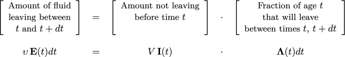

# Distribution of Residence times

Reactors treated in this course have been modeled under specific flow considerations that lead to simplicity in the mole and energy balances and are valid in many industrial reactors.

Unfortunately, as it is shown in Figure \@ref(fig:fig004000), there are other cases where the deviation of those industrial reactors from ideal behavior may be sufficiently large that the use of an ideal reactor model will give an unacceptably significant error because of the careless treatment that these models do to the fluid flow pattern within the reactors. 

```{r fig004000, out.width = "65%", echo=FALSE, fig.align='center', fig.cap='Examples of nonideal flow in a CSTR and packed-bed vessel. [@missen1999]', fig.lp='fig:'}
library(png)
library(grid)
img <- readPNG("figures/004_draw_25.png")
grid.raster(img)
```

If the flow pattern does not follow the ideal models, it must be necessary to apply a more complex methodology for the reactor performance analysis. Nevertheless, before going deeper into these methodologies, it is essential to emphasize that  the factors that govern the performance of a chemical reactor can be grouped into two broad classifications:

 1. The **amount of time** that a reactant molecule spends in the reactor. The longer that reactant can spend in the reactor, the more chance they can react. The time that molecules spend in the reactor is called **the residence time**, which is a crucial parameter in the flow reactor performance, and the **distribution of residence time** is a key factor in determining the extent of reaction.
 2. The **extent of mixing** within the reactor. When dealing with two or more different molecules that must react, molecular collision must occur as a first step. Therefore, the concentration at the molecular level is essential.

The degree of mixing depends not only on the reactor configuration and operating conditions but also on the fluid and reactants' properties.

Mixing is a complex phenomenon that can be analyzed on both a macroscopic and microscopic scale. The RTD functions provide a measure only of macroscopic mixing. [@missen1999] 

However, non-ideal flow results in irregularities relating to the micromixing of fluid elements of differing ages at the microscopic level, too. Therefore, in this section of the course, we will see how the classical approach of Residence Time Distribution (RTD) provides a method for evaluating the effect of flow patterns within the reactor on chemical conversion levels.

## RTD functions

First of all, the study of non-ideal flow behavior is based on the RTD of non-reacting species in an arbitrary flow system with constant density fluid. From this point, it will be explained its relationship to a chemically reacting species present in the reactor.

Residence time theory deals with the age of particles within a flow system. The particles may be atoms, molecules, or fluid elements conserved as they flow through the system.

:::: {.infobox .info data-latex="information"}
  
The residence time, or age, of a particle in the system is the elapsed time between the time at which the particle enters the system and the time it leaves.
::::

This approach assumes specific essential considerations:

1. If a particle reenters the system after it leaves, the aging of that particle resumes from the value it had as its previous exit.
 2. A particle is not allowed to remain in the system forever.
 3. All particles must have an original entrance and a final departure.
 4. The age of the particle when it finally leaves the system will be its residence time.

Regardless the state of mixing or type of flow, we use the classical definition of mean residence time $\overline{t}$ of an element of fluid volume within a fully contained, continuous flow reactor with a total fixed volumen of $V$ operated at steady state which is:
\begin{equation}
  \overline{t} = \frac{V}{\upsilon}
(\#eq:ec004001)
\end{equation}
where $\upsilon$ is the steady volumetric flow rate.

It is vital to point out that a fully contained vessel has no diffusion or dispersion at the vessel's entrance or exit so that a fluid element once inside the reactor cannot escape back into the input stream or once removed from cannot return to the vessel. 

This assumption is more precisely related to the boundaries of the reactor. It is assumed a plug flow in both the inlet tube and the outlet tube. Such boundary conditions are called "closed-closed." Figure \@ref(fig:fig00400) gives others boundary conditions than closed-closed that they are essential for specific experimental techniques to assess the mixing parameters inside the reactor, but they will not consider in this course. 

```{r fig00400, out.width = "65%", echo=FALSE, fig.align='center', fig.cap='Boundary conditions of reactors in relation to the residence time distribution. [@westerterp1984]', fig.lp='fig:'}
library(png)
library(grid)
img <- readPNG("figures/004_draw_28.png")
grid.raster(img)
```

Now, let us introduce some mathematical concepts. Let $d\,V = \upsilon\, dt$ represent a fluid element which entered the system $t$ time ago. Also, let $\mathbf{P}(t)$ represent the probability that the element remains in the reactor during the period $t$. The total volume of the fluid in the reactor must be

\begin{equation}
  V = \upsilon \int_{0}^\infty {\mathbf{P}(t)\,dt}
  (\#eq:ec004002)
\end{equation}

Now, let us introduce some mathematical concepts. Let $d\,V = \upsilon\, dt$ represent a fluid element which entered the system $t$ time ago. Also, let $\mathbf{P}(t)$ represent the probability that the element remains in the reactor during the period $t$. The total volume of the fluid in the reactor must be

Now, let $\mathbf{F}(t)$ represent the probability of a fluid element leaving the system during the period $t$ so $\mathbf{P}(t) + \mathbf{F}(t) = 1$. The foregoing equation then becomes

\begin{equation}
  \frac{V}{\upsilon} = \int_{0}^\infty {\left(1 - \mathbf{F}(t)\right)\,dt}
(\#eq:ec004003)
\end{equation}
which upon integration by parts gives

\begin{equation}
  \frac{V}{\upsilon} = \left[1 - \mathbf{F}(t)\right] \cdot \infty - \left[1 - \mathbf{F}(t)\right] \cdot 0+\int_{F(0)}^{F(\infty)} {t\,d\mathbf{F}(t)}
(\#eq:ec004004)
\end{equation}
with boundary conditions of $F(t) = 0$ at $t=0$, and 1 at $t=\infty$ (chance of 100% removal in an infinitive time) so that
\begin{equation}
  \frac{V}{\upsilon} = \int_{0}^{1} {t\,d\mathbf{F}(t)} = \overline{t}
(\#eq:ec004005)
\end{equation}

\begin{equation*}
  \mathbf{F}(t) \to 1 \text{ when } t \to \infty
 \end{equation*}
  
$\mathbf{F}(t)$ is called "_Cumulative Distribution Function_''. This function is dimensionless, and **represents the fraction of effluent that has been in the reactor for less time than _t_, and leaves the reactor with age less than _t_**.

The typical shape of $\mathbf{F}(t)$ function is shown on Figure \@ref(fig:fig004000a). From this figure, it is possible to note that 80% of the molecules spend 40 min or less in the reactor, and 20% of the molecules spend longer than 40 min in the reactor.

```{r fig004000a, out.width = "55%", echo=FALSE, fig.align='center', fig.cap='Typical cumulative distribution curve **F**. [@fogler2008]', fig.lp='fig:'}
library(png)
library(grid)
img <- readPNG("figures/004_draw_16.png")
grid.raster(img)
```

The distribution of residence times is represented by an external residence time distribution or an exit age distribution, $\mathbf{E}(t)$. This function is called **Residence Time Distribution Function** or (RTD-function) which **defines a fraction of exiting fluid elements with residence times lies between time $t$ and $t+dt$.**

Since $\mathbf{E}(t)$ is a fraction, $\mathbf{E}(t)$ has units of time$^{-1}$. In addition, the fraction of fluid that leaves the reactor over all time, this means between $t=0$ and $t=\infty$ must be 1. Therefore
\begin{equation}
 \int_{0}^{\infty} \mathbf{E}(t)\,dt = 1
(\#eq:ec004008)
\end{equation} 

The fraction of fluid **_in the effluent stream_** that was **_in the reactor_** for a time between $t=0$ and $t=t$  si given by
\begin{equation*}
  \int_{0}^{t} \mathbf{E}(t)\,dt 
\end{equation*} 

Another way of saying the same thing is that $\int_{0}^{t} \mathbf{E}(t)\,dt$ is the fraction of fluid in the exit stream with an \textit{exit age} less than $t$. This fractions can be represented graphically as shown in Figure \@ref(fig:fig004019).

```{r fig004019, out.width = "70%", echo=FALSE, fig.align='center', fig.cap='Typical RTD curve **E**. [@roberts2009]', fig.lp='fig:'}
library(png)
library(grid)
img <- readPNG("figures/004_draw_17.png")
grid.raster(img)
```

The fraction of the fluid that spends a given duration, $t$ inside the reactor, is given by the value of $\mathbf{E}(t)\,dt$. Therefore, $\mathbf{E}(t)$ curve is related to $\mathbf{F}(t)$ because the fraction of the fluid that leaves the reactor with age less than $t$ is equal to the sum over all times less than $t$ of $\mathbf{E}(t) \Delta t$, or expressed continuously. [@roberts2009]

\begin{equation}
  \mathbf{F}(t) = \int_0^{t} \mathbf{E}(t)\,dt
(\#eq:ec004009)
\end{equation}

Equation \@ref(eq:ec004009) could be rewritten as
 \begin{equation}
  \frac{d \mathbf{F}(t)}{dt} = \mathbf{E}(t)
(\#eq:ec004006)
\end{equation} 

Therefore from Eq. \@ref(eq:ec004005)
 \begin{equation}
 \overline{t} = \int_{0}^{\infty} t\,\mathbf{E}(t)\,dt
(\#eq:ec004007)
\end{equation} 

This procedure is called normalizing the distribution, and Figure \@ref(fig:fig004001) shows that.

```{r fig004001, out.width = "70%", echo=FALSE, fig.align='center', fig.cap='The typical exit age distribution curve **E** (RTD) [@levenspiel2004]', fig.lp='fig:'}
library(png)
library(grid)
img <- readPNG("figures/004_draw_01.png")
grid.raster(img)
```

The RTD function may be used directly to analyze reactors, or related functions may be used depending on the application.

Another useful distribution curve is the Washout function, $\mathbf{W}$, which sometimes is called "Complement function''. This function gives **the fraction of effluent that has been in reactor (with the residence times) for longer than time $t$**. It could be calculated from
\begin{equation}
  \mathbf{W}(t) = \int_{t}^{\infty} \mathbf{E}(t)\,dt \equiv 1 - \mathbf{F}(t) = 1 - \int_0^t{\mathbf{E}(t)\,dt}
(\#eq:ec004010)
\end{equation}
So,
\begin{equation}
  \mathbf{F}(t) + \mathbf{W}(t) = 1
(\#eq:ec004011)
\end{equation}
Furthermore, the relationship between the functions in derivative form is
\begin{equation}
  \frac{d\mathbf{F}(t)}{dt} =- \frac{d\mathbf{W}(t)}{dt} = \mathbf{E}(t)
(\#eq:ec004012)
\end{equation}

A typical $\mathbf{F}(t)$ and the corresponding $\mathbf{W}(t)$ function curve are illustrated in Figure \@ref(fig:fig004002)

```{r fig004002, out.width = "70%", echo=FALSE, fig.align='center', fig.cap='The typical **F(t)** and **W(t)** curves. [@hayes2013]', fig.lp='fig:'}
library(png)
library(grid)
img <- readPNG("figures/004_draw_02.png")
grid.raster(img)
```

Another distribution function of interest in some application is the "Internal Age Distribution'', $\mathbf{I}$, which is **the fraction of fluid inside the vessel with age between $t$ and $t + dt$**. It has properties similar to $\mathbf{E}(t)$, so
\begin{equation*}
    \int_0^\infty \mathbf{I}(t)\,dt = 1
\end{equation*}
The time $t=0$ refers to an arbitrary initial time and not the start of the flow of fluid into the vessel. In physical terms, this equation states that all fluid has an age between 0 and $\infty$.

As a consequence, the fraction of vessel contents younger that a specified age $t$ is,
\begin{equation*}
     \int_0^{t} \mathbf{I}(t^\prime)\,dt^\prime = 1
\end{equation*}
While the fraction older than $t$ is
\begin{equation*}
     \int_t^{\infty} \mathbf{I}(t^\prime)\,dt^\prime = 1 -  \int_0^{t} \mathbf{I}(t^\prime)\,dt^\prime
\end{equation*}
Similar to $\mathbf{E}(t)$, the mean age fluid elements inside the vessel is,
\begin{equation*}
 \overline{t}_1 =   \int_0^\infty t\,\mathbf{I}(t)\,dt = \text{ mean internal age }
\end{equation*}

As might be expected, there is an interrelationship between $\mathbf{I}$ and $\mathbf{E}$ since the fluid entering a vessel at a given time obviously either leaves it or stays inside. Therefore:
\begin{equation}
  \overline{t}\,\mathbf{I}(t) = 1 - \int_0^t \mathbf{E}(t)\,dt = \mathbf{W}(t)
(\#eq:ec004012a)
\end{equation}
or
\begin{equation}
  \mathbf{I}(t) = \frac{\mathbf{E}(t)}{1 - \mathbf{F}(t)} \Rightarrow \mathbf{E(t)} = - \overline{t}\;\frac{d\mathbf{I}(t)}{dt}
\end{equation}

Finally, the **Intensity function**, $\boldsymbol\Lambda(t)$ is defined as **fraction of fluid in the vessel of age $t$ will leave at time between $t$ and $t + dt$**. The intensity is useful in detecting the existence of dead space and bypassing.

The intensity function can be related to  $\mathbf{E}$ and $\mathbf{I}$ functions from

<center>



</center>

Therefore
\begin{equation}
  \boldsymbol\Lambda (t) = \frac{1}{\overline{t}} \frac{\mathbf{E}(t)}{\mathbf{I}(t)} 
\end{equation}

Combining the last two equations
\begin{equation}
  \boldsymbol\Lambda (t) = \cfrac{- \overline{t}\;\cfrac{d\mathbf{I}(t)}{dt}
}{\overline{t}\,\mathbf{I}(t)} = - \frac{d\left[\ln\left(\overline{t}\mathbf{I}(t)\right)\right]}{dt}
\end{equation}

## Means and moments

In addition to characterizing the RTD using the three functions $\mathbf{E}(t)$, $\mathbf{F}(t)$ and $\mathbf{W}(t)$, the residence time can also be characterized using the moments of the RTD functions. There are several types of moments. [@hayes2013]

The first type is the moment around the origin, which is defined in terms of density function as
\begin{equation}
  \mu_n = \int_0^{\infty} t^n\,\mathbf{E}(t)\,dt
(\#eq:ec004013)
\end{equation}

The value of **n** determines which moment is calculated. For example, the first moment about the origin is the **mean residence time**, $\overline{t}$
\begin{equation}
  \mu_1 = \overline{t} = \int_0^{\infty} t\,\mathbf{E}(t)\,dt
(\#eq:ec004014)
\end{equation}
As we already know, the mean residence time is the average time that molecules spend in the system. In a constant-density system $\overline{t} = V/\upsilon = \tau$

:::: {.infobox .info data-latex="information"}
Equation \@ref(eq:ec004013) can provide a helpful check on operating data because the volumetric flow rate is relatively easy to set and measure. However, the volume of the reactor filled by a fluid is not always so easy to determine.
::::

Rather than compute the moments about the origin, it is common for the moments of the RTD function to be calculated about the mean residence time. These moments are called central moments, and are defined as
\begin{equation}
  \mu_n^{\prime} = \int_0^{\infty} {\left(t-\overline{t}\right)}^{n}\,\mathbf{E}(t)\,dt
(\#eq:ec004015)
\end{equation}

The variance, $\sigma_t^2$, of the RTD is the second central moment:
\begin{equation}
  \sigma^2 = \mu_2^{\prime} = \int_0^{\infty} {\left(t-\overline{t}\right)}^2\,\mathbf{E}(t)\,dt
(\#eq:ec004016)
\end{equation}

An alternative form may be more convenient to use is obtained by expanding the square in Eq. \@ref(eq:ec004016)
\begin{equation}
  \sigma_t^2 = \left(\int_0^{\infty} {t}^2\,\mathbf{E}(t)\,dt\right) - \overline{t}^{\,2}
(\#eq:ec004016a)
\end{equation}

The variance measures the spread of the distribution about the mean characterized by  the standard deviation, $\sigma_t$. The third central moment, the skewness, measures the symmetry of the distribution about the mean:
\begin{equation}
  \sigma^3 = \mu_3^{\prime} = \int_0^{\infty} {\left(t-\overline{t}\right)}^3\,\mathbf{E}(t)\,dt
(\#eq:ec004017)
\end{equation}

All moments must be calculated meticulously for a complete summary of a distribution.  In practice, these three parameters are typically appropriate for a good RTD characterization.

## Normalized RTD functions
It is common when using residence time theory to work with normalized RTD, defined as the residence time divided by the mean residence time. This dimensionless time is given by [@hayes2013]
\begin{equation*}
  \theta = \frac{t}{\overline{t}}
\end{equation*}
The density functions for the two cases are related by
\begin{equation*}
 \mathbf{E}(\theta)\,d\theta = \mathbf{E}(t)\,dt 
\end{equation*}
Because $\overline{t}\,d\theta = dt$, it follows that
\begin{equation*}
 \mathbf{E}(\theta) = \overline{t}\,\mathbf{E}(t) = \frac{\overline{t}\;C(t)}{\displaystyle \int_0^\infty C(t)\,dt}
\end{equation*}
The other relationships do not change. The normalized cumulative distribution function is
\begin{equation*}
  \mathbf{F}(t) = \int_0^{t} \mathbf{E}(t)\,dt = \int_0^{\theta} \mathbf{E}(\theta)\,d\theta = \mathbf{F}(\theta)
\end{equation*}

The normalized washout function is
\begin{equation*}
  \mathbf{W}(\theta) = \int_{\theta}^{\infty} \mathbf{E}(\theta)\,d\theta
\end{equation*}
Finally, the moments about the origin and the central moments for the normalized RTD functions are
\begin{align*}
  &\nu_{(1,\theta)} = \int_{\theta}^{\infty} \theta \,\mathbf{E}(\theta)\,d\theta = \overline{\theta} = 1 \\
  &\nu_{\theta}^{2} = \int_{\theta}^{\infty} {\left(\theta - \overline{\theta}\right)}^2\,\mathbf{E}(\theta)\,d\theta = \int_{\theta}^{\infty} {\theta}^2\,\mathbf{E}(\theta)\,d\theta - 1 = \frac{\theta^2}{\overline{t}^2}
\end{align*}

For numerical work with tracer data directly, it is common to use the dimensional $\mathbf{E}(t), \overline{t}$, and $\sigma_t^2$. The dimensionless quantities are used with the performance models. Figure \@ref(fig:tabrtd) shows a summary of RTD functions expressed by dimensionless time.


```{r tabrtd, out.width = "65%", echo=FALSE, fig.align='center', fig.cap='Relationships between Residence Time Functions', fig.lp='fig:'}
library(png)
library(grid)
img <- readPNG("figures/tab_rtd.png")
grid.raster(img)
```

## Experimental determination of RTD

The RTD is measured experimentally by injecting a tracer, which is an inert chemical compound into the reactor at some time $t=0$ and then measuring its concentration, $C$, in the effluent stream as a function of time. The tracer must meet the following requirements:

1. it must be a nonreactive species that is easily detectable at low concentrations, e.g., by electrical conductivity, light absorption, or nuclear radiation.
2. it should have physical properties similar to those of the reacting mixture, such as density, and be completely soluble in the mixture to avoid flow changes due to viscosity and molecular diffusion of the tracer in the solution.
3. it should not adsorb on the walls or other surfaces in the reactor.
 4. The tracer should be inexpensive and easy to handle.
 5. The tracer should be stable and conserved so that it can be accounted for by a material balance relating the response to the input; if tracer decays, its half-life should be such that $t_{1/2}\,(\text{tracer}) > 25\overline{t}\,  (\text{fluid})$.

The two most used methods of injection are _pulse input_ and _step input_.

## Determination of **E(t)** from Pulse input

The direct experimental determination of **E(t)** requires a sharp pulse of tracer to be injected into the system. Essentially, an amount of tracer $N_0$ is required to be injected into the vessel's inlet at a single instant of time at $t=0$. Figure \@ref(fig:fig004003) shows typical concentration-time curves at the inlets and outlet of an arbitrary reactor. [@hayes2013]

```{r fig004003, out.width = "65%", echo=FALSE, fig.align='center', fig.cap='Typical pulse impulse curves for RTD measurement', fig.lp='fig:'}
library(png)
library(grid)
img <- readPNG("figures/004_draw_03.png")
grid.raster(img)
```

Mathematically, the ideal shape of the injected pulse is described by a Dirac delta function. In practice, the tracer should be injected in as short an elapsed time as is experimentally possible to achieve.

The tracer's concentration in the effluent is then measured as a function time, and the density function can be evaluated using the following analysis. The fraction of tracer molecules that leave the system over some time interval $dt$ is

\begin{equation}
  \frac{dN}{N_0} = \mathbf{E}(t)\,dt
(\#eq:ec004018)
\end{equation}
where $dN$ represents the number of tracer molecules that leaves the system over the time interval $dt$, and $N_0$ is the total number of tracer molecules injected.

The number of molecules can be expressed in terms of the concentration and the volumetric flow rate,
\begin{equation}
  dN = \upsilon\,c(t)\,dt
(\#eq:ec004019)
\end{equation}
where $C(t)$ is the concentration of tracer in the effluent streams as a function of time.

Thus, the total number of molecules initially injected can also be calculated from the effluent profile by integration over a long time:

\begin{equation}
  N_0 = \int_0^{\infty} \upsilon\,C(t)\,dt \equiv \frac{N_0}{\upsilon} = \int_0^{\infty} C(t)\,dt
(\#eq:ec004020)
\end{equation}

Combining Eqs \@ref(eq:ec004019) and \@ref(eq:ec004020) into Eq. \@ref(eq:ec004018) for a constant-density system,
\begin{equation}
 \mathbf{E}(t) = \frac{c(t)}{\displaystyle\int_0^\infty{c(t)\,dt}} \approx \frac{c_i(t)}{\displaystyle\sum_i {c_i(t)\,\Delta t_i}}
(\#eq:ec004021)
\end{equation}

Once $\mathbf{E}(t)$ is determined, the mean residence time, $\overline{t}$, and the variance of distribution, $\sigma_t^2$, may be calculated based on Eqs. \@ref(eq:ec004007)  and \@ref(eq:ec004016a)
\begin{gather*}
 \overline{t} = \int_{0}^{\infty} t\,\mathbf{E}(t)\,dt \approx \sum_i t_i E_i(t) \Delta t_i \\
   \sigma_t^2 = \left(\int_0^{\infty} {t}^2\,\mathbf{E}(t)\,dt\right) - \overline{t}^{\,2} \approx \left[ \sum_i t_i^2 E_i(t) \Delta t_i \right] - \overline{t}^2
\end{gather*} 

Advantages of using a pulse input include:

1. requiring only a small amount of tracer.
2. involving usually only a tiny impact on process operation.

Disadvantages include:

1. difficulty in achieving a perfect pulse.
2. difficulty in achieving accurate material balance on traces using equation \@ref(eq:ec004020)

Obtaining $\mathbf{E}(t)$, $\overline{t}$ and $\sigma_t^2$ from experimental tracer data involves determining areas under curves defined continuously or by discrete data. Two simple ways in which discrete data may be treated to obtain the required areas:

1. use of data in histogram form, and
2. use of the trapezoid rule.

In the histogram method, Figure \@ref(fig:fig004003a), the area under the response curve is
\begin{gather*}
  \text{area} = \sum_{i=1}^{n_C} c_i(t)\,\Delta t_i \\
  \Delta t_i = \frac{t_{i+1} - t_{i-1}}{2}
\end{gather*}

```{r fig004003a, out.width = "65%", echo=FALSE, fig.align='center', fig.cap='Basis for histogram method of area determination. [@missen1999]', fig.lp='fig:'}
library(png)
library(grid)
img <- readPNG("figures/004_draw_26.png")
grid.raster(img)
```

In the use of the trapezoid rule, Figure \@ref(fig:fig004003b), the area under the response curve is given by

```{r fig004003b, out.width = "65%", echo=FALSE, fig.align='center', fig.cap='Basis for histogram method of area determination. [@missen1999]', fig.lp='fig:'}
library(png)
library(grid)
img <- readPNG("figures/004_draw_27.png")
grid.raster(img)
```

\begin{equation*}
  \text{area} = \sum_{i=1}^{n_c - 1} c_i(t)_\text{av}\,\Delta t_i = \sum_{i=1}^{n_c - 1} \left(\frac{c_i + c_{i+1}}{2}\right) \left(t_{i+1} - t_i\right)
\end{equation*}

The only way to determine which numerical method provides the best answer is to predict the experimental concentrations using the calculated parameters in an appropriate mixing model.

```{exercise, it004001, name="Calculations of RTD and distribution functions curves from pulse impulse method"}
Consider a vessel through which a fluid is flowing. The RTD function is determined utilizing a pulse injection of the tracer in the inlet stream, and its outlet concentration is monitored as a function of time. The output concentration in mol/L measured as a function of time in seconds is

 t (s) | C (mol/L) | t (s) | C (mol/L) | t (s) | C (mol/L) | t (s) | C (mol/L) 
--|--|--|--|--|--|--|--
0.0 | 0 | 225 | 7.4 | 275 | 8.2 | 375 | 0.5
150 | 0 | 240 | 9.4 | 300 | 5.0 | 400 | 0.2
175 | 1 | 250 | 9.7 | 325 | 2.5 | 450 | 0.0
200 | 3 | 260 | 9.4 | 350 | 1.2 | 500 | 0.0

Determine:
  
1. Plot of tracer concentration vs time.
2. RTD curve, $\mathbf{E}(t)$.
3. Cumulative distribution function plot, $\mathbf{F}(t)$.
4. Washout function plot, $\mathbf{W}(t)$.
5. Mean residence time.
6. Fraction of material leaving the reactor that has spent between 230 and 270 seconds.

```

_Solution_

The solution in a Python script is available at  [link](https://github.com/aliglara/ebook_che5314_ucv/blob/main/codes/lect_021RTDimpulse.ipynb).

(a) By plotting _C_ as a function of time, the curve shown in Figure \@ref(fig:fig004005a) is obtained. From the $C(t)$ curve is possible to calculate the RTD, according to Eq. \@ref(eq:ec004021), for a pulse impulse test.

We just need to divide each point of c(t) by the integral
 \begin{equation*}
  \int_0^\infty c(t)\:dt
\end{equation*}
which is just the area under the $C (t)$ curve.

```{r fig004005a, out.width = "65%", echo=FALSE, fig.align='center', fig.cap='Trace concentration curve', fig.lp='fig:'}
library(png)
library(grid)
img <- readPNG("figures/004_01_01.png")
grid.raster(img)
```

Figure \@ref(fig:fig004005b) shows the obtained RTD curve

```{r fig004005b, out.width = "65%", echo=FALSE, fig.align='center', fig.cap='RTD curve', fig.lp='fig:'}
library(png)
library(grid)
img <- readPNG("figures/004_01_02.png")
grid.raster(img)
```

(b) The cumulative distribution curve, _F(t)_, and washout curve, _W(t)_, were obtained from _E(t)_ curve, and Figure \@ref(fig:fig004006a) shows the results obtained.

```{r fig004006a, out.width = "65%", echo=FALSE, fig.align='center', fig.cap='Cumulative curve, F(t)', fig.lp='fig:'}
library(png)
library(grid)
img <- readPNG("figures/004_01_03.png")
grid.raster(img)
```

```{r fig004006b, out.width = "65%", echo=FALSE, fig.align='center', fig.cap='Washout curve, W(t)', fig.lp='fig:'}
library(png)
library(grid)
img <- readPNG("figures/004_01_04.png")
grid.raster(img)
```

(c) The mean residence time is obtained from \@ref(eq:ec004007), thus $\overline{t} = 261.615$ seconds.

(d) To calculate the fraction of material leaving the reactor that has resided in the reactor between 230 and 270 seconds, it is necessary to solve

 \begin{equation*}
   \int_{230}^{270} {\mathbf{E}(t)dt}
 \end{equation*}
 
 However, times 230 and 270 seconds are not presented in the original data. It is necessary to append our data by interpolating _E(t)_ points to correspond times 230 and 270 seconds. Then, the data obtained are plotted in Figure \@ref(fig:fig004007). The shaded area represents the fraction of material leaving the reactor that resided in the reactor between 230 and 270 seconds.
 
```{r fig004007, out.width = "65%", echo=FALSE, fig.align='center', fig.cap='Analysis of curve E(t)', fig.lp='fig:'}
library(png)
library(grid)
img <- readPNG("figures/004_01_05.png")
grid.raster(img)
```

Then, we learned between 230 and 270 seconds, the 37.53\% of the material left into the reactor.

## Determination of **E(t)** from Step Change

In this case, a step input tracer is a step increase from one steady-state value to another. Usually, as illustrated in Figure \@ref(fig:fig004004), the step increase is from a zero value, and for a $t\to \infty$, the final concentration of the tracer will be equal to its inlet concentration. [@hayes2013]

For a step change, a material-balance criterion is that the steady-steady inlet and outlet tracer concentrations must be equal, both before and after the step change. Then, it may be concluded that the system's response, as shown in Fig. \@ref(fig:fig004004), is linear to the tracer, and there is no loss of tracer because of reaction or adsorption. [@missen1999]


```{r fig004004, out.width = "65%", echo=FALSE, fig.align='center', fig.cap='Typical step change curves for RTD measurement. [@fogler2008]', fig.lp='fig:'}
library(png)
library(grid)
img <- readPNG("figures/004_draw_04.png")
grid.raster(img)
```

In comparison with pulse input, which is related to $\mathbf{E}(t)$, the response to a step change is related to $\mathbf{F}(t)$. The advantages of this experimental method are:

 1. A step change is usually easier to achieve.
 2. A material balance is usually easier to achieve.

While disadvantages include:

 1. Continuous delivery requires a greater amount of tracer.
 2. It may have a significant impact on process operation.
 
Now, considering a constant rate of tracer addition to a feed that is initiated at time $t=0$, the tracer concentration for a system with a constant volumetric flow rate must achieve following conditions:
 \begin{equation*}
   C_0(t) = \left\{ \begin{array}{ll}
   0 & t <0 \\
   {\left(C_0\right)} \,\text{ constant} & t \geq 0 \end{array} \right.
 \end{equation*}
 
Thus, in the case of a step increase from an initial value, $C(0)$, to some final value, $c(\infty)$, the outlet concentration as function of time gives the cumulative distribution function, $\mathbf{F}(t)$, directly from the following equation:
 \begin{equation}
   \mathbf{F}(t) = \frac{c(t) - c(0)}{C(\infty) - c(0)}
   (\#eq:ec004022)
 \end{equation}
 
If the inlet tracer concentration has a step decrease from initial value, $C(0)$, to a final value, $C(\infty)$, then the effluent concentration can be used to calculate the washout function, $\mathbf{W}(t)$:
 \begin{equation}
\mathbf{W}(t) = \frac{c(t) - c(\infty)}{c(0) - c(\infty)}
(\#eq:ec004023)
 \end{equation} 
 
A tracer study may use a step increase followed later by a step decrease; the transient responses in the two cases are the checked consistency. When considered separately, the washout technique has advantages: less tracer is required, and it avoids having to maintain a steady-state value of $C_o$ for a lengthy period. [@missen1999]
 
The normalized response data may be converted to $\mathbf{E}(t)$, since
 \begin{equation*}
   \mathbf{E}(t) = \frac{d\mathbf{F}(t)}{dt}
 \end{equation*}
 Or could be estimated depending on the differencing technique used. From backward differencing:
  \begin{equation*}
   \mathbf{E}(t) = \frac{d\mathbf{F}(t)}{dt} \approx \frac{F_{i+1} - F_{i}}{t_{i+1} - t_{i}}; \quad i = 1, 2, \,\dots \, n-1
 \end{equation*}
 and central differencing:
   \begin{equation*}
   \mathbf{E}(t) = \frac{d\mathbf{F}(t)}{dt} \approx \frac{F_{i+1} - F_{i-1}}{t_{i+1} - t_{i-1}}; \quad i = 2, 3,\, \dots \, n-2
 \end{equation*}
 
Finally, based on the normalized condition of $\mathbf{E}$ curve. The mean residence time, which is calculated from~\cref{ec:004_007} could be approximated to:
 \begin{equation*}
   \overline{t} \approx \sum{t_i\,\mathbf{E}_i\,\Delta t}
 \end{equation*}
 and the variance $\sigma^{2}$
 \begin{equation*}
   \sigma_t^{2} \approx \sum{t_i^2\,\mathbf{E}_i\,\Delta t} - \overline{t}^{2}
 \end{equation*}

```{exercise, it004002, name="Calculations of RTD and distribution functions curves from step change method"}
The inlet concentration of helium (tracer A) was step-increased from 1.0 to 2.0 mmol/L to determine the mixing pattern in a fluidized-bed reactor. The response data were as follows:
  
 t (min) | C (mmol/L) | t (min) | C (mmol/L) 
--|--|--|--
0.0  | 1.000 | 30.0  | 1.410 
5.0  | 1.005 | 45.0  | 1.610 
10.0 | 1.020 | 60.0  | 1.770 
15.0 | 1.060 | 90.0  | 1.920
20.0 | 1.200 | 120.0 | 1.960

Determine $F(t)$, $E(t)$, $\sigma^2$ for flow through the vessel, and calculating $\overline{t}$ 

```


_Solution_

The solution in a Python script is available at  [link](https://github.com/aliglara/ebook_che5314_ucv/blob/main/codes/lect_031RTDstep.ipynb).

The figure \@ref(fig:fig004008) shows results obtained for $F(t)$

```{r fig004008, out.width = "80%", echo=FALSE, fig.align='center', fig.cap='Left: Trace concentration curve. Right: F(t) curve', fig.lp='fig:'}
library(png)
library(grid)
img <- readPNG("figures/004_02_01.png")
grid.raster(img)
```

 
The RTD was calculated by
 \begin{equation*}
   \mathbf{E}(t) = \frac{d\mathbf{F}(t)}{dt}
 \end{equation*}
 
 Which was estimated using backward differencing for $F(t)$. The figure \@ref(fig:fig004009) shows results obtained for $E(t)$
 
```{r fig004009, out.width = "65%", echo=FALSE, fig.align='center', fig.cap='E(t) curve', fig.lp='fig:'}
library(png)
library(grid)
img <- readPNG("figures/004_02_03.png")
grid.raster(img)
```

The mean residence time was estimated by trapezoid rule.
\begin{equation*}
  \overline{t} = \sum\limits_{i=1}^{n_c - 1} {\left[t_i\,E_i(t)\right]}_{av} \Delta t_i
\end{equation*}
From this,

\begin{equation*}
  \boxed{\overline{t} = 57.537 \text{ min}}
\end{equation*}

Finally, the variance was obtained by,
\begin{equation*}
  \sigma^2 = \left\{\sum\limits_{i=1}^{n_c - 1} {\left[t_i^2\,E_i(t)\right]}_{av} \Delta t_i \right\} - \overline{t}^2
\end{equation*}

From this,
\begin{equation*}
  \sigma^2= 530.249 \text{ min}^2
\end{equation*}

**WIP**
